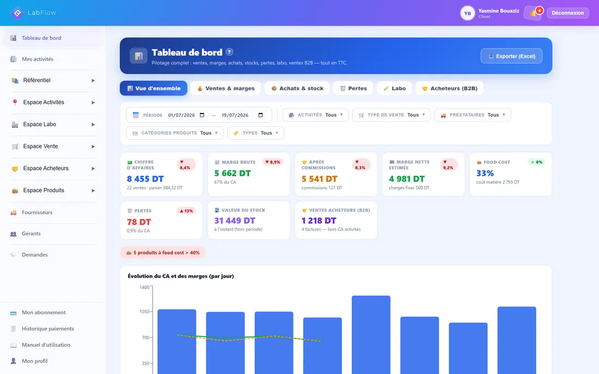

# PLAN DE REFONTE V3 — SITE VITRINE LABFLOW

> Document de référence unique pour l'implémentation de la V3.
> Rédigé le 20/07/2026. Remplace `PLAN-REFONTE-V2.md` pour tout ce qui concerne la V3, mais **ne l'annule pas** : le §6 « Verrous » de la V2 reste valable, sauf les deux verrous explicitement levés ici (§13.3).
>
> ⚠️ **LIRE LE §0.4 EN PREMIER.** Le client a tranché deux arbitrages le 20/07/2026 **après** la rédaction de ce plan. Ses décisions priment sur le corps du document partout où elles le contredisent — en particulier sur le sort de `tarifs.html` (§3.1, §3.3, §6.1) et sur le périmètre métier (§14.5).

---

## 0.4 DÉCISIONS CLIENT DU 20/07/2026 — PRIMENT SUR LE RESTE DU PLAN

### D1 — `tarifs.html` est CONSERVÉE, pas supprimée

Le plan prévoyait sa suppression + deux 301 (§3.1, §3.3, §6.1). **Le client a tranché l'inverse** : l'URL `/tarifs.html` est conservée, avec une page **entièrement réécrite**, titrée « Combien coûte LabFlow ? », **sans un seul montant, sans calculateur**. Motif : c'est la meilleure position organique du site, et la page qui capte les visiteurs les plus proches de l'achat.

**Ce qui devient caduc** : le `git rm`, la modification du `COPY` du `Dockerfile` (§3.5), les deux redirections 301 (§3.3), le retrait de l'entrée du `sitemap.xml` (§3.4), l'étape 0 du §6.1.
**Ce qui reste intégralement valable** : tout le retrait des **montants**, du **calculateur**, de la clé `lf_calc`, de l'appel à `GET /api/public/tarifs-reference` et des attributs `[data-ob]` — y compris sur la nouvelle `tarifs.html`.
**Conséquence à ne pas manquer** : la nav garde ses 4 entrées du §4 section 0, mais `tarifs.html` doit être **reliée depuis la section `#devis` de l'accueil et depuis le pied de page des 6 pages**. Une URL conservée mais orpheline se désindexe — on perdrait la position qu'on cherchait précisément à garder.

### D2 — Périmètre métier ÉLARGI, formulation vérifiée dans le code

Le §14.5 proposait « les métiers qui transforment » et jugeait « tout type de commerce » infondé. **Fact-check refait dans le code applicatif : le socle est réellement agnostique.** Aucune contrainte alimentaire au schéma (zéro `allergenes`/`dlc`/`peremption` dans les 175 migrations) ; le filtrage par domaine métier a été **supprimé en migration 086** (`DROP TABLE ingredient_domaines`, `ALTER TABLE categories DROP COLUMN domaine_id`) ; les unités sont des **étiquettes opaques sans aucune conversion** (« pièce » fonctionne comme « kg ») ; la vente d'un article brut sans recette est un **flux de première classe** (`article_type IN ('produit','ingredient')`, marge sur le PMP d'achat) ; la formule Basique est littéralement « Stock + Ventes d'articles, sans Espace Produit » (migration 164). Le vocabulaire recette/portion/labo est **confiné à l'Espace Produit**, verrouillé en Basique — la sidebar elle-même est neutre.

**Formulation retenue, à décliner sur tout le site :**

> Vous achetez, vous stockez, vous vendez. LabFlow gère cette chaîne pour n'importe quel type d'article — vos familles, vos catégories, vos unités, au kilo, au litre ou à la pièce. Rien n'est imposé.
> **Et si vous transformez ce que vous vendez**, LabFlow va plus loin : le prix de revient exact d'un produit fabriqué, votre atelier de production, et quel produit vous rapporte vraiment.
> *Né dans les métiers de bouche, là où le calcul de marge est le plus exigeant. C'est ce qui le rend précis partout ailleurs.*

La structure « **et si** vous transformez » est impérative : la transformation garde sa section vedette, mais devient un **plus** et non un **prérequis**.

**Ajouts à la liste noire du §11.2 :**
- Ne **jamais nommer** une verticale non alimentaire (téléphonie, prêt-à-porter, quincaillerie, cosmétique…). Rien n'est outillé spécifiquement pour elles.
- Ne **jamais promettre** : code-barres, scan, SKU, numéro de série, IMEI, garantie, numéro de lot, date de péremption, caisse/TPV, fidélité, boutique en ligne. **Vérifié : zéro occurrence dans les deux repos.**
- Ne pas écrire « adapté à tous les commerces » sans la nuance ci-dessus.
- Le `#pourqui` garde ses métiers de bouche mais s'ouvre — « et plus largement tout commerce qui achète, stocke et vend » — **sans lister de verticale**.

**Deux réserves produit signalées au client (hors périmètre du site) :**
1. Le KPI **« 🍔 Food cost »** est affiché à **tout le monde**, non masquable, seuil rouge à 40 % en dur (`ClientDashboard.tsx:460, 473, 496, 505, 514` · `dashboardV2Widgets.tsx:277` · `dashboardV2Controller.js:291`). Un revendeur non alimentaire le verrait **en permanence en rouge**. Renommage en « Coût matière » + seuil configurable = ~6 lignes, meilleur rapport effort/effet du produit.
2. **Aucun code-barres, SKU ni numéro de série** nulle part. Seul vrai trou fonctionnel pour le commerce de détail.

### D3 — Numéro WhatsApp : non fourni

Le placeholder `wa.me/21600000000` reste en place, assorti d'un commentaire HTML `<!-- TODO numéro WhatsApp réel — bloquant avant mise en ligne -->` à chaque occurrence. **Aucun numéro n'a été inventé.** Le §14.1 reste bloquant de lancement.

### D4 — Livraison

Le client valide à la fin. Travail sur la branche **`feat/refonte-v3`**, commits locaux, **aucun push, aucun merge vers `main`, aucun déploiement**.

---

## 0. EN-TÊTE

### 0.1 Objectif

Refondre `https://labflow-tn.com` pour qu'il **représente réellement l'application LabFlow** : un système de gestion complet pour les métiers qui transforment de la matière première alimentaire. Le site actuel (V2.1) présente quatre modules et une grille tarifaire ; la V3 doit couvrir onze piliers métier, retirer intégralement les prix, et faire de la vidéo de démonstration existante un actif de premier plan.

### 0.2 État actuel en production

| | |
|---|---|
| Repo | `C:\Users\CHAHDONj\labflow-site` — site statique HTML/CSS/JS vanilla, **sans build, sans CI**, 13 commits |
| Déploiement | push sur `main` → webhook Coolify → `https://labflow-tn.com` |
| Pages | `index.html` (28 Ko), `tarifs.html` (21 Ko), `demande-acces.html` (31 Ko), `merci.html`, `mentions-legales.html`, `confidentialite.html` |
| CSS | `assets/css/v2.css` — 22,5 Ko, 384 lignes, 30 tokens, un seul breakpoint global à 900 px |
| JS | **tout inline**, `assets/js/` est vide. Max 9,2 Ko sur une même page |
| Police | `bricolage-grotesque-latin.woff2`, 76,9 Ko, **unique police** |
| Images | 44 fichiers, **1,02 Mo au total dans le repo** (1 047 099 o). **5 captures optimisées et versionnées ne sont affichées sur aucune page** |
| Vidéo | `demo-hero.webm/.mp4` (12 s muette) + `demo-60s-son.mp4` (89,80 s sonorisée, **4,16 Mo**) |
| Application | `https://app.labflow-tn.com` — API `https://api.labflow-tn.com` |
| Compte de démo | `demo@dar-yasmine.tn` — **données réelles**, seed idempotent `node scripts/seed-demo-vitrine.js` |

Le 1,02 Mo est le poids de `assets/img/` sur le disque, tous formats et toutes densités confondus. **À ne pas confondre avec le budget du §13.6**, qui porte sur les images **effectivement chargées par une page** (≈ 155 Ko @1x pour l'accueil V3, §9.3).

### 0.3 Comment lire ce document

- **Le §0.4 prime sur tout le reste** : ce sont les décisions prises par le client après la rédaction. En cas de contradiction avec le corps du plan, c'est le §0.4 qui gagne.
- Les §1 à §5 sont le **quoi** (stratégie, direction, contenu). Les §6 à §10 sont le **comment** (procédures, specs). Les §11 à §14 sont les **garde-fous**. La §15 est le **journal des arbitrages déjà tranchés** — la lire avant de rouvrir un débat que ce plan a déjà clos.
- Le §12 est le plan d'exécution : **c'est par là qu'on commence à coder**, dans l'ordre des lots.
- Toute phrase encadrée par « **verrou** » ou listée au §11.2 / §13 ne se réécrit pas sans revalidation. Un rédacteur qui « améliore » une de ces phrases produit une contre-vérité produit.
- Les chemins sont absolus. Les numéros de ligne renvoient à l'état actuel de `main` et sont à revérifier avant chaque édition.
- **Aucune modification n'est autorisée** dans `C:\Users\CHAHDONj\fiche-technique-backend` ni `C:\Users\CHAHDONj\fiche-technique-frontend`. Ces repos servent uniquement de source de fact-check.

---

## 1. LE POURQUOI DE LA V3

### 1.1 La demande du client, reformulée

Le client veut un site qui **représente l'application**, pas une brochure de quatre modules. Professionnel, moderne, attirant. Deux exigences structurantes s'y ajoutent : plus aucun prix affiché, et la demande d'accès conservée à l'identique comme unique point d'entrée structuré.

Diagnostic de la V2.1 : sur onze piliers, **deux sont bien servis, cinq partiellement, quatre quasi absents**. Le registre éditorial (concret, patron-friendly, chiffres réels) est le bon et doit être préservé. La V3 est **une extension de couverture, pas une réécriture de ton**.

### 1.2 Les 11 piliers

1. **Centralisateur** de données — flux vers les clients professionnels **et** gestion interne.
2. **Rapports et indicateurs** qui facilitent la prise de décision.
3. **Suivi complet par article**.
4. **Produits transformés** : recettes détaillées, valorisation au Dernier Prix (DP) et au Prix Moyen Pondéré (PMP). *Désigné par le client comme le grand avantage différenciant.*
5. **Factures** côté propriétaire du compte **et** côté clients professionnels.
6. **Transferts internes**.
7. **Ventes aux clients professionnels** (le client dit « transferts externes »).
8. **Traçabilité** avec les **exports**.
9. **Gérants** et **fournisseurs**.
10. **Suivi des recettes** via les fiches techniques.
11. **Sécurité des données** : chaque client n'accède qu'à ses propres données.

⚠️ Deux formulations du brief sont **factuellement fausses** au regard du code et ne doivent jamais être reprises telles quelles :
- « gestion complexe de **tout type de commerce** » → le produit n'est pas outillé pour le non-alimentaire (§11.1, §14.5).
- « recettes détaillées **DP et PMP** » → DP et PMP ne sont pas des méthodes de recette mais de **valorisation du coût** (§11.3).

### 1.3 Changement structurant n°1 — zéro tarif

Suppression totale : plus aucun prix, aucun pack chiffré, aucun calculateur, **plus de page `tarifs.html`**. Le contact se fait par la demande d'accès ou par WhatsApp.

Conséquence non négociable : **on ne laisse pas un trou.** Retirer les prix sans expliquer pourquoi se lit comme de l'opacité. La section `#devis` (§6.2) remplace la section tarifs **au même rang visuel**, et la « ligne de service » (§6.2.6) répond à l'objection prix sous chaque bouton, pas seulement en FAQ.

### 1.4 Changement structurant n°2 — la demande d'accès est intouchable

`demande-acces.html` conserve **intégralement** : le contrat `POST /api/public/demande-acces` avec ses 10 clés, le honeypot `website`, la garde anti-bot de 3 s, la normalisation du téléphone, la validation blur-puis-frappe, le masque `XX XXX XXX`, la redirection vers `merci.html`. Seules retouches admises : retrait de la chaîne `lf_calc`, retrait des liens « Tarifs », vrai numéro WhatsApp, trois correctifs d'accessibilité, et la distinction 400/429/réseau dans le handler d'échec.

---

## 2. LA DIRECTION RETENUE

### 2.1 « CHIFFRES EN MAIN »

**Concept.** Le site est construit comme un interrogatoire. Chaque section s'ouvre sur une question qu'un patron se pose vraiment à voix haute, y répond par **un chiffre issu du compte de démonstration**, et le prouve par **l'écran exact qui produit ce chiffre**. Le tableau de bord n'est pas une fonctionnalité parmi onze : c'est la destination. Tout le reste — stock, recettes, transferts, ventes B2B, gérants, traçabilité — est présenté comme ce qui rend l'indicateur juste, via la formule de subordination : **« cet espace existe pour que tel chiffre soit vrai »**.

Visuellement : un rapport de gestion bien composé, pas une brochure SaaS. Les nombres sont la typographie héroïque, le dégradé de marque recule, la densité augmente.

### 2.2 Pourquoi elle a gagné

Classement du jury : **decision 32 · flux 30,5 · systeme 30,5 · preuve 29**.

- **Jury patron — 9/10, préférée.** « "Savez-vous ce que vous gagnez ?" c'est la question qui me réveille la nuit. » « Chaque module a une RAISON d'exister. En V2 je voyais une liste de fonctions et je m'en fichais. » Réserve retenue et corrigée : le mot « plomberie » en titre de section a été **rejeté** (« vous me dites que 8 des 11 choses que vous m'avez vendues sont de la tuyauterie ») — il est remplacé par le titre de `systeme` (§4, section 5).
- **Jury conversion — 8,5/10, préférée.** « Le seul qui construise un entonnoir plutôt qu'une visite. » Seule direction traitant la collision `.wa` / `.sticky-cta`, et la seule à chiffrer l'effort demandé (« quinze minutes suffisent »).
- **Jury design — 7,5/10.** « La meilleure architecture d'information des quatre, et de loin. » Reproche retenu : « visuellement, c'est une V2.5 » et « l'alternance gauche/droite est le réflexe par défaut depuis 2016 » → corrigé par les greffes visuelles du §2.3.
- **Jury produit — 7/10.** « La meilleure formule conceptuelle au service de la mauvaise hiérarchie. » Reproche majeur retenu et corrigé : le pilier 4 était relégué en « Rangée 2 » → il devient une **section entière, la plus longue de la page, en nuit profonde** (greffe de `flux`).

### 2.3 Les greffes retenues (et leur origine)

**De « SYNOPTIQUE » (systeme) :**
- La section **« Ce que LabFlow ne fait pas »** — élément le mieux noté de tout le corpus, réclamé par les 4 jurys. Filtre de leads + pare-feu de copy contre la liste noire.
- La **ligne de service** sous chaque CTA primaire — meilleur élément de conversion identifié.
- Le titre **« Du sac de farine à la facture client : un seul système »**, qui remplace « La plomberie ».
- Le remplacement de l'entrée nav « Tarifs » par **« Vos données »**.
- Le garde-fou d'agrégation du tableau de bord (par catégorie/fournisseur, pas par article).
- La discipline formelle : ombres portées supprimées sur les blocs, filets 1 px. **Non retenu : le passage au gris-bleu froid `#F5F6F8`** — le lin chaud `#F7F5F1` est la seule chose qui distingue ce site du blanc SaaS générique.

**De « LE FIL DU DINAR » (flux) :**
- Le titre **« Ce croissant, il vous coûte exactement combien ? »** — jugé « meilleure phrase de tout le dossier » par le jury patron.
- La **hiérarchie par profondeur de noir** : `--nuit-coeur #0B0E1A` pour la seule section produits transformés, qui reçoit 2× l'espace des autres.
- La section cloisonnement en **trois colonnes concrètes** : « Trois personnes regardent le même système. Elles ne voient pas la même chose. »
- Les **liens WhatsApp pré-remplis par section** (`?text=` différent selon l'origine du clic).
- La **barre de progression 2 px** en haut du viewport. *Non retenu : le rail fixe à 9 stations (cliché SaaS, meurt sous 900 px) et le vocabulaire station/maillon/amont (rejeté par le jury patron).*

**De « LA TABLE LUMINEUSE » (preuve) :**
- Le **label de route** au-dessus de chaque capture (« Espace Labo › Historique Transferts ») — « meilleur micro-détail de tout le lot » selon le jury design.
- La **capture comparée** propriétaire / gérant pour le pilier 11 — priorité n°1 du tournage.
- La section **`#apres`** comme remplacement de rang égal à la page tarifs, avec les 3 étapes numérotées.
- Les **trois entrées de FAQ en « Non »**.
- La règle **« on n'invente pas de pièce »**.
- Le **chapitrage vidéo visible sur la page**, ramené à **6 repères** (arbitrage : le jury produit en voulait 11, le jury patron « devant onze boutons je n'en clique aucun »).
- *Non retenu : le fond sombre dominant. Risque d'audience jugé non rattrapable par le jury patron (« le noir me dit que ce produit n'est pas pour toi »).*

---

## 3. ARBORESCENCE APRÈS REFONTE

### 3.1 Pages

| URL | Fichier | Statut | Indexation |
|---|---|---|---|
| `/` | `index.html` | **Refonte complète** | indexée, priority 1.0 |
| `/demande-acces.html` | `demande-acces.html` | Logique conservée, réhabillage | indexée, priority 1.0 |
| `/merci.html` | `merci.html` | **Retouches + bloc démonstration et WhatsApp (§4 ter)** | `noindex` |
| `/mentions-legales.html` | `mentions-legales.html` | **3 corrections + 4 blocs `[À COMPLÉTER]` + `v3.css` + canonical** | `noindex,follow` |
| `/confidentialite.html` | `confidentialite.html` | **Retrait du lien Tarifs · 4 blocs `[À COMPLÉTER]` (L.48, 62, 64, 70) · mesure d'audience en L.64 · 2 paragraphes WhatsApp (§2 et §5) · reformulation L.66 · `v3.css` + canonical** | `noindex,follow` |
| `/404.html` | `404.html` | **NOUVELLE** (§3.3) | `noindex` |
| ~~`/tarifs.html`~~ | — | **SUPPRIMÉE** | 301 |

**Aucune page de contenu nouvelle** — la page 404 est un filet technique, pas une page indexable, et n'entre pas au sitemap. Justification : les 11 piliers tiennent sur l'accueil parce qu'ils sont hiérarchisés (1 en vedette, 1 en différenciant, le reste en sections courtes) ; une page « Fonctionnalités » diluerait le point d'entrée unique et doublerait la maintenance d'un site sans build ni CI.

### 3.2 Ancres de la page d'accueil

**Conservées** (`demande-acces.html` pointe dessus — ne pas casser) : `#fonctionnalites`, `#pourqui`, `#faq`, `#top`, `#cta`.
**Déjà présentes dans le DOM actuel, réutilisées telles quelles** : `#principe` (`index.html` L.150), `#preuves` (`index.html` L.241).
**Nouvelles** : `#le-probleme`, `#decider`, `#entrees`, `#recettes`, `#sorties`, `#factures`, `#limites`, `#vos-donnees`, `#devis`, `#apres`.
**Supprimée** : `#tarifs` — levée de verrou V2, actée au §13.3. Impact technique nul (une ancre inexistante laisse le navigateur en haut de page).

⚠️ **La section 9 garde `id="preuves"` au pluriel**, tel qu'il est en production (`index.html` L.241). Toutes les mentions de `#preuve` (au singulier) dans ce plan — §4 section 9, §4 section 8 (« renvoi vers `#preuve` »), §5 — désignent cette même ancre et sont à lire au pluriel. Aucun lien interne n'y pointe aujourd'hui (vérifié sur les 6 pages), donc renommer serait sans risque ; on ne le fait pas, parce que le gain est nul et qu'une URL a pu être partagée.

Note : la section 5 doit répondre aux **deux** fragments `#fonctionnalites` (conservé — `demande-acces.html` pointe dessus, on ne casse pas une ancre existante) et `#entrees` (nouveau, cohérent avec le titre de la section). Un élément ne pouvant pas porter deux `id`, le mécanisme est **une cible vide posée juste avant la section** — à ne pas improviser :

```html
<span id="entrees" class="ancre" aria-hidden="true"></span>
<section id="fonctionnalites"> … </section>
```

avec, dans `v3.css` :

```css
.ancre { display: block; position: relative; top: calc(-1 * var(--h-nav) - 12px); visibility: hidden; }
```

Un `<span>` vide plutôt qu'un wrapper : un wrapper obligerait à revoir les marges de section et le `clip-path` des zones nuit voisines (§13.4). Le décalage négatif compense la nav sticky, sinon le titre passe dessous.

**`#fonctionnalites` reste la cible canonique** : c'est lui que visent la nav et `demande-acces.html`. `#entrees` n'est qu'un alias de confort pour les liens externes et les partages ; **si aucun lien ne le vise à la livraison du Lot 5, on le supprime** plutôt que de laisser une ancre morte dans le DOM.

### 3.3 Redirections 301 — deux, pas une

`nginx.conf` sert la page sur **deux** URLs à cause du `try_files $uri $uri.html $uri/ =404` (L.23). Ajouter les deux blocs suivants (leur **position dans le fichier est indifférente** : `location =` gagne par type de match, pas par ordre d'écriture) :

```nginx
# /tarifs retiré en V3 (plus de prix publics). L'intention « tarifs » est
# commerciale : on l'envoie sur la section qui répond à la question du coût.
location = /tarifs.html {
  add_header Cache-Control "public, max-age=3600";
  return 301 https://labflow-tn.com/#devis;
}
location = /tarifs {
  add_header Cache-Control "public, max-age=3600";
  return 301 https://labflow-tn.com/#devis;
}
```

**Cible : `/#devis`, pas `/demande-acces.html`** — mais l'argument ne vaut que pour l'humain. Un visiteur qui vient de « tarif LabFlow » atterrit sur la section qui répond littéralement à sa question, le formulaire à un clic ; c'est mieux qu'un formulaire en 2 étapes qui ne répond pas et produit du pogo-sticking.

⚠️ **Pour un crawler, `/#devis` est `/`.** Les moteurs suppriment le fragment avant traitement : la cible réelle du 301 est la page d'accueil, et rediriger une page profonde vers l'accueil est le motif classique de requalification en **soft 404**. Le `#devis` n'apporte donc **aucune protection SEO** ; il n'apporte qu'un meilleur atterrissage utilisateur. Il faut l'écrire tel quel : **si l'on supprime `/tarifs.html`, on accepte que l'URL soit désindexée et que son équité ne soit pas transférée.** C'est ce qui rend l'option §14.4 techniquement supérieure.

**Conséquence assumée, à ne pas prendre pour un bug** : `return 301` avec une URL littérale ne réinjecte pas `$request_uri`. Un `/tarifs.html?utm_source=facebook` perd ses paramètres de campagne. La présence du fragment `#devis` interdit de toute façon un append propre (`?utm=…#devis` n'est pas reconstructible sans dupliquer le bloc). On l'accepte : le volume de trafic payant sur cette URL est nul aujourd'hui.

`add_header` s'applique bien à un `return 301` (nginx couvre 200/201/204/206/301/302/303/304/307/308 sans `always`). Ajouter `always` reste plus lisible et immunise contre un futur `error_page` — c'est facultatif.

**Une page 404, dans le même commit.** Le `=404` du `try_files` (L.23) rend aujourd'hui la page d'erreur nginx nue : pas de logo, pas de lien, pas de CTA (aucune directive `error_page` dans le fichier, vérifié). C'est ce que verront `/prix`, `/tarifs-labflow`, `/pricing` et tout partage approximatif de l'ancienne page — au moment précis où l'on retire une URL indexée et où l'on renomme la feuille de style. Trois lignes de travail :

1. Créer `404.html` : même `<head>` que `merci.html` (`noindex`), `v3.css`, nav logo seul, un H1 « Cette page n'existe pas (ou plus). », un paragraphe « Si vous cherchiez nos tarifs : il n'y a pas de prix affiché sur ce site, et voici pourquoi. », deux boutons — `[Demander un accès]` et `[Comprendre notre façon de chiffrer]` (→ `/#devis`) — et le footer standard à 3 liens. ~2 Ko.
2. `nginx.conf` : ajouter `error_page 404 /404.html;` dans le bloc `server`.
3. `Dockerfile` L.3 : ajouter `404.html` au `COPY` explicite — **même commit que le `git rm`**, sinon le build casse (§3.5).

La page n'entre **pas** au `sitemap.xml` et ne porte pas de `canonical`.

Le `add_header Cache-Control` est **important** : sans lui, un 301 est mis en cache navigateur sans expiration et devient irrévocable côté client. Si l'arbitrage §14.4 est encore ouvert au moment du déploiement, **déployer en 302 pendant 2 semaines**, puis basculer en 301.

Les `location =` (match exact) ont la priorité maximale en nginx : aucun conflit possible avec la regex de redirection app (L.12) ni avec le prefix `location /`.

### 3.4 `sitemap.xml` et `robots.txt`

- `sitemap.xml` : supprimer l'entrée `/tarifs.html` (L.4). 2 URLs restantes. Remonter `demande-acces.html` à `priority 1.0`. **Ajouter un `<lastmod>` à chacune des deux URLs restantes, à la date du push** — le fichier n'en contient aucun aujourd'hui (vérifié : 6 lignes, `<loc>` et `<priority>` seuls). C'est le signal le plus direct dont dispose Googlebot pour prioriser un recrawl, et on lui demande précisément un recrawl (Lot 11, point 10). Fichier cible :

```xml
<?xml version="1.0" encoding="UTF-8"?>
<urlset xmlns="http://www.sitemaps.org/schemas/sitemap/0.9">
  <url><loc>https://labflow-tn.com/</loc><lastmod>AAAA-MM-JJ</lastmod><priority>1.0</priority></url>
  <url><loc>https://labflow-tn.com/demande-acces.html</loc><lastmod>AAAA-MM-JJ</lastmod><priority>1.0</priority></url>
</urlset>
```

Renseigner `AAAA-MM-JJ` au jour du push, pas à la rédaction.
- `robots.txt` : **une seule modification, et surtout pas celle qu'on croit.**
  - **Ne PAS ajouter** `Disallow: /tarifs.html` : cela empêcherait Googlebot de crawler l'URL, donc de **voir le 301** ; l'URL resterait indexée sans description. Séquence correcte : 301 → laisser crawler → recrawl (1 à 3 semaines).
  - **Retirer la ligne L.3 `Disallow: /merci.html`**, dans le même commit. Le même piège y est **déjà actif en production** : `merci.html` L.7 porte `<meta name="robots" content="noindex">` que Googlebot ne peut pas lire puisque le crawl lui est interdit. Le `noindex` seul fait le travail, et mieux. Sans ce retrait, la colonne « Indexation » du tableau §3.1 énonce un `noindex` qui n'est pas appliqué.

### 3.5 `Dockerfile` — point de rupture n°1

L.3 : retirer `tarifs.html` du `COPY` explicite, **dans le même commit que le `git rm`**. Docker échoue sur un `COPY` de fichier inexistant → le build Coolify échoue → **le site reste en ligne dans sa version précédente, c'est-à-dire AVEC les prix.** Échec silencieux à conséquence maximale.

---

## 4. STRUCTURE DE LA PAGE D'ACCUEIL, SECTION PAR SECTION

Légende : **F** = fond (lin `--bg-lin` / nuit `--bg-nuit` / nuit-cœur `--nuit-coeur`).

---

### Section 0 — NAV STICKY

**Rôle** : accès permanent au CTA unique + orientation.
**F** : translucide + blur, bascule `.sombre` sur les zones nuit.

**Contenu** : logo (`<use href="#lf-logo">`) + 4 liens + bouton primaire.

| Libellé | Cible | Section |
|---|---|---|
| Le tableau de bord | `#decider` | 3 |
| Le système | `#fonctionnalites` | 5 |
| **Vos données** | `#vos-donnees` | 11 |
| FAQ | `#faq` | 14 |

**L'ordre suit celui du document**, contrairement à la V2 où « Le système » ouvrait la nav. Deux motifs : une nav d'ancres qui remonte le lecteur en arrière casse la lecture ; et la V3 fait du tableau de bord la destination (§2.1), pas le socle — le mettre en second contredirait toute la hiérarchie de la page. Vérification au Lot 5 : l'ordre des `href` de `.nav-links` est identique à l'ordre d'apparition des `id` cibles dans le DOM, sur `index.html` **et** sur `demande-acces.html` (§4 bis).

Bouton : **« Demander un accès »** → `demande-acces.html`.

« Tarifs » n'est pas retiré, il est **remplacé** : le header reste à 4 entrées, et le pilier 11 — première objection d'un patron qui sort d'Excel, et le seul sans preuve visuelle — gagne une entrée permanente.

**Responsive** : burger sous 1020 px (code JS existant, `aria-expanded` / `aria-controls`, conservé tel quel). `.nav-links a` passe à `padding: 13px 0` (cible ≥ 44 px).
**Motion** : `.scrolled` (filet apparaissant au-delà de 8 px de scroll, listener passif) + bascule `.sombre` par `IntersectionObserver` `rootMargin: '-32px 0px -94% 0px'` avec sa `Map` d'états multi-zones. **Mécanique délicate — ne pas réécrire.**

---

### §4 bis — `demande-acces.html` : ce qui change au-delà de la logique

Le §3.1 annonce un « réhabillage » : voici son périmètre exact, seul autorisé.

**Nav (L.145-150) — identique à celle d'`index.html`, sans exception.** Les quatre entrées deviennent : `index.html#decider` « Le tableau de bord » · `index.html#fonctionnalites` « Le système » · `index.html#vos-donnees` « Vos données » · `index.html#faq` « FAQ ». L'entrée « Votre métier » disparaît des deux pages en même temps. Deux barres de navigation différentes sur le même site sont un défaut de finition visible dès le premier clic.

**Le volet nuit (`<aside class="volet-nuit">`, L.278-305) est CONSERVÉ tel quel.** Il fait doublon assumé avec le bloc E `#apres` du §6.2.5 : les deux blocs ne sont jamais vus dans la même page, et l'aside est ce qui rassure pendant la saisie du formulaire. Décision : ne pas dédupliquer, ne pas réécrire l'un pour l'autre — mais **toute modification du bloc E doit être répercutée à l'identique sur l'aside**, sinon le site raconte deux versions du même parcours. Cela vaut en particulier pour le retrait du délai « sous 24 h » (L.281) acté au §6.2.6.

**`<head>`** : la page ne change pas de positionnement, `title` et `meta description` restent inchangés ; seuls s'ajoutent les trois balises `og:*` du §7.7 et le `canonical` de l'étape 4 bis.

**Rien d'autre.** Le §1.4 reste le verrou : aucune modification de la logique du formulaire hors des corrections du §7.6.

---

### §4 ter — `merci.html` : la page d'attente

Seul écran vu après conversion, et seul contact avant le rappel — `publicSiteController.js` n'envoie aucun email au prospect (§7.1). Quatre ajouts, tous à coût nul :

1. **Un bouton de démonstration**, sous les trois tuiles : `[▶ Voir la démonstration · 1 min 30]` (`.btn-outline`), qui ouvre la même modale que sur l'accueil (le bloc JS et le markup de la modale sont recopiés depuis `index.html` — ~1,3 Ko inline, la page est aujourd'hui à 0 Ko de JS). En attendant votre conseiller, le prospect regarde le produit.
2. **Un lien WhatsApp pré-rempli**, en lien texte sous le bouton, message : « Bonjour, je viens d'envoyer ma demande d'accès et je voudrais préciser un point. » — ajouté au tableau du §7.3.
3. **Les trois balises `og:*`** du §7.7.
4. **Le `canonical`** de l'étape 4 bis.

Le bouton « Retour à l'accueil » (L.54) passe en lien secondaire : il n'est plus l'action principale de la page.

---

### Section 1 — HERO (`#top`)

**Rôle** : poser la question centrale et promettre le chiffre. **Piliers 1, 2.**
**F** : lin.

**Eyebrow** : `Logiciel de gestion pour les métiers qui transforment — conçu en Tunisie`

**H1** :
> Vous savez ce que vous vendez.
> Savez-vous ce que vous **gagnez** ?

Le mot « gagnez » porte le tracé SVG animé `.souligne` (composant V2 réutilisé tel quel).

**Sous-titre** :
> LabFlow rassemble vos achats, vos recettes, vos stocks, vos ventes et vos clients professionnels dans un seul endroit. Vous saisissez une fois : le stock, le coût de vos plats et votre marge se mettent à jour tout seuls.

**CTA** : `[Demander un accès]` (`.btn`, primaire) + `[▶ Voir la démo · 1 min 30]` (`.btn-lecture`, bouton bordé **de même hauteur 48 px**, triangle en SVG inline — jamais l'emoji ▶).

**Ligne de service**, sous les boutons, `--encre-2` 0,86 rem :
> Un conseiller vous rappelle — un humain, pas un robot. Devis établi après un échange — aucun paiement en ligne, aucune carte bancaire.

**Preuve visuelle** : `.shot.hero-shot` contenant la boucle `demo-hero.webm` / `.mp4` (12 s, muette, `preload="none"`, poster `demo-hero-poster.webp`), **plus `kpi-marge@1x.avif`** (1,9 Ko, **déjà affiché sur `demande-acces.html`** — ce n'est pas un actif dormant) en surimpression du coin bas-gauche, légendé « Marge brute — compte de démonstration ». Un vrai chiffre entre dans l'œil dès la première seconde.

⚠️ **Décision éditoriale à assumer explicitement.** `kpi-marge@1x` porte le badge **▼ 8,9 %**, et `dashboard@1x` (§3) affiche cinq indicateurs en recul sur la période 01/07 → 19/07/2026 (CA ▼8,4 %, marge brute ▼8,9 %, après commissions ▼8,3 %, marge nette ▼9,2 %, pertes ▲13 %) plus un badge « 5 produits à food cost > 40 % ». Trois issues, à trancher au **Lot 6** : (a) rejouer le seed sur une période en progression ; (b) recadrer les captures sur une plage favorable ; (c) **l'assumer et l'exploiter** — cohérent avec le registre « rapport de gestion » — en légendant la surimpression : « *Ce mois-ci, la marge a reculé de 8,9 %. Le savoir le 19 du mois, c'est encore pouvoir agir.* » Ce qui est interdit, c'est de laisser la question impensée sous un H1 qui demande « Savez-vous ce que vous **gagnez** ? ».

⚠️ **Correction d'inventaire** : `kpi-marge@1x.avif` **n'est pas** un actif inutilisé — il est déjà affiché en production dans `demande-acces.html` L.300-301 (crop du volet nuit). Les captures réellement affichées nulle part sont **cinq** : `dashboard`, `production-deduction`, `commandes-table`, `stepper`, `facture-timbre`. Le §0.2 a raison ; c'est le §10.2 qui compte mal (voir sa correction).

**Mention sous la vidéo** (verrou brief) :
> Tableau de bord, catalogue de produits, stock valorisé — écrans réels du compte de démonstration, montants en DT.

**Responsive** : sous 900 px, la vidéo passe **sous** le titre. Hauteur de hero 118 px de padding.
**Motion** : trait du H1 (1 s ease-out, `delay .55s`) · vidéo promue à `preload='auto'` + `load()` + `play()` 300 ms après l'événement `load` · pause hors écran (`IntersectionObserver` `threshold: .15`) · `controls` au lieu de l'autoplay si `prefers-reduced-motion`.
**⚠️ Ajout obligatoire** : bouton pause/lecture persistant 44 × 44 px sur le cadre, `aria-pressed`, libellé « Mettre la démonstration en pause » — WCAG 2.2.2, tout mouvement > 5 s doit pouvoir être arrêté (§9.5).

---

### Section 2 — TROIS QUESTIONS (`#le-probleme`)

**Rôle** : poser le manque avant toute solution. Sur du trafic froid, c'est le pattern B2B qui transforme le mieux, et il ne coûte **aucune image**.
**F** : **nuit 1**.

**Kicker** : `Le point de départ`
**H2** : `Trois questions que vous vous posez. Trois réponses que personne ne vous donne.`

Trois `.fiche-question--vide`, chacune : un numéro d'ordre `01` / `02` / `03` en mono ambre, la question en italique entre guillemets français, un filet 1 px, et **à la place du chiffre un tiret cadratin `—` de 3,2 rem** en `--texte-nuit-2`.

> 01 — « Est-ce que ce plat me rapporte encore, au prix d'achat d'aujourd'hui ? »
> 02 — « Combien vaut ce qu'il y a dans mes frigos, ce matin ? »
> 03 — « Qu'est-ce que mon labo a réellement envoyé en boutique ce mois-ci ? »

**Chute** :
> Le cahier, l'Excel et la calculette savent additionner. Ils ne savent pas répondre.

**Responsive** : 3 colonnes → 1 sous 900 px. Section volontairement courte : le jury patron alerte sur le risque de culpabilisation (« je gère mon affaire depuis douze ans »). Trois questions maximum, enchaînement immédiat sur la réponse.
**Motion** : les tirets pulsent en opacité 0,5 → 0,8 sur 2 s `ease-in-out`, décalés de 300 ms. 4 lignes de CSS, zéro JS. En `reduced-motion` : opacité fixe 0,7.

---

### Section 3 — LE TABLEAU DE BORD (`#decider`)

**Rôle** : la promesse centrale. **Pilier 2 (héros).** Plus grande section claire de la page.
**F** : lin.

**Kicker** : `La réponse`
**H2** : `Un écran, jusqu'à six façons de savoir où vous en êtes.`

**Chapô** :
> Ce n'est pas un résumé : jusqu'à six onglets — vous n'avez que ceux qui correspondent à votre configuration — chacun répondant à une question précise, sur la période que vous choisissez. **Les indicateurs de la vue d'ensemble sont comparés à la même période d'avant**, pour que vous voyiez tout de suite si ça monte ou si ça descend.

**Le mapping onglet → question** (`.onglet-pill`, libellés **exacts de l'application**, emoji conservés car ce sont des citations littérales de l'interface, donc de la preuve) :

| Onglet | Question |
|---|---|
| 📊 Vue d'ensemble | Où j'en suis, tout compris ? |
| 💰 Ventes & marges | Qu'est-ce qui me reste, canal par canal ? |
| 📦 Achats & stock | Combien j'ai acheté, et à qui ? |
| 🗑️ Pertes | Combien la casse m'a coûté ? |
| 🧪 Labo | Mon labo produit-il au bon coût ? |
| 🤝 Acheteurs (B2B) | Mes clients pros, ils pèsent combien ? |

⚠️ **Vérifié dans `ClientDashboard.tsx` (`computeTabsVisibles`)** : *Vue d'ensemble* et *Ventes & marges* exigent au moins un point de vente ; *Achats & stock* aussi ; *Pertes* apparaît dès qu'il y a un point de vente **ou** un labo ; *Labo* dès qu'il y a un labo ; *Acheteurs* seulement si le module est actif (gaté serveur, 403). Un compte **labo seul** ne voit donc que deux onglets : Pertes et Labo. Un compte de type « Dépôt & grossiste » est un point de vente au sens du modèle (`labo_depot` dans `TYPES_ACTIVITE`) et conserve les six onglets si le module Acheteurs est actif. **Ne jamais promettre les six onglets sans condition.**

⚠️ **Les deltas n'existent pas partout.** `previousPeriode` n'est appelé qu'aux onglets *Vue d'ensemble* (`dashboardV2Controller.js` L.166) et *Acheteurs* (L.730), et `deltaPct` ne produit qu'un seul indicateur sur ce dernier (`deltas: { ca: … }`, L.830). Les onglets Ventes & marges, Achats & stock, Pertes et Labo ne renvoient aucun delta. Confirmé visuellement : les badges ▼/▲ de `dashboard@1x` n'existent que sur la rangée de KPI de la vue d'ensemble.

**Une ligne sur l'Espace Vente** (angle mort des 4 directions, signalé par le jury produit) :
> Vos canaux de vente et les commissions de vos livreurs se paramètrent une fois ; **sur vos ventes en livraison, elles sont ensuite déduites automatiquement de la marge.**

⚠️ **Ne pas ajouter de ligne de gating ici** (contrairement aux §6 et §7) : la vente est incluse dans toutes les formules depuis la migration 164. Une mention « selon votre configuration » y serait une contre-vérité, et affaiblirait le seul chiffre héros de la page.

**⚠️ Garde-fou obligatoire, non négociable** (liste noire n°18) :
> Le tableau de bord regroupe par catégorie et par fournisseur. Le détail article par article, c'est dans le stock et les historiques — juste en dessous.

**Preuve visuelle** : `dashboard@1x.avif` (30,9 Ko, **actif inutilisé**, 1100 × 688) dans le `.shot` avec faux chrome navigateur — **c'est la seule capture de la page qui garde le chrome**, parce que c'est le produit montré en entier. + `ventes-canaux@1x.avif` (5,4 Ko) en encart.

**Label de route** au-dessus : `app.labflow-tn.com › Tableau de bord`
**Annotation** : ① sur la carte de marge, `figcaption` : « ① Marge après commissions — les livreurs sont déjà déduits. Compte de démonstration Dar Yasmine. »

**`.kpi-rangee`** : 3 chiffres en count-up sous la capture — food cost, marge après commission, valeur de stock.

**Responsive** : sous 900 px, la liste onglet→question se réduit à 3 lignes + un `<details>` « voir les six ».
**Motion** : `.rev` sur l'ensemble, count-up sur les 3 KPI (stagger 600 ms hérité de la cascade).

---

### Section 4 — D'OÙ VIENT LE CHIFFRE (`#principe`)

**Rôle** : la charnière. Prouver que les briques sont reliées, pas juxtaposées. **Piliers 1 (démonstration), 4.**
**F** : **nuit 2**.

**Kicker** : `Le principe`
**H2** : `Touchez un chiffre. Tout le système suit.` *(meilleure ligne du site, conservée mot pour mot)*

**Chapô** :
> C'est toute l'idée de LabFlow. Sur le compte de démonstration, la farine pâtissière est achetée 2,037 DT/kg TTC. **Supposons qu'elle passe à 2,450 DT** — voici ce qui se recalcule tout seul.

**La cascade** — composant V2 conservé intégralement (3 `.maillon`, 2 `.chevron`, count-up), avec **une correction obligatoire** :

| Maillon | Étiquette | Avant → Après | Détail |
|---|---|---|---|
| 1 | Prix d'achat | 2,037 → **2,450** DT/kg | Farine pâtissière, prix payé TTC — le nouvel approvisionnement est saisi. |
| 2 | Coût de revient | 1,375 → **[à recalculer]** DT | Croissant au beurre, coût TTC — la recette est recalculée, automatiquement. |
| 3 | **Ce qu'il vous reste sur un croissant** | [à recalculer] → **[à recalculer]** DT | Recalculé avec le coût — visible le matin même sur le tableau de bord. |

⚠️ **Bloquant — les TROIS maillons.** (a) Le maillon 1 doit passer en TTC (2,037, cohérent avec l'encadré DP/PMP qui verrouille « prix payé, taxes comprises ») ; la valeur « après » est une hypothèse et doit être introduite par « supposons ». Vérifié dans `export-excel-exemple.xlsx` : les 7 approvisionnements de farine pâtissière vont de 1,872 à 1,973 DT HT, le dernier valant 1,904 HT / 2,037 TTC — **2,290 n'existe dans aucune ligne du fichier**. (b) Le maillon 2 est le seul chiffre réel des trois (1,375 DT TTC, confirmé par `export-transferts-exemple.xlsx`) ; sa valeur « après » est à recalculer sur le compte Dar Yasmine. (c) L'étiquette « Marge » (`index.html` L.169) et le couple 67,0 → 66,7 % sont à **supprimer** : 67 % est la marge brute globale du compte rapportée au CA (`kpi-marge@1x` : « 5 662 DT · 67% du CA »), pas la marge du croissant, et 66,7 % ne se reconstitue sous aucune hypothèse. Remplacer par un **montant en dinars par croissant**, calculable et vérifiable. Sur un site qui écrit « aucun chiffre client inventé » (`index.html` L.265), publier 2,290 et 66,7 % est rédhibitoire.

**Chute** :
> Fini la calculette, le cahier et les prix qui datent de l'an dernier : le système fait les comptes, vous prenez les décisions.

**Responsive** : 3 colonnes → 1 sous 900 px, chevrons pivotés 90°.
**Motion** : count-up rAF, easing `1-(1-p)³`, 900 ms, `toFixed(dec).replace('.', ',')`, stagger 600 ms, `unobserve` après déclenchement. **Le count-up lit le flag `RM` AVANT de démarrer** et écrit directement la valeur finale — il n'est pas neutralisé après coup.

---

### Section 5 — LE SYSTÈME / CE QUI ENTRE (`#fonctionnalites` + alias `#entrees`)

**Rôle** : le socle. **Piliers 3 (principal), 9-fournisseurs.**
**F** : lin.

**Kicker** : `Le système`
**H2** : `Du sac de farine à la facture client : un seul système.` *(greffe systeme — remplace « La plomberie », rejeté par le jury patron)*
**Chapô** :
> Chaque espace existe pour une raison : rendre un chiffre juste. Les écrans ci-dessous sont réels, issus du compte de démonstration.

**Rangée 1 — le stock article par article**

H3 : `Chaque article a son seuil. La ligne passe en rouge avant la rupture.`
Sous-titre de subordination : *Cet espace existe pour que la valeur de votre stock soit vraie.*

> Vous fixez le minimum à ne pas descendre pour chaque article : le logiciel passe la ligne en rouge avant que vous en manquiez. Et pour n'importe quel article — la farine, le beurre, la viande hachée — vous sortez son historique d'entrées et de sorties, avec le prix payé et le fournisseur.

Pastilles `.seuil` : cercle CSS **doublé d'un libellé texte obligatoire** — « au-dessus du seuil » (vert) · « proche du seuil » (orange) · « seuil atteint » (rouge). La couleur n'est jamais le seul indicateur.

Preuve : `stock-valeur@1x.avif` (13,1 Ko, déjà en ligne), `.shot--nu` (crop plein cadre, sans chrome).
Label de route : `app.labflow-tn.com › Espace Activités › Stock`
Annotation ① : « ① la colonne Coût TTC — c'est elle qui alimente la marge du tableau de bord. Compte de démonstration Dar Yasmine. »

**Et ce qui part à la poubelle ?** — pied de rangée, deux lignes :

> La casse, les invendus, un produit qui a tourné : vous les sortez du stock en indiquant le motif. Ils sont chiffrés au prix que vous les avez payés, et ils apparaissent dans l'onglet Pertes de votre tableau de bord.

*(Rattachement : pilier 3. Si le fact-check du Lot 2 ne confirme pas la saisie d'un motif de perte, remplacer par : « **Hors périmètre V3 assumé** : les pertes ne sont traitées que par leur onglet au §3. Décision actée, à ne pas rouvrir en cours d'implémentation. »)*

**Rangée 1 bis — l'inventaire**

H3 : `Vous comptez vos frigos. Le logiciel repart de ce que vous avez compté.`
Sous-titre de subordination : *Cet espace existe pour que la moyenne de vos prix d'achat reste juste.*

> Quand vous faites votre inventaire, vous saisissez ce que vous avez réellement en stock. LabFlow recale les quantités — et la moyenne de vos prix d'achat repart de là. C'est pour ça que le coût de vos recettes ne traîne pas des prix vieux de six mois.

*(Placée avant la rangée « les fournisseurs » pour que la notion d'inventaire soit introduite **avant** l'encadré PMP du §6, qui s'appuie dessus. Fact-check : migrations 041 à 045 et 081, `fiche-technique-backend`.)*

**Rangée 2 — les fournisseurs**

H3 : `Vos fournisseurs, et ce que vous leur avez acheté`

> Un même fournisseur peut livrer plusieurs de vos points de vente et votre labo : vous le créez une fois. Vous retrouvez à tout moment l'historique de ce que vous lui avez pris, à quel prix.

Preuve : capture **à retourner** `/client/fournisseurs` (§10.1, priorité 2). À défaut : bloc texte assumé, **jamais un écran fabriqué**.

**Responsive** : rangées alternées gauche/droite sur desktop, empilées sous 900 px (image puis texte, toujours dans cet ordre).
**Motion** : `.rev` / `.rev-2` par rangée, max 3 pas.

---

### Section 6 — LES PRODUITS TRANSFORMÉS (`#recettes`) ★ LE DIFFÉRENCIANT

**Rôle** : la section que le brief désigne comme le grand avantage différenciant. **Piliers 4 (héros), 10 (principal).**
**F** : **`--nuit-coeur #0B0E1A`** — descend d'un cran sous `--bg-nuit` pour se signaler comme LA section. **≈ 2× la hauteur de n'importe quelle autre.**

**Kicker** : `Ce que les tableurs ne savent pas faire`
**H2** : `Ce croissant, il vous coûte exactement combien ?` *(greffe flux — meilleure phrase du corpus selon le jury patron)*

**Ordre pédagogique — NON NÉGOCIABLE.** On n'ouvre **jamais** par les acronymes. DP et PMP n'apparaissent ni dans un titre, ni dans la nav, ni dans le hero.

**(a) La question et la recette**

> Votre recette peut contenir d'autres recettes : la pâte feuilletée entre dans le mille-feuille, la crème pâtissière aussi. LabFlow descend jusqu'au dernier ingrédient et vous donne le coût réel du produit fini, recalculé dès que vous saisissez une nouvelle livraison.

Preuve : `ft-arbre@1x.avif` (9,9 Ko, déjà en ligne).
Label de route : `app.labflow-tn.com › Espace Produits › Produits Valorisés › Fiche Technique`

**(b) L'encadré DP / PMP — TEXTE DÉFINITIF, À NE PAS RÉÉCRIRE**

> ### Deux façons de compter ce qu'un ingrédient vous a coûté
>
> Vous avez acheté de la farine trois fois ce mois-ci, à trois prix différents. Pour calculer ce que vous coûte un croissant, LabFlow sait compter de deux manières.
>
> **Au prix de votre dernier achat**
> On prend le prix de la dernière livraison, celle d'hier. C'est la façon la plus proche de ce que vous paieriez si vous rachetiez aujourd'hui. *(Dans le logiciel : DP, pour Dernier Prix.)*
>
> **À la moyenne de vos achats**
> On fait la moyenne de ce que vous avez payé **depuis votre dernier inventaire** — et les grosses livraisons pèsent plus lourd dans la moyenne que les petites. C'est la façon la plus proche de ce qu'il y a réellement dans vos frigos. *(Dans le logiciel : PMP, pour Prix Moyen Pondéré.)*
>
> **Vous choisissez l'une, l'autre, ou les deux côte à côte dans le même fichier Excel — au moment de sortir la fiche technique.** Partout ailleurs dans le logiciel, c'est la moyenne qui s'applique.
>
> Les deux comptent en prix payé, taxes comprises.

Ligne complémentaire, sous l'encadré (mécanisme réel, rassurant, exploité par aucune des 4 directions) :
> **Si un article n'a pas encore de prix dans un point de vente, LabFlow reprend celui du laboratoire qui l'approvisionne.**

⚠️ **Note d'implémentation** : le repli est rattaché au labo lié à l'activité (`activites.labo_id`, `produitsController.js` L.913-923 et L.960-965), pas à un labo quelconque du compte, et il sert au calcul du coût des produits et à la valorisation des pertes — **pas** à l'affichage de la valeur de stock. Ne pas élargir cette phrase.

**(c) La production qui déduit**

H3 : `Vous lancez une production. Les ingrédients partent tout seuls du stock.`
> Vous lancez une production de tartes aux amandes : les amandes, le chocolat de couverture et le sucre glace sortent du stock au poids exact de la recette, sans que personne ne les décompte à la main.

Preuve : `production-deduction@1x.avif` (24,8 Ko, **actif inutilisé**).
Annotation ① : « ① ces quantités en négatif, c'est la production qui les a retirées du stock au poids de la recette — personne n'a eu à les calculer. Compte de démonstration Dar Yasmine. »

⚠️ **Note d'implémentation.** La capture `production-deduction@1x` contient aussi deux lignes de **Vente** (Rym Ben Salah) et quatre lignes de **produits finis transférés** (réf. TR-2026-S07). L'annotation ne doit désigner que les quatre dernières lignes (Boîte pâtisserie carton, Amandes émondées, Chocolat noir de couverture, Sucre glace). **Recadrer la capture sur ces quatre lignes** est la solution la plus sûre : sinon la pastille ① pointe une zone où figurent des ventes et des transferts. Ne jamais écrire « personne ne les a saisies » : la colonne « Créé par » de ces lignes affiche « Yasmine Bouaziz ».

**(d) La fiche technique**

H3 : `La fiche technique de chaque produit, en un clic`
> Pour chaque produit, LabFlow vous sort la fiche complète : la recette avec ses sous-recettes, le coût de chaque composant, le coût total — un fichier Excel par point de vente ou par labo. Le fichier vous donne le prix retenu pour chaque composant, ligne par ligne : vous voyez d'un coup d'œil ce qui est valorisé et ce qui ne l'est pas encore.

⚠️ **Note d'implémentation — ne jamais écrire que LabFlow « signale », « alerte » ou « prévient » en cas de prix manquant sur une fiche technique.** Vérifié le 20/07/2026 : aucun mécanisme de ce type n'existe (`exportController.js` : 0 occurrence de « manquant », « sans prix », « non valorisé » ; `produitsController.js` L.1186 documente au contraire « map vide → prix 0 »). Le comportement réel est d'afficher 0 dans les colonnes « Prix Unit. » et « Coût », ce que `fiche-technique-exemple.xlsx` reproduit.

⚠️ **« Fiche technique en PDF » est INTERDIT** — elle sort en **Excel**. Risque de dérive maximal ici, parce que tout le reste du registre officiel (factures, contrats, manuel) est en PDF.

**(e) Le rappel vidéo**

> Vous préférez voir ? La fiche technique du mille-feuille, en mouvement, à **0:42** de la démonstration.

Bouton qui ouvre la modale et positionne `video.currentTime = 42`.

**Ligne de gating** (alerte n°1 du jury produit), en pied de section, sobre :
> Cet espace fait partie des options que l'on active selon votre configuration ; on en parle lors du premier échange.

**Responsive** : les 4 blocs s'empilent. L'encadré DP/PMP passe de 2 colonnes à 1.
**Motion** : `.rev` échelonné, aucune animation spécifique — la section est déjà signalée par la profondeur du noir.

---

### Section 7 — CE QUI SORT (`#sorties`)

**Rôle** : les deux sorties du stock. **Piliers 6 et 7.**
**F** : lin.

**H2** : `Deux sorties, un seul stock.`

**Colonne gauche — Vers vos points de vente** *(pour que les sorties de votre labo soient vraies)*

> Votre cuisine centrale envoie 30 mille-feuilles au salon de thé : la marchandise sort du stock du labo et entre dans celui du point de vente, valorisée à ce qu'elle vous a réellement coûté. Vous voyez tout de suite l'écart entre ce que vous avez payé les matières et ce que vaut la marchandise transférée.
>
> Le sens est labo → points de vente.

Preuve : `export-transferts-exemple.xlsx` (**25,2 Ko**) + capture **à retourner** `/client/labo/historique-transferts` (§10.1, priorité 3).

**Colonne droite — Vers vos clients pros** *(pour que ce que vous vendez aux professionnels soit vrai)*

> Vos clients professionnels — un hôtel, une épicerie fine, un autre restaurant — commandent seuls sur leur propre espace, à leurs tarifs négociés, à l'heure qui les arrange. Vous suivez chaque commande en quatre étapes : en attente, expédiée, livrée — annulée si besoin.

Preuve : `portail-catalogue@1x.avif` (20,3 Ko, déjà en ligne) labellisé **« Vue de votre client professionnel »** + `commandes-table@1x.avif` (15,3 Ko, **inutilisé**) + `stepper@1x.avif` (2,8 Ko, **inutilisé**) en bande basse.

Ligne de gating : même formule que la section 6.

**Responsive** : 2 colonnes symétriques → empilées sous 900 px.

---

### Section 8 — LES FACTURES (`#factures`)

**Rôle** : les deux versants du pilier 5.
**F** : lin.

**H2** : `Ce que reçoit votre client pro. Ce que vous gardez de vos fournisseurs.`

**Gauche — La facture de votre client pro**
> **Chaque commande expédiée à un client professionnel sort sa facture en PDF** : numérotée à la suite, TVA calculée ligne par ligne, timbre fiscal posé. Votre client la retrouve tout seul dans son espace, vous n'avez rien à renvoyer.

Preuve : `facture-timbre@1x.avif` (1,4 Ko, **inutilisé**, gros plan sur la ligne Timbre fiscal) + le PDF téléchargeable (renvoi vers `#preuve`).

**Droite — Vos achats, regroupés par facture**
> Vous saisissez vos livraisons au fur et à mesure ; LabFlow les regroupe par référence de facture et par fournisseur et vous rend un PDF récapitulatif. Vous retrouvez d'un coup ce que vous avez acheté chez ce fournisseur, et à quel prix.

⚠️ Interdits ici : « scannez vos factures », « OCR », « reconnaissance automatique », « import de factures », « facture owner », « avoir », « note de crédit », « relance de paiement », « télédéclaration ».

**Responsive** : diptyque → empilé sous 900 px.

---

### Section 9 — LA PREUVE (`#preuve`)

**Rôle** : rendre les chiffres vérifiables par le visiteur lui-même. **Pilier 8 (principal).** Micro-conversion sans formulaire.
**F** : lin.

**Kicker** : `Rien de maquillé`
**H2** : `Téléchargez les chiffres. Vérifiez-les.`
**Chapô** :
> Tout ce que vous voyez sur ce site sort d'un compte de démonstration réel. Ouvrez les fichiers vous-même : c'est exactement ce que LabFlow vous rendra.

**Trois tuiles `.fichier`**, traitées en **CTA de plein droit** (bord 1,5 px, format, nom de fichier, poids affiché) — la V2 les traitait en liens discrets :

| Format | Titre | Fichier | Légende | Poids |
|---|---|---|---|---|
| PDF | Facture d'un client pro | `assets/files/facture-acheteur-exemple.pdf` | TVA ligne à ligne, timbre fiscal, net à payer | 10 Ko |
| XLSX | Historique d'approvisionnement | `assets/files/export-excel-exemple.xlsx` | **462 lignes réelles : date, article, quantité, prix HT et TTC, TVA, fournisseur et référence de facture. Les saisies manuelles portent le nom de leur auteur ; les mouvements générés par le logiciel — productions, transferts — sont marqués AUTO et n'ont pas d'auteur.** | 59 Ko |
| XLSX | Transferts du labo | `assets/files/export-transferts-exemple.xlsx` | 28 transferts vers le salon de thé, chacun valorisé | 25 Ko |

⚠️ **Correction à ne pas oublier** : la tuile actuelle des transferts (`index.html` **L.262**) affiche `export-transferts-exemple.xlsx` **sans son poids**, alors que les deux autres l'affichent (L.250, L.256). Les tuiles V3 portent format, nom de fichier et poids — sans exception. Poids exacts mesurés : 10 566 / 58 997 / 25 206 / 23 748 octets.

`assets/files/fiche-technique-exemple.xlsx` **n'est pas exposé en V3**. Vérifié le 20/07/2026 : feuille unique, en-tête « Prix Unit. (DT) » (ni DP ni PMP), 5 composants sur 9 à un prix de 0 DT — dont le beurre pâtissier et la farine pâtissière —, COÛT TOTAL 0,207 DT, sans aucun signalement de prix manquant. Le même mille-feuille vaut 2,467 DT HT / 2,640 DT TTC dans `export-transferts-exemple.xlsx` et 1,494 DT sur la capture `ft-arbre@1x` déjà publiée. Exposer ce fichier dans une section intitulée « Rien de maquillé » démolirait tout l'appareil de preuve. **Condition de réintégration** : régénérer l'export depuis un contexte où tous les composants ont un prix, **en mode DP+PMP (deux feuilles)**, puis revérifier les trois valeurs du mille-feuille entre elles. S'il est réintégré, la 4ᵉ tuile reprend la ligne suivante :

| **XLSX** | **Fiche technique du mille-feuille** | `assets/files/fiche-technique-exemple.xlsx` | la recette jusqu'aux sous-recettes, et le coût de chaque composant | **23 Ko** |

**Arbitrage noté** : les trois findings qui touchent cette section (retrait du fichier faux, tableau à cinq colonnes, repli de mise en page) sont fusionnés ici. Le périmètre **par défaut est à 3 tuiles** ; la 4ᵉ ligne ci-dessus n'est activée que si la condition de réintégration est remplie au Lot 2. Conséquence de mise en page au §14.3.

**Règle « on n'invente pas de pièce »** : le tableau de bord n'a pas de fichier joint. On écrit « le tableau de bord s'exporte aussi en Excel » et on n'attache rien.

**Formulation verrouillée** :
> Les historiques et les fiches techniques s'exportent en Excel. Vos factures sortent en PDF.

**Caveat de traçabilité obligatoire** (liste noire n°19) :
> Depuis le 18 juillet 2026, chaque mouvement porte le nom de la personne qui l'a saisi ; les mouvements antérieurs n'ont pas d'auteur enregistré.

« Chaque mouvement porte le nom de la personne qui l'a saisi » ne doit **jamais** être écrit seul : les captures du compte de démonstration montreront des cellules « Créé par » vides.

**Second point d'ouverture de la vidéo** + le **chapitrage à 6 repères** (§9.4).
**Encart honnête** conservé verbatim + rangée `#partenaires` (API `GET /api/public/partenaires` inchangée, masquée si vide).

**Responsive** : périmètre par défaut à **3 tuiles** → `.preuves-grid` reste à **3 colonnes**, « 3 → 1 sous 900 px ». Si la 4ᵉ tuile est réintégrée (condition §14.3) : 4 colonnes → 2×2 sous 1020 px → 1 sous 620 px.

---

### Section 10 — CE QUE LABFLOW NE FAIT PAS (`#limites`)

**Rôle** : le coup de crédibilité. Filtre de leads + pare-feu de copy. **Greffe `systeme`, réclamée par les 4 jurys.**
**F** : lin. Pleine largeur, deux colonnes, puces carrées grises, registre sobre.

**H2** : `Ce que LabFlow ne fait pas.`

- Pas d'application mobile, pas de mode hors ligne
- Pas de lecture automatique de vos factures fournisseur — vous saisissez, LabFlow regroupe et restitue
- Pas d'avoirs ni de notes de crédit
- Pas de relance de paiement ni de télédéclaration
- Une seule devise : le dinar
- Les transferts vont du labo vers les points de vente, pas l'inverse
- Pas d'inscription en ligne : votre compte est paramétré avec vous
- Pas de suivi article par article dans le tableau de bord — il est dans le stock et les historiques

**Chute** :
> Si l'un de ces points est bloquant pour vous, dites-le au premier échange — vous perdrez cinq minutes au lieu de trois mois.

Double bénéfice mesurable : disqualification des leads inadaptés **avant** qu'ils consomment un rappel, un paramétrage et une formation ; et captation de requêtes longue traîne (« labflow application mobile », « avoir facture », « transfert entre deux points de vente ») que rien d'autre sur le site n'adresse.

**Responsive** : 2 colonnes → 1 sous 900 px.
**Motion** : `.rev` simple.

---

### Section 11 — VOS DONNÉES (`#vos-donnees`)

**Rôle** : **Pilier 11 (principal) + 9-gérants.** La section où l'on en dit le moins.
**F** : lin, mais traitée en **bloc encadré** (filet 1 px `--trait-fort`, fond `--surface`) pour se distinguer.

> **Décision de structure** : la direction `decision` fusionnait `#vos-donnees` et `#cta` dans un seul `.zone-nuit` pour éviter la double encoche en losange. Les sections 12-13-14 s'intercalant, la fusion n'est plus possible. **`#vos-donnees` passe donc en fond clair encadré** — la page conserve 4 zones nuit (`#le-probleme`, `#principe`, `#recettes`, `#cta`), ce qui suffit.

**Kicker** : `Qui voit quoi` *(jamais « cloisonnement », mot que le patron n'emploie pas)*
**H2** : `Trois personnes regardent le même système. Elles ne voient pas la même chose.` *(greffe flux)*

Trois colonnes, **100 % CSS/SVG, zéro image**. Chaque colonne liste ce qui est visible **et** ce qui ne l'est pas.

| VOUS | VOTRE GÉRANT | VOTRE CLIENT PRO |
|---|---|---|
| Tout votre compte : vos points de vente, votre labo, vos achats, vos marges. Vous seul créez les accès des autres. | Le point de vente ou le labo que vous lui confiez, et rien d'autre — **y compris les chiffres de ce site-là : ses ventes, ses achats, sa marge**. Il ne peut modifier que les lignes qu'il a saisies lui-même. | Ses commandes et ses tarifs à lui. Jamais les tarifs d'un autre client, jamais vos stocks. |

**Phrase de clôture — la SEULE affirmation technique autorisée** :
> **L'accès à vos données est vérifié à chaque demande, du côté du logiciel — pas seulement à l'affichage.**

**Fermeture légale** :
> Vos données personnelles sont traitées conformément à la loi tunisienne n° 2004-63.

**Preuve visuelle** : **la capture comparée** — même menu vu depuis le compte propriétaire et depuis `gerant@dar-yasmine.tn`, côte à côte. Le menu amputé prouve le cloisonnement mieux qu'une phrase. **Priorité n°1 du tournage** (§10.1). À défaut : schéma CSS en 3 colonnes, assumé sans image.

⚠️ **INTERDITS ABSOLUS ici** : chiffrement · chiffré au repos · 2FA · double authentification · sauvegardes automatiques · hébergé en Tunisie · serveurs locaux · certifié · audité · ISO · RGPD · « sécurité de niveau bancaire » · « inviolable » · « impossible d'accéder aux données d'un autre client ». **Aucun badge, aucun cadenas doré, aucune illustration de bouclier** — le vocabulaire graphique sécuritaire ferait promettre à l'image ce que le texte s'interdit. Ce texte est un **plafond**, pas un point de départ.

✅ **Point tranché (vérifié le 20/07/2026).** `routes/dashboard.js` : `router.get('/v2', authenticate, requireClient, getDashboardV2)` et `requireClient` (`auth.js` L.95-100) laisse passer le rôle `gerant` ; le contexte est ensuite filtré sur les activités et labos confiés (`gerantAllowsActivite` / `gerantAllowsLabo`). **Un gérant voit donc le tableau de bord complet — CA, marges, food cost, valeur de stock — mais uniquement sur son périmètre.** À écrire, pas à laisser découvrir : un patron pose la question au premier échange.

---

### Section 12 — POUR QUI (`#pourqui`)

**Rôle** : périmètre honnête. **Pilier 1 (cadrage).**
**F** : lin, bande compacte.

**H2** : `Si vous achetez, transformez et vendez.`

> Un plat, un gâteau, un sandwich ou une découpe : si vous achetez de la marchandise, que vous la transformez et que vous la vendez, LabFlow est fait pour vous.

**Phrase de limite, à écrire noir sur blanc** :
> LabFlow est pensé pour les métiers qui transforment de la matière première alimentaire. Il n'est pas outillé pour le commerce non alimentaire.

**7 pastilles métier** — ce sont de la **copy libre**, du texte décoratif jamais soumis à l'API. Elles peuvent employer le vocabulaire du patron (« salon de thé », « dépôt ») et n'ont pas à reproduire l'enum — mais elles ne doivent pas le contredire. Libellés retenus, avec leur valeur d'enum entre parenthèses (non affichée) :

`Restaurant` (restaurant) · `Café & salon de thé` (cafe_bar) · `Boulangerie & pâtisserie` (patisserie_boulangerie) · `Boucherie` (boucherie) · `Traiteur` (traiteur) · `Labo & dépôt` (labo_depot) · `Autre métier de la transformation` (autre)

**Ne jamais scinder « Boulangerie & pâtisserie » en deux pastilles** (une seule valeur d'enum) et **ne jamais supprimer la 7ᵉ** : c'est la seule porte d'entrée pour un métier alimentaire non listé, et la seule chose qui ne dise pas non à un prospect valide.

⚠️ **Verrou, à ne pas confondre avec ce qui précède** : le `<select id="type">` de `demande-acces.html` (L.211-220) et ses **7 `value`** — `restaurant`, `cafe_bar`, `patisserie_boulangerie`, `boucherie`, `traiteur`, `labo_depot`, `autre` — sont **gelés**. Aucun ajout, aucune suppression, aucun renommage de `value`, y compris pour « aligner » le formulaire sur les pastilles. Toute divergence produit un **400 systématique** (`publicSiteController.js` L.11 et L.43). Les libellés visibles des `<option>` peuvent être reformulés ; les `value` non. La règle du §13.2 reste entière et ne concerne que le formulaire.

---

### Section 13 — LE DEVIS (`#devis`) + LE DÉMARRAGE (`#apres`)

**Rôle** : remplacer la section tarifs **au même rang visuel**. Contenu complet au §6.2.
**F** : lin.

Cinq blocs, dans une seule `<section id="devis">` qui prend exactement la place de l'ancienne `#tarifs` :
- A — Kicker `Le devis`, H2 `Vous ne paierez pas ce que vous n'utilisez pas.`
- B — `Quatre éléments, et rien d'autre` (ce qui fait varier le devis)
- C — `Le socle, il est dans tous les comptes`
- D — `Un démarrage clé en main, pas un logiciel livré vide` *(texte rapatrié de `tarifs.html` L.161)*
- E — `Ce qui se passe si vous demandez un accès` (3 étapes numérotées) — porte l'ancre `#apres`

CTA primaire + ligne de service en clôture.

---

### Section 14 — FAQ (`#faq`)

**Rôle** : lever les dernières objections.
**F** : lin.

**Kicker** : `Questions franches`
**H2** : `Ce qu'on nous demande avant de signer`

⚠️ `.faq-theme-titre` passe de `<div>` à **`<h3>`** (hiérarchie de titres réelle pour les lecteurs d'écran).

**Thème « Démarrage »**
- *Comment se passe la mise en route ?* — texte V2, **fin de phrase coupée** (le renvoi vers la page Tarifs disparaît) : « … La mise en route est un service facturé une seule fois ; son montant figure sur votre devis, établi après un échange avec un conseiller. »
- *Y a-t-il un essai gratuit ?* — **conservée VERBATIM**. « Non — et c'est volontaire… » Dénégation fact-checkée, excellent filtre de leads.
- *Est-ce que je dois tout paramétrer moi-même ?* — **nouvelle**, rapatrie le contenu de `tarifs.html` L.161.

**Thème « Fonctionnement »**
- *Faut-il un labo pour utiliser LabFlow ?* — ⚠️ **CRITIQUE, à conserver.** Porte la règle verrouillée labo ⇒ acheteurs. Devient l'unique trace de cette règle sur tout le site après la suppression de `tarifs.html`.
- *Qui saisit, et combien de temps ça prend ?* — **nouvelle**. « Vous, ou la personne à qui vous confiez le point de vente. LabFlow ne lit pas vos factures fournisseur à votre place : à chaque livraison, vous saisissez les lignes reçues, une fois. En échange, vous ne recomptez plus rien — le stock, le coût de vos recettes et votre marge se recalculent tout seuls à partir de cette saisie. C'est le même geste que dans votre cahier, mais fait une seule fois au lieu de trois. Vos gérants peuvent le faire à votre place : chaque ligne porte le nom de la personne qui l'a saisie. »

  ⚠️ Ne pas chiffrer une durée (« quinze minutes par jour ») : aucun élément du code ni du compte de démonstration ne permet de l'étayer, et le site s'interdit les chiffres non vérifiables (§11.2 item 32).
- *Est-ce que j'ai des rapports ?* — **nouvelle**. « Oui, sous deux formes. Le tableau de bord répond à l'écran, sur la période que vous choisissez : ventes et marges, achats et stock, pertes, labo, clients pros. Et tous vos historiques se filtrent puis s'exportent en Excel, avec le logo de votre entreprise sur chaque fichier. Il n'y a pas de « module Rapports » séparé à ouvrir : les chiffres sont là où vous travaillez. » *(Respecte l'item 17 en refusant l'entité distincte, et l'item 21 en ne promettant aucun export PDF d'historique.)*
- *Le portail de mes clients pros, comment y accèdent-ils ?*
- *Puis-je choisir la façon de compter partout ?* — **nouvelle**. « Non. Le choix est au moment de sortir la fiche technique ; ailleurs, c'est la moyenne depuis votre dernier inventaire. »
- *Puis-je transférer d'un point de vente à un autre ?* — **nouvelle**. « Non. Les transferts vont du labo vers vos points de vente. »

**Thème « Vos données »**
- *Et si je veux récupérer mes chiffres ?* — **conservée VERBATIM.** C'est ici que le risque de violer la règle Excel/PDF est maximal.
- *Mes gérants peuvent-ils avoir un accès limité ?*
- *Depuis quand les saisies portent-elles un nom ?* — **nouvelle**. « Depuis le 18 juillet 2026. Les mouvements plus anciens n'ont pas d'auteur enregistré. »

**Thème « Devis & engagement »** *(remplace le thème « Tarifs »)*
- *Combien ça coûte ?* — **nouvelle**, texte au §6.2.7.
- *Puis-je changer de configuration en cours de route ?* — **nouvelle**, texte au §6.2.7.
- *Suis-je engagé sur la durée ?* — **conservée**, déplacée sous ce thème, et **fusionnée avec `tarifs.html` L.173** (texte définitif au §6.1 étape 0). C'est une condition contractuelle, pas un prix.

**Supprimée** : *Les prix affichés sont-ils définitifs ?* — la question n'a plus d'objet.

---

### Section 15 — CTA FINAL (`#cta`)

**Rôle** : les deux portes.
**F** : **nuit 3**, `clip-path` losange conservé.

**H2** : `Le prochain chiffre que vous regarderez sera le vôtre.`
**Sous-titre** :
> Racontez-nous vos points de vente, votre labo, vos clients pros. Un conseiller vous répond — un humain, pas un robot.

**Deux boutons côte à côte** : `[Demander un accès]` (`.btn`, plein) et `[Écrire sur WhatsApp]` (`.btn-outline--nuit`, contour blanc). **Le seul endroit de la page où les deux cohabitent à égalité de surface.**

**Ligne de service** + **réassurances** : `Rappel par un conseiller · Démonstration personnalisée · Compte livré prêt à travailler` + `Aucun paiement en ligne, aucune carte bancaire demandée.`

---

### FOOTER

Logo, « Conçu en Tunisie 🇹🇳 », puis **3 liens, page par page — le lien « Tarifs » disparaît des 5 pages, et aucune page ne se lie elle-même** :

| Page | Footer après retrait | Ligne actuelle |
|---|---|---|
| `index.html` | Demande d'accès · Mentions légales · Confidentialité | L.337 |
| `demande-acces.html` | Accueil · Mentions légales · Confidentialité | L.312 |
| `merci.html` | Accueil · Mentions légales · Confidentialité | L.61 |
| `mentions-legales.html` | Accueil · Demande d'accès · Confidentialité | L.63 |
| `confidentialite.html` | Accueil · Demande d'accès · Mentions légales | L.74 |

`margin-top: calc(-2.2vw - 1px)` **intouchable**.

### MODALE DÉMO (`#demo-modale`)

Conservée : `role="dialog" aria-modal="true" hidden`, Échap, clic sur le fond, restitution du focus, `body.style.overflow` verrouillé, **source MP4 unique**, `preload="none"`, poster. **Conserver le commentaire HTML qui documente le choix MP4-seul** — c'est une décision, pas du bruit.
Enrichie : les 6 boutons de chapitre répétés sous la vidéo, chapitre courant surligné par un listener `timeupdate` throttlé à 4 Hz.
⚠️ **Ajout obligatoire** : piégeage du focus (Tab/Shift+Tab) — §9.5.

### FLOTTANTS

- `.wa` : bulle WhatsApp **conservée sur mobile uniquement** (`display: none` ≥ 901 px). Réflexe natif en Tunisie ; en desktop elle abîme le registre.
- `.sticky-cta` : barre mobile, **2 boutons en ratio 3:1** — primaire **libellé « Demander un accès · on vous rappelle »** + WhatsApp icône 44 × 44. **Aucune ligne de service** sur cette barre (§6.2.6). Vérifier qu'elle ne double pas la bulle (`.wa` remonte déjà à `bottom: 78px` sous 900 px).
- **Barre de progression** 2 px en haut du viewport, `transform: scaleX()`, listener passif, ~15 lignes. Reste **active** en `reduced-motion` (sans transition) : c'est un indicateur d'avancement, pas de la décoration.

---

## 5. LES 11 PILIERS — TABLEAU DE CORRESPONDANCE

| # | Pilier | Section principale | Rappels | Preuve visuelle | Bénéfice concret |
|---|---|---|---|---|---|
| **1** | Centralisateur | §1 Hero (HÉROS) | §4 (démonstration), §12 (périmètre), §5 (multi-sites) | boucle hero 12 s + `kpi-marge@1x` | **Temps.** « Le transfert saisi au labo entre tout seul dans le stock du point de vente. » |
| **2** | Rapports / décision | §3 Tableau de bord (HÉROS) | §4, §8 | `dashboard@1x` ★ + `ventes-canaux@1x` + vidéo 0:05 | **Temps + argent.** « Le chiffre du mois est là le matin même, pas à la fin du trimestre. » |
| **2 bis** | Canaux de vente et commissions (Espace Vente) | §3 Tableau de bord (rappel) | §7 colonne droite, §5, §13 bloc C | `ventes-canaux@1x` | **Argent.** « La commission du livreur est déduite avant que vous ne lisiez votre marge. » |
| **3** | Suivi par article | §5 rangée 1 | §9 (export 462 lignes), §3 (garde-fou), §14 (FAQ « Qui saisit ? »), §3 (onglet Pertes), §5 (sortie pour casse) | `stock-valeur@1x` + vidéo 0:16 + XLSX appro | **Argent.** « Le stock sous son seuil se voit d'un coup d'œil, avant le coup de feu. » |
| **4** | Produits transformés, DP/PMP | §6 (HÉROS, nuit-cœur, 2× hauteur) | §4, §9, §14 | `ft-arbre@1x` + `production-deduction@1x` ★ + vidéo 0:42 | **Argent.** « Le jour où la farine augmente, vous voyez le soir même quels produits ne rapportent plus assez. » |
| **5** | Factures (2 versants) | §8 diptyque | §9 (PDF), §7 | `facture-timbre@1x` ★ + `facture-acheteur-exemple.pdf` + vidéo 1:20 | **Argent + temps.** « TVA calculée ligne à ligne, timbre fiscal posé par défaut, numérotation automatique — plus rien à recalculer à la main. » |
| **6** | Transferts internes | §7 colonne gauche | §9, §10 (sens unique) | `export-transferts-exemple.xlsx` + vidéo 0:58 + capture **à retourner** | **Temps.** « Zéro double saisie entre le labo et la boutique. » |
| **7** | Ventes clients pros | §7 colonne droite | §8, §9 | `portail-catalogue@1x` + `commandes-table@1x` ★ + `stepper@1x` ★ + vidéo 1:14 | **Temps.** « Vos clients pros passent commande quand ils veulent, sans vous appeler. » |
| **8** | Traçabilité & exports | §9 La preuve | §5, §6, §7 (« ça s'exporte »), §11 | les 3 fichiers + vidéo 0:22 / 0:49 / 1:05 | **Temps.** « L'historique que réclame le comptable, filtré puis exporté en Excel, avec votre logo dessus. » |
| **9-A** | Fournisseurs | §5 rangée 2 | §8 (factures appro), §13 bloc D | capture **à retourner** `/client/fournisseurs` | **Argent.** « Renégocier avec des chiffres en main. » |
| **9-B** | Gérants | §11 colonne 2 | §14 (FAQ) | capture **à retourner** `/client/gerants` | **Temps.** « Déléguer la saisie et le suivi d'un site sans ouvrir le reste de votre compte. » |
| **10** | Fiches techniques | §6 bloc (d) | §9, §14 | `ft-arbre@1x` + vidéo 0:42 *(le XLSX de fiche technique est retiré du périmètre — §9)* | **Temps.** « La fiche à jour sans la refaire à la main à chaque changement de prix. » |
| **11** | Cloisonnement | §11 (PRINCIPAL) + entrée de nav permanente | §14 | **capture comparée à retourner** — priorité 1 | **Argent.** « Chaque client pro ne voit que ses propres commandes et ses propres tarifs. » |

★ = actif déjà présent dans le repo, optimisé, versionné, **affiché nulle part aujourd'hui**.

---

## 6. RETRAIT DES TARIFS

### 6.1 Procédure fichier par fichier

**Tout tient dans un seul commit.** Le Dockerfile, le nginx et la suppression ne peuvent pas être dissociés sans casser la prod.

#### Étape 0 — rapatrier ce qui n'existe nulle part ailleurs

`tarifs.html` contient **trois** contenus uniques (L.161, L.171, L.173). Après le `git rm`, ils sont perdus.
- **L.161** — le paragraphe de mise en route (fournisseurs, import Excel massif du catalogue avec modèle fourni, absence d'inscription self-service) → devient le **bloc D** de `#devis` et la FAQ « Est-ce que je dois tout paramétrer moi-même ? ».
- **L.171** — « Pourquoi n'affichez-vous pas un prix fixe unique ? » (le forfait unique serait injuste) → devient le **chapô du bloc A**.

- **L.173** — « Y a-t-il un engagement ? » → **à rapatrier** dans la FAQ « Suis-je engagé sur la durée ? » (voir l'arbitrage ci-dessous).

**Correction d'un document d'entrée** : la règle labo ⇒ acheteurs **n'est pas perdue** — elle figure déjà dans `index.html` L.309.

**Arbitrage des trois autres réponses de la FAQ tarifs, vérifié ligne à ligne :**

- **L.174 « Que couvrent les frais de démarrage ? »** — RIEN à rapatrier. Son contenu (paramétrage, catalogue importé, fournisseurs, tarifs, formation) est déjà celui de L.161 ⇒ bloc D. Ne subsistent que les montants, qui doivent disparaître. Décision : abandon assumé.
- **L.173 « Y a-t-il un engagement ? »** — À RAPATRIER. Elle est plus riche que la version d'`index.html` L.316 conservée au §4 section 14 : elle porte trois faits absents (la démonstration n'engage à rien, la signature est électronique, les conditions sont discutées avant signature). La FAQ « Suis-je engagé sur la durée ? » du thème « Devis & engagement » prend donc le texte fusionné suivant :

> L'abonnement est mensuel. Demander un accès et assister à la démonstration ne vous engagent à rien. Si vous décidez de continuer, les conditions de durée et de préavis sont écrites noir sur blanc dans votre contrat, signé électroniquement, et discutées avec votre conseiller avant toute signature.

- **L.175 « Proposez-vous un essai gratuit ? »** — abandon assumé. Le §13.5 verrouille la version courte d'`index.html` L.307 ; comparaison faite, la version longue n'ajoute que « vous voyez d'abord LabFlow en images », déjà porté par la vidéo de démonstration et la section §9.

#### Étape 1 — `nginx.conf`
Les deux 301 (§3.3), plus `error_page 404 /404.html;`.

#### Étape 1 bis — page 404
Créer `404.html` (~2 Ko, spécification complète au §3.3), l'ajouter au `COPY` du `Dockerfile` **dans le même commit**, et ajouter `error_page 404 /404.html;` dans `nginx.conf`. Coût : 10 minutes. Sans elle, tout lien mort issu de la suppression de `/tarifs.html` ou du renommage de la feuille tombe sur la page blanche par défaut de nginx.

#### Étape 2 — `Dockerfile`
L.3 : retirer `tarifs.html` du `COPY`.

#### Étape 3 — `git rm tarifs.html`
329 lignes. Emporte les 3 `.pack`, le calculateur, `localStorage.setItem('lf_calc', …)` (L.324), `fetch(API + '/api/public/tarifs-reference')` (L.305), l'hydratation `[data-ob]` et 126 lignes de JS inline.

#### Étape 4 — `sitemap.xml` et `robots.txt`
Supprimer L.4 du `sitemap.xml`, ajouter les deux `<lastmod>` (§3.4). `robots.txt` : **une seule modification** — retirer L.3 `Disallow: /merci.html` ; ne rien ajouter (§3.4).

#### Étape 4 bis — canonical sur les 5 pages

Le `try_files $uri $uri.html` (`nginx.conf` L.23) sert chaque page sur deux URLs. Aucune des 6 pages ne porte de `canonical` aujourd'hui (vérifié : 0 occurrence). Ajouter dans le `<head>` de chaque page conservée, en URL absolue :

- `index.html` → `<link rel="canonical" href="https://labflow-tn.com/">`
- `demande-acces.html` → `<link rel="canonical" href="https://labflow-tn.com/demande-acces.html">`
- `merci.html` → `<link rel="canonical" href="https://labflow-tn.com/merci.html">`
- `mentions-legales.html` → `<link rel="canonical" href="https://labflow-tn.com/mentions-legales.html">`
- `confidentialite.html` → `<link rel="canonical" href="https://labflow-tn.com/confidentialite.html">`

La forme avec extension est retenue parce que c'est celle du `sitemap.xml` et des liens internes : la canonicalisation doit désigner l'URL déjà connue de Google, pas en introduire une nouvelle. (`404.html` n'en porte pas : elle est `noindex` et hors sitemap.)

#### Étape 5 — `index.html`

| Ligne | Action |
|---|---|
| L.6 | `<title>` → **« LabFlow — Le système de gestion des métiers qui transforment »** (58 car.) |
| L.7 | `meta description` → **« Achats, recettes, stocks, ventes et clients professionnels dans un seul système. Vous saisissez une fois : le coût de vos plats et votre marge se mettent à jour tout seuls. »** (154 car.) |
| L.8 | `og:title` → **« Vous savez ce que vous vendez. Savez-vous ce que vous gagnez ? »** (H1 V3, §4 section 1) |
| L.9 | `og:description` → **« Un tableau de bord, six façons de savoir où vous en êtes. Écrans réels, chiffres réels. Demandez un accès : un conseiller vous rappelle. »** *(voir l'arbitrage sous le tableau)* |
| L.105 | `<a href="tarifs.html">Tarifs</a>` → `<a href="#vos-donnees">Vos données</a>` |
| L.270-297 | Bloc `<!-- 5. TARIFS (teaser) -->` + `<section id="tarifs">` → **supprimer**, **remplacer** par `<section id="devis">` (§6.2). Vérifié : aucune dépendance JS (ni `data-zone`, ni `getElementById('tarifs')`) |
| L.306 | FAQ mise en route : retirer « (détail sur la page Tarifs) » |
| L.314 | `Tarifs` → `Devis &amp; engagement` |
| L.315 | FAQ « Les prix affichés sont-ils définitifs ? » → **supprimer**, remplacer par « Combien ça coûte ? » |
| L.316 | « Suis-je engagé sur la durée ? » → **conserver** sous le nouveau thème |
| L.337 | Footer : supprimer le lien Tarifs |
| L.355-356 | Bulle WhatsApp : vrai numéro (§14.1) |

**Arbitrage noté sur `og:description` (L.9)** : sa rédaction initiale portait « réponse sous 24 h ». Elle a été alignée sur l'arbitrage du §6.2.6 (délai chiffré retiré tant que la notification admin n'est pas commandée) — un délai contractuel ne peut pas être retiré de la page et maintenu dans l'aperçu partagé sur WhatsApp. Si le client commande le lot backend de notification, les deux se rétablissent ensemble.

⚠️ **À CONSERVER — faux positifs du grep.** Le mot « prix » apparaît **18 fois** ; **~13 désignent les prix d'achat du client** et sont le cœur des piliers 1 à 4. Un `sed` global détruirait la démonstration produit centrale. Ne jamais toucher : **L.9** (og:description), **L.121** (sous-titre hero), **L.157-158** (cascade `Prix d'achat` / `1,904 → 2,290 DT/kg`), **L.174**, **L.197**, **L.207**, **L.217 / L.221 / L.313** (« à leurs tarifs négociés »), **L.265**, **L.142**.

⚠️ **Portée de cet encadré.** Cette liste protège le mot *prix*, et lui seul. Elle ne dispense pas de la réécriture du `<head>` ci-dessus : la formule « le petit ERP » y figure trois fois (L.6, L.7, L.9) et viole le §11.4. La protection de **L.9** porte sur l'expression « Touchez un prix d'achat », pas sur le mot « ERP ».

#### Étape 6 — `demande-acces.html` (chaîne `lf_calc`)

| Ligne | Action |
|---|---|
| L.88-91 | CSS `.calc-recap` → supprimer. **Ne PAS toucher à `--font-mono`** (L.43, 66, 68) |
| L.148 | lien nav Tarifs → `<a href="index.html#vos-donnees">Vos données</a>` |
| L.163 | `<div id="calc-recap">` → supprimer |
| L.312 | footer : supprimer le lien Tarifs |
| L.421-440 | bloc JS de lecture `lf_calc` → **supprimer en entier**, `var calcConfig = null;` compris |
| L.491 | `configCalculateur: calcConfig,` → **supprimer la ligne** (ne pas remplacer par `null`) |
| L.501 | `removeItem('lf_calc')` → **déplacer**, pas supprimer (voir ci-dessous) |
| L.318 / L.509 | `wa.me/21600000000` → vrai numéro |

**Le piège du récap fantôme.** Un visiteur venu avant la V3 a encore `lf_calc` dans son `localStorage`. **Retirer seulement l'écriture sans retirer la lecture ferait réapparaître un récap tarifaire — « 2 points de vente (Premium) » — sur la page de conversion.** Exactement ce que le client veut supprimer. Le retrait du bloc de lecture est **obligatoire, pas optionnel**.

**Purge résiduelle** : conserver le `removeItem` mais le déplacer **au chargement du script**, sans condition, à côté de `var startedAt = Date.now();` (L.322) :
```js
try { localStorage.removeItem('lf_calc'); } catch (e) {}
```
Coût : 1 ligne. La clé disparaît du navigateur des anciens visiteurs. À retirer dans ~6 mois.

#### Étape 7 — pages restantes

- `merci.html` L.61 : supprimer le lien Tarifs. **L.52 (« un devis clair en dinars ») → CONSERVER** : un devis n'est pas un tarif affiché, c'est le mécanisme de conversion voulu.
- `mentions-legales.html` **L.55** → réécrire : « Ce site ne publie aucun tarif. Les conditions financières sont établies au cas par cas et formalisées dans le contrat signé, seul document faisant foi. » · **L.53** → « fictif » devient **« réel »** (§13.5) · **L.63** : supprimer le lien Tarifs.
- `confidentialite.html` **L.74** : supprimer le lien Tarifs. L.50 : aucune retouche.

**Relecture des 4 pages secondaires contre le §11.2.** Un seul point mérite un arbitrage écrit : `confidentialite.html` **L.66** — « Les échanges avec ce site et l'application LabFlow sont chiffrés (HTTPS). Les accès aux données sont restreints à l'équipe et journalisés. » Ce n'est **pas** une violation des items 20 et 22 : l'item 22 vise les données chiffrées *au repos*, L.66 parle du transport (HTTPS), qui est vrai ; l'item 20 vise le « journal d'audit complet », L.66 ne parle que des accès. **Décision : conserver L.66 en l'état**, en supprimant l'adverbe implicite de complétude. Formulation cible, plus prudente et strictement vraie :

> Les échanges avec ce site et l'application LabFlow passent par une connexion HTTPS. L'accès aux données est restreint aux membres de l'équipe qui en ont besoin.

Motif du retrait de « journalisés » : la V3 crée une entrée de nav permanente « Vos données » dont le texte est un plafond (§4 section 11) ; le seul endroit du site qui parle de journalisation doit rester en deçà de ce plafond, faute de quoi le lien légal en pied de section contredit la section elle-même.

#### Étape 8 — `assets/css/v2.css` → `v3.css`

`git mv assets/css/v2.css assets/css/v3.css` (§9.1), puis :
- Supprimer **L.257 à L.312** (bloc packs + calculateur + ticket, ~4,5 Ko).
- L.370 `.preuves-grid, .packs { … }` → retirer `, .packs`.
- L.371 `.calc-zone { … }` → supprimer.

⚠️ **NE PAS SUPPRIMER — tokens partagés dans le voisinage** : `--font-mono` (L.45), `.mono, .dt` (L.69-70), `.encart-honnete` (L.248-252), `.wa` (L.354-359 et L.374). Une suppression à la ligne plutôt qu'au sélecteur les emporterait.

#### Étape 9 — `tools/verify-pages.js`
§9.6.

### 6.2 Les blocs qui remplacent la section tarifs

Une seule `<section id="devis">`, cinq blocs. **Règle transversale : aucun montant, aucun pourcentage, aucun nom de formule commerciale.**

#### 6.2.1 Bloc A — en-tête

> **Kicker** : Le devis
> **H2** : Vous ne paierez pas ce que vous n'utilisez pas.
>
> Il n'y a pas de prix affiché sur ce site, et ce n'est pas une pudeur commerciale : un montant unique serait faux pour presque tout le monde. Une boutique seule paierait pour des modules qu'elle n'ouvrira jamais ; un atelier avec trois points de vente serait à l'étroit. Votre devis se compose à partir de votre organisation réelle. Voici exactement ce qui le fait varier.

#### 6.2.2 Bloc B — ce qui fait varier votre devis

> **H3** : Quatre éléments — et une option, si vous voulez les recettes sans laboratoire
>
> **Vos points de vente.** Restaurant, café, boutique, kiosque : chaque site a son stock, ses ventes et sa marge. Plus vous en avez, moins chaque site supplémentaire pèse.
>
> **Votre laboratoire.** Un atelier ou une cuisine centrale qui produit pour vos points de vente. C'est lui qui débloque la production, les fiches techniques avec sous-recettes et les transferts valorisés.
>
> **Vos gérants.** Chaque gérant dispose de son propre accès, limité aux sites que vous lui confiez. Vous gardez la vue d'ensemble.
>
> **Vos clients professionnels.** Le portail sur lequel ils commandent seuls, à leurs tarifs négociés, se dimensionne selon la taille de votre carnet d'acheteurs. Il suppose un laboratoire.
>
> **Les recettes sans laboratoire.** Les fiches techniques, les sous-recettes et le coût de revient sont compris dès qu'il y a un laboratoire. Si vous n'en avez pas et que vous les voulez quand même, elles s'ajoutent à votre configuration.

*(Ce cinquième paragraphe est ce qui empêche le H3 de mentir. Vérifié : `src/middleware/auth.js` L.187-200, `requireFormulePremium` renvoie 403 si `formule_activites === 'basique'` **et** `nb_labos === 0`. Un prospect qui découvre après signature qu'il n'a pas accès aux fiches techniques est un litige — c'est la raison d'être du bloc B.)*

Ce bloc fait un second travail décisif : il dit **que le produit se compose**. Avec la disparition de `tarifs.html`, plus aucune page n'expliquait que l'Espace Produit, l'Espace Acheteurs et les gérants sont conditionnés ou optionnels. Un prospect qui découvre après signature qu'il n'a pas accès aux fiches techniques est un prospect perdu et un litige.

#### 6.2.3 Bloc C — ce qui est compris quelle que soit la configuration

> **H3** : Le socle, il est dans tous les comptes
>
> Le stock de chaque site, valorisé en dinars, jour après jour. Les pertes chiffrées et les inventaires. Les ventes et la marge réelle, canal par canal. Les fournisseurs et l'historique de vos approvisionnements. Tous les historiques filtrables et exportables en Excel, avec le logo de votre entreprise sur chaque fichier. Les factures en PDF. Le manuel intégré, et une équipe qui répond en français.
>
> Les fiches techniques, les sous-recettes et la production sont comprises dès qu'il y a un laboratoire.

⚠️ « Les pertes chiffrées et les inventaires » de ce bloc est une **énumération**, pas une présentation : la notion d'inventaire est introduite au §4 section 5, rangée 1 bis. Ne pas compter cette ligne comme sa présentation au lecteur.

⚠️ **Fact-check appliqué** : les fiches techniques **ne sont pas** dans le socle (Espace Produit gaté). Les y écrire serait la promesse la plus coûteuse du site.

#### 6.2.4 Bloc D — la mise en route *(rapatrié de `tarifs.html` L.161)*

> **H3** : Un démarrage clé en main, pas un logiciel livré vide
>
> Il n'y a pas d'inscription en ligne, et pas de compte à configurer tout seul. Notre équipe paramètre le vôtre avec vous : vos points de vente, votre catalogue d'articles — importé en une fois depuis un fichier Excel, modèle fourni —, vos fournisseurs, vos tarifs. Puis nous formons votre équipe. Le jour du lancement, vous ouvrez un compte prêt à travailler, pas une page blanche.
>
> Ce service est facturé **une seule fois**, à part de l'abonnement mensuel. Son montant figure sur votre devis.

#### 6.2.5 Bloc E — ce qui se passe après *(ancre `#apres`)*

> **H3** : Ce qui se passe si vous demandez un accès
>
> **1. Vous remplissez le formulaire — deux minutes.** Nom, email, téléphone. Le reste est facultatif.
> **2. Un conseiller vous rappelle.** Un humain. Il écoute votre organisation : labo, points de vente, clients pros. Puis il vous montre LabFlow en conditions réelles, sur des cas comme les vôtres — en français, en dinars.
> **3. Devis, contrat, compte paramétré, équipe formée.** Si ça vous convient. Rien ne se passe sans votre signature.

#### 6.2.6 La ligne de service — l'élément le plus rentable du plan

> **Un conseiller vous rappelle — un humain, pas un robot. Devis établi après un échange — aucun paiement en ligne, aucune carte bancaire.**

⚠️ **Le délai chiffré est retiré, et c'est un arbitrage, pas un oubli.** `publicSiteController.js` n'envoie **aucun email** — ni à l'admin, ni au prospect (§7.1, §14.12) : la promesse « sous 24 h » repose sur quelqu'un qui consulte la file admin à la main, et une resoumission peut être silencieusement perdue (§14.11). La substitution ci-dessus s'applique **aux trois emplacements en toutes lettres et au libellé de `.sticky-cta`**, ainsi qu'au sous-titre du §4 section 15, à la ligne de réassurances, à l'étape 2 du bloc E (§6.2.5), à l'aside de `demande-acces.html` (§4 bis) et à l'`og:description` (§6.1 étape 5) — **neuf emplacements au total** (les 3 mentions en toutes lettres + ces 6). Compter neuf, pas six : le décompte erroné d'une version antérieure de ce plan laissait trois occurrences en place. Si le client commande le lot backend de notification (§12, Lot 0), le délai chiffré se rétablit partout en même temps.

**Trois emplacements en toutes lettres** : hero, `#devis`, CTA final.

**Sur `.sticky-cta` : pas de ligne de service.** La barre mobile est spécifiée à 2 boutons en ratio 3:1 (§4 FLOTTANTS, §8.4, §7.2) et une ligne de texte sous une barre de 56 px de haut, en bas d'un écran de 390 px, serait illisible et volerait de la hauteur au contenu. À la place, la promesse passe **dans le libellé du bouton primaire** : `Demander un accès · on vous rappelle`. Deux mots de plus, zéro pixel de plus. *(Le libellé ne porte pas de délai chiffré, conformément à l'arbitrage ci-dessus.)*

Sur un site sans prix, l'objection « combien ? » ne se lève pas une fois en FAQ : elle se lève **à l'endroit exact où le doigt hésite**. Coût : zéro octet de JS. Chacune de ses quatre affirmations est fact-checkée.

#### 6.2.7 Les deux entrées de FAQ

> **Combien ça coûte ?**
> Il n'y a pas de prix affiché ici parce qu'il n'y a pas de prix unique. Votre abonnement est mensuel et se compose selon vos points de vente, votre laboratoire, vos gérants et la taille de votre carnet de clients professionnels. À cela s'ajoute la mise en route, facturée une seule fois. Un conseiller établit votre devis après un échange — c'est gratuit, et ça ne vous engage à rien.

> **Puis-je changer de configuration en cours de route ?**
> Oui. Vous ouvrez un deuxième point de vente, vous ajoutez un laboratoire, votre carnet d'acheteurs s'agrandit : votre contrat est mis à jour et votre abonnement ajusté en conséquence.

⚠️ **Le mot « devis » est à protéger** d'une passe de nettoyage trop zélée : c'est lui qui porte l'appel au contact, et il ne divulgue aucun prix.

---

## 7. PARCOURS DE CONTACT

### 7.1 Répartition des rôles

| | **Demander un accès** | **WhatsApp** |
|---|---|---|
| Rôle | Canal principal, **seul canal traçable** | Canal d'appoint, instantané |
| Pour qui | Le prospect décidé, qui accepte 2 min de saisie | Celui qui ne remplira jamais un formulaire, ou a une question unique |
| Produit | Une ligne dans `demandes_acces`, notification SSE + persistée, 4 signaux de qualification | **Rien côté serveur.** Un message dans un téléphone. |
| Traitement | File admin `/admin/site/demandes`, filtre `nouvelle` par défaut | Manuel intégral |

⚠️ **Conséquence opérationnelle, vérifiée dans le code** : `publicSiteController.js` **n'envoie aucun email** — ni à l'admin, ni au prospect. La seule notification est un push SSE et une entrée en table `notifications`. **La promesse « réponse sous 24 h » repose entièrement sur quelqu'un qui regarde la file admin.** Et un lead WhatsApp n'y apparaît jamais : il faut le ressaisir à la main, sinon il n'existe pas.

**Doctrine visuelle** : « Demander un accès » est le seul bouton en aplat dégradé. WhatsApp est toujours un **bouton bordé** — jamais un aplat vert (`#25D366` sur blanc = 1,98:1, et un aplat saturé volerait le poids visuel du primaire). La **bulle flottante** garde son vert : c'est une affordance immédiatement reconnue sur le marché tunisien.

### 7.2 Placement

| Emplacement | Demander un accès | WhatsApp |
|---|---|---|
| Nav sticky | ✅ seul | ❌ le header ne doit pas hésiter |
| Hero | ✅ primaire | ❌ (le secondaire est « Voir la démo ») |
| `#devis` / `#apres` | ✅ primaire seul | ❌ |
| CTA final | ✅ plein | ✅ contour blanc, **égalité de surface** |
| `.sticky-cta` mobile | ✅ 3 | ✅ 1 (icône 44 × 44) |
| Bulle flottante | ❌ | ✅ **mobile uniquement** |
| Footer | ❌ | lien texte |
| Bandeau d'erreur du formulaire | ❌ | ✅ (déjà présent, L.509) |

**Correctif cosmétique à faire** : sur `demande-acces.html`, il n'y a pas de `.sticky-cta`, mais la media query remonte quand même la bulle à 78 px (**L.374**) et ajoute `footer { padding-bottom: 130px }` (**L.375** — L.376 est l'accolade fermante de la media query). Résultat : un vide de 130 px et une bulle qui flotte trop haut. Une règle locale dans le `<style>` de la page suffit (`.wa { bottom: 18px }` + `footer { padding-bottom: 40px }` sous 900 px).

### 7.3 Messages WhatsApp pré-remplis par section

`href` statiques, **zéro octet de JS**. Le conseiller sait ce que la personne venait de lire.

| Emplacement | Message |
|---|---|
| Bulle `index.html` | Bonjour, je voudrais voir LabFlow pour mon activité. |
| `#recettes` | Bonjour, je voudrais voir comment LabFlow calcule le coût de mes recettes. |
| `#devis` | Bonjour, je voudrais savoir ce que donnerait LabFlow chez moi et recevoir un devis. |
| CTA final | Bonjour, je voudrais demander un accès à LabFlow. |
| Bulle `demande-acces.html` | Bonjour, j'ai une question avant de remplir le formulaire. |
| **`merci.html` (§4 ter)** | Bonjour, je viens d'envoyer ma demande d'accès et je voudrais préciser un point. |
| **Échec d'envoi (L.509)** | Bonjour, ma demande d'accès n'est pas partie depuis le site. |

Le dernier est le plus utile : il s'affiche au seul moment où le visiteur a déjà tout rempli et où la conversion est en train d'être perdue.

**Contrainte technique** : percent-encoder le `text` (accents et virgules obligatoirement ; `&` **jamais** en clair — il casserait la query string).
Exemple : `https://wa.me/216XXXXXXXX?text=Bonjour%2C%20je%20voudrais%20voir%20LabFlow%20pour%20mon%20activit%C3%A9.`

### 7.4 Le formulaire final

**Aucun champ n'est supprimé de l'interface. Aucun champ n'est ajouté.** Le seul retrait est une clé du JSON.

| Champ | Sort | Note |
|---|---|---|
| `nom` | conservé, requis | serveur : 2-150 caractères |
| `email` | conservé, **requis** | ⚠️ le rendre facultatif est **impossible sans modification backend** — le serveur rejette par un 400 générique. Suggestion écartée. |
| `telephone` | conservé, requis | canal de rappel réel |
| `ville` | conservé, facultatif | — |
| `type` → `typeActivite` | conservé, facultatif | ⚠️ **enum serveur verrouillé** — ne jamais ajouter ni renommer une option |
| `npv` → `nbPointsVente` | conservé, **relibellé** | devient un signal de qualification de démo |
| `#r-labo` → `aLabo` | conservé, **relibellé** | signal le plus discriminant |
| `#r-b2b` → `interetB2b` | conservé, **relibellé** | — |
| `message` | conservé, facultatif | — |
| `website` (honeypot) | **conservé, intact** | verrou brief |
| `consent` | conservé, requis côté client | non envoyé au serveur — comportement actuel |
| `configCalculateur` | **SUPPRIMÉ du payload** | seul champ mort |

**Relibellés (les aides, pas les libellés)** — ces trois champs alimentaient `act`, `lab`, `palier` ; ils deviennent des critères de démonstration :
- `npv` : « De 0 (vous n'avez qu'un dépôt ou un labo) à 50. »
- `aLabo` : « Un atelier ou une cuisine centrale qui produit pour vos points de vente. C'est ce qui débloque les recettes et le coût de revient — dites-le nous, la démonstration ne sera pas la même. »
- `interetB2b` : « Cafés, hôtels, revendeurs… ils commanderaient seuls sur leur portail, à leurs tarifs. »

### 7.5 Contrat API préservé — garantie vérifiée ligne à ligne

Le retrait de `configCalculateur` du payload est **strictement sans effet** côté serveur :
- `publicSiteController.js` **L.36** : `b.configCalculateur ?? b.config_calculateur ?? null` → clé absente ⇒ `null`.
- **L.55** : la garde de validation est **entièrement court-circuitée**. Aucun chemin vers le 400.
- **L.73** : l'`INSERT` reçoit `null`.
- `migrations/173_site_vitrine.sql` : `config_calculateur JSONB` **nullable, sans default**. **Aucune migration requise.**
- `AdminDemandesAccesPage.tsx` : `configEntries(null)` → `[]`, rendu conditionné par `cfg.length > 0`. **La card admin cesse simplement d'afficher ce bloc.** Aucun crash.

**Verdict : aucune modification backend n'est nécessaire, et aucune n'est proposée.**

### 7.6 Cinq entrées, dont quatre corrections à appliquer (aucune ne touche le contrat)

> **Convention de comptage — à lire avant de citer cette section.** Cette liste porte **cinq entrées numérotées**, dont **quatre sont des corrections à appliquer** (1, 3, 4 et — pour mémoire — la n°2 qui prescrit de ne rien changer). La n°5 n'est pas une correction : c'est un comportement backend à connaître. Ailleurs dans ce plan, « §7.6.4 » désigne l'**entrée numérotée 4** et « les 4 corrections du §7.6 » désigne les entrées **1, 2, 3 et 4**. Le Lot 8 porte les entrées 1, 3 et 4 ; l'entrée 2 est un no-op vérifié et l'entrée 5 n'a pas de code associé.

1. **Aligner la regex email sur le serveur.** Front L.342 : `/^[^@\s]+@[^@\s]+\.[^@\s]+$/`. Serveur : `{2,}` sur le TLD. Une adresse en `.c` passe le front et se fait rejeter par un 400 illisible. Ajouter `{2,}`.
2. **Normalisation du téléphone — rien à faire, et c'est vérifié.** Le masque (`demande-acces.html` L.374) applique `tel.value.replace(/\D/g,'').slice(0,8)` sur chaque événement `input`, collage compris : le champ ne peut contenir que des chiffres et les espaces du masque. La normalisation L.451 (`replace(/[\s.-]/g,'')`) est donc déjà suffisante, et la remplacer par `replace(/\D/g,'')` serait un **no-op**. **Ne pas y toucher** — le masque tronque aussi à 8 chiffres, ce qui rend la branche `+216` du serveur (`publicSiteController.js` L.13) inatteignable depuis le formulaire : toute « amélioration » de ces deux lignes se fait à l'aveugle. *(Cette entrée est conservée en place, sans renumérotation, précisément pour qu'un relecteur ne la « redécouvre » pas comme une correction manquante. Le §7.6 compte donc **quatre** corrections à appliquer, la n°2 étant un « ne rien faire » motivé.)*
3. **Distinguer 400 / 429 / réseau** dans le `.catch` (L.506-512). Le rate-limit est de **5 requêtes / IP / 15 min** ; sur un réseau mobile tunisien en CGNAT, un visiteur légitime peut le déclencher.
   - `429` → « Trop de demandes ont été envoyées depuis votre connexion. Réessayez dans quelques minutes, ou écrivez-nous directement sur WhatsApp. »
   - `400` → « Un des champs n'a pas été accepté. Vérifiez votre email et votre numéro. »
   - réseau → message actuel.
4. **Trois correctifs d'accessibilité** : (a) `.prog` est `aria-hidden="true"` → ajouter un `role="status"` qui annonce « Étape 2 sur 2 : votre activité » ; (b) le message d'erreur de `#npv` (L.228) n'a **ni `id` ni référence** → `id="npv-err"` + `aria-describedby` ; (c) `#err` passe de `display:none` à visible → le laisser dans le DOM en permanence (`role="alert"`, vide) et n'injecter que le texte.
5. **Comportement de dédup à connaître** (aucun changement de code) : `ON CONFLICT (LOWER(email)) WHERE statut IN ('nouvelle','contactee') DO NOTHING`. Un prospect qui resoumet pour corriger son numéro reçoit `merci.html` et un 200, mais **sa correction est silencieusement perdue**. À dire au client : la file admin n'est pas fiable à 100 %.

### 7.7 Deux ajouts à coût quasi nul, même commit

- **`og:image` sur `demande-acces.html` et `merci.html`.** Vérifié : les balises Open Graph n'existent **que** sur `index.html`. La V3 fait de WhatsApp la moitié de l'entonnoir, et un lien partagé dans une conversation WhatsApp affiche l'aperçu OG. `assets/img/og.jpg` existe déjà : trois balises à copier.
- **Une mesure d'audience.** Vérifié : aucun analytics sur les 5 pages. On supprime une page indexée, on refond l'entonnoir et on promeut WhatsApp — sans pouvoir mesurer l'effet, et de façon irréversible côté SEO. Trois événements minimum : ouverture du formulaire, passage 1 → 2, soumission ; plus les clics WhatsApp et la profondeur de scroll. Script sans cookie < 2 Ko, largement dans le budget libéré. ⚠️ `confidentialite.html` L.64 contient un bloc `[À COMPLÉTER]` prévu exactement pour ce cas — à remplir dans le même commit. **Options chiffrées et arbitrage : §14.10.**

- **Mise à jour de `confidentialite.html` pour le canal WhatsApp.** Vérifié : §2 (L.50) ne décrit que le formulaire et §5 (L.60) ne cite que « hébergement, envoi d'emails, signature électronique ». La V3 fait de WhatsApp un canal de contact officiel à six points d'entrée : la politique doit le dire. Deux insertions, à faire dans le commit du Lot 8 :

**§2, à la suite du paragraphe existant :**
> Si vous nous écrivez sur WhatsApp, nous recevons votre numéro de téléphone, votre nom de profil et le contenu de votre message. Ces informations servent uniquement à vous répondre. Elles ne sont pas versées automatiquement dans nos outils : nous ne conservons que ce que vous nous transmettez.

**§5, à la suite du paragraphe existant :**
> Les échanges par WhatsApp transitent par le service WhatsApp, opéré par Meta Platforms Ireland Ltd., selon ses propres conditions. Nous n'avons aucune maîtrise de ce traitement. Si vous préférez ne pas passer par ce service, utilisez le formulaire de demande d'accès.

⚠️ Ces deux paragraphes ne font **pas** de Meta un sous-traitant de LabFlow : un visiteur qui écrit spontanément sur WhatsApp n'est pas un traitement sous-traité. Le §5 les présente comme une **information de transfert vers un service tiers**, pas comme un ajout à la liste des sous-traitants.

---

## 8. DESIGN SYSTEM

### 8.0 Trois corrections bloquantes découvertes au calcul

| # | Constat | Chiffre | Fix |
|---|---|---|---|
| **A** | `--grad-marque-texte` (voile 22 %) est documenté comme « ce qui rend le texte blanc conforme AA ». **Faux à l'extrémité ciel du dégradé.** | blanc / `#0EA5E9` voilé 22 % = **4,16:1** (seuil 4,50) | **voile à 30 %** → 4,88 / 7,09 / 6,49:1 |
| **B** | `--ambre-dt` et `--vert-marge` sont utilisés indifféremment en gros chiffres ET en texte courant | 3,53:1 et 3,18:1 sur lin | conformes **seulement** en texte large. **Deux tokens « fort » obligatoires** sous 24 px |
| **C** | `--border-sable: #E7E2D9` borde les `input`, `select`, `textarea`, `.f-radio button` | **1,29:1** sur blanc | échec WCAG 1.4.11 (3:1). **`--trait-controle` dédié** |

Le brief pose « Accessibilité AA » comme budget contractuel, et la V2 **ne le tient pas aujourd'hui**. Ces trois points sont chiffrés, donc réfutables — refaire le calcul avant de croire.

### 8.1 Principe d'évolution

On **part** du thème dérivé du logo (`#0EA5E9 → #6366F1 → #A855F7`) et on ne le remplace pas. Trois évolutions :

1. **Le dégradé recule.** Il ne subsiste qu'à **trois** endroits : le losange du logo, le bouton primaire, et le trait animé sous le mot du H1. Partout ailleurs : aplats et filets 1 px. Un site qui prétend produire des chiffres fiables ne doit pas scintiller. Effet secondaire mesurable : moins de surfaces dégradées = moins de zones où le contraste du texte blanc dépend de la position dans le dégradé (cause de la faille A).
2. **Trois couleurs sont réservées aux nombres, et à rien d'autre.** Ambre = dinars. Vert = marges. Orange brûlé = coûts, food cost, pertes (**nouveau**). Ces couleurs ne touchent **jamais** un bouton, un fond de section, un titre. C'est ce qui produit la lecture « rapport de gestion » sans une ligne de copy supplémentaire.
3. **Le rouge d'erreur n'est pas réutilisé pour les coûts.** On ne dramatise pas les chiffres du client, on les qualifie. `#C2410C` = 4,76:1 sur lin, AA texte normal.

**Ne bouge pas** : `--bg-lin` (le lin chaud est la seule chose qui distingue ce site du blanc SaaS générique), le couple `--indigo` / `--indigo-lien`, les tokens nuit, le trio solidaire `clip-path 2.2vw` / `padding calc(84px + 2.2vw)` / `footer margin-top calc(-2.2vw - 1px)`.

**Rayons conservés** (16 px tuile / 12 px capture) : les baisser à 8/6 px obligerait à retoucher le rayon asymétrique du coin plié de `.fichier`. Gain de registre réel mais mineur, coût en régressions non. La densité et la typo portent seules le registre « rapport ».

### 8.2 Le `:root` de `v3.css`

```css
:root {
  /* ── Surfaces clair ───────────────────────────────────────── */
  --bg-lin:        #F7F5F1;
  --surface:       #FFFFFF;
  --surface-2:     #F1EEE7;
  --trait:         #E7E2D9;   /* filets DÉCORATIFS uniquement */
  --trait-controle:#9A9285;   /* NOUVEAU — tout contrôle focusable : 3,08:1 (1.4.11) */
  --trait-fort:    #C9C2B4;   /* filets porteurs de sens non focusables */

  /* ── Surfaces nuit ────────────────────────────────────────── */
  --bg-nuit:       #101322;
  --nuit-coeur:    #0B0E1A;   /* NOUVEAU — section produits transformés uniquement */
  --surface-nuit:  #151B2E;
  --trait-nuit:    #232B42;
  --trait-controle-nuit: #5C6A93;  /* NOUVEAU — 3,46:1 / bg-nuit */

  /* ── Encres ───────────────────────────────────────────────── */
  --encre:         #1A1F2E;   /* 15,07:1 / lin */
  --encre-2:       #5A6072;   /* 5,76:1 / lin — plancher texte secondaire */
  --texte-nuit:    #E8EAF2;   /* 15,36:1 */
  --texte-nuit-2:  #9AA3C7;   /* 7,41:1 / bg-nuit */

  /* ── Marque ───────────────────────────────────────────────── */
  --ciel:   #0EA5E9;
  --indigo: #6366F1;          /* JAMAIS du texte sur lin (4,10:1) */
  --violet: #A855F7;
  --indigo-lien: #4F46E5;     /* 5,77:1 — TOUS les liens et kickers */
  --grad-marque: linear-gradient(135deg, #0EA5E9, #6366F1, #A855F7);
  /* CORRECTION V3 : voile 22 % → 30 % */
  --grad-marque-texte:
      linear-gradient(rgba(13,16,30,.30), rgba(13,16,30,.30)),
      linear-gradient(135deg, #0EA5E9, #6366F1, #A855F7);

  /* ── Sémantique des NOMBRES (et de rien d'autre) ──────────── */
  --ambre-dt:   #B8721F;  --ambre-dt-fort:   #96590C;  --ambre-dt-nuit:   #FFB454;
  --vert-marge: #0F9D6E;  --vert-marge-fort: #0B7350;  --vert-marge-nuit: #3DDC97;
  --rouge-cout: #C2410C;  --rouge-cout-fort: #C2410C;  --rouge-cout-nuit: #FB923C;

  /* ── États système (jamais des nombres) ───────────────────── */
  --erreur: #B91C1C;  --erreur-fond: #FDECEC;
  --seuil-rupture: #DC2626;
  --safran: #E39A2E;          /* DÉCOR SEUL — 2,16:1, jamais du texte */

  /* ── Focus ────────────────────────────────────────────────── */
  --focus: #4F46E5;  --focus-nuit: #A5B4FC;
  --focus-anneau: 0 0 0 3px rgba(99,102,241,.35);

  /* ── Typographie ──────────────────────────────────────────── */
  --font-titre: 'Bricolage Grotesque', system-ui, -apple-system, 'Segoe UI', sans-serif;
  --font-corps: system-ui, -apple-system, 'Segoe UI', Roboto, sans-serif;
  --font-mono:  ui-monospace, 'Cascadia Mono', 'Segoe UI Mono', Menlo, monospace;

  --t-h1:      clamp(2.4rem, 5.4vw, 3.9rem);
  --t-h2:      clamp(1.65rem, 3.2vw, 2.1rem);   /* baissé : les CHIFFRES sont les titres visuels */
  --t-h2-cta:  clamp(2.1rem, 4.4vw, 3.3rem);
  --t-h3:      1.16rem;
  --t-corps:   17px;
  --t-petit:   0.92rem;
  --t-micro:   0.78rem;
  --t-chiffre-xl: clamp(2.6rem, 5vw, 4.4rem);
  --t-chiffre-l:  clamp(1.9rem, 3vw, 2.6rem);
  --t-chiffre-m:  1.3rem;
  --lh-corps: 1.55;
  --mesure:   62ch;

  /* ── Espacement (rythme 8) ────────────────────────────────── */
  --e-1: 8px; --e-2: 16px; --e-3: 24px; --e-4: 32px; --e-5: 48px; --e-6: 64px; --e-7: 88px;
  --sec-y: 88px;  --sec-y-mobile: 56px;
  --container: 1180px;  --gouttiere: 24px;

  /* ── Rayons / ombres / élévation ──────────────────────────── */
  --r-tuile: 16px; --r-shot: 12px; --r-champ: 11px; --r-pill: 999px; --r-pastille: 6px;
  --ombre-douce: 0 1px 2px rgba(26,31,46,.04), 0 10px 30px rgba(26,31,46,.07);
  --ombre-tuile: 0 1px 3px rgba(26,31,46,.05), 0 14px 40px rgba(26,31,46,.08);
  --ombre-levee: 0 4px 8px rgba(26,31,46,.06), 0 22px 50px rgba(26,31,46,.12);
  --ombre-nuit:  0 18px 50px rgba(0,0,0,.35);
  --z-fond: 0; --z-sticky: 54; --z-wa: 55; --z-header: 60; --z-modale: 100;

  /* ── Motion ───────────────────────────────────────────────── */
  --ease-sortie: cubic-bezier(.2,.6,.2,1);
  --d-micro: 150ms; --d-court: 200ms; --d-moyen: 350ms; --d-long: 900ms;

  /* ── Logo (surchargé par .top.sombre et footer) ───────────── */
  --logo-lab: #1A1F2E; --logo-flow: #6B7280;
}
```

### 8.3 Contrastes vérifiés — tableau à conserver dans le repo

| Paire | Ratio | Verdict | Usage autorisé |
|---|---|---|---|
| `--encre` / `--bg-lin` | **15,07:1** | AAA | tout |
| `--encre-2` / `--bg-lin` | **5,76:1** | AA | texte secondaire dès 12 px |
| `--encre-2` / `--surface-2` | **5,41:1** | AA | URL de la barre de capture |
| `--indigo-lien` / `--bg-lin` | **5,77:1** | AA | liens, kickers |
| `--indigo` / `--bg-lin` | 4,10:1 | **ÉCHEC** | jamais de texte |
| `--ambre-dt` / `--bg-lin` | 3,53:1 | AA *large seulement* | chiffres ≥ 24 px ou ≥ 18,66 px gras |
| `--ambre-dt-fort` / `--bg-lin` | **5,17:1** | AA | `.dt` inline, légendes |
| `--vert-marge` / `--bg-lin` | 3,18:1 | AA *large seulement* | grands pourcentages |
| `--vert-marge-fort` / `--bg-lin` | **5,38:1** | AA | ✓ de validation, deltas |
| `--rouge-cout` / `--bg-lin` | **4,76:1** | AA | toute taille |
| `--texte-nuit` / `--bg-nuit` | **15,36:1** | AAA | tout |
| `--texte-nuit-2` / `--surface-nuit` | **6,87:1** | AA | texte secondaire nuit |
| `--ambre-dt-nuit` / `--surface-nuit` | **9,70:1** | AAA | montants sur nuit |
| `--vert-marge-nuit` / `--surface-nuit` | **9,68:1** | AAA | marges sur nuit |
| `--rouge-cout-nuit` / `--surface-nuit` | **7,56:1** | AAA | coûts sur nuit |
| blanc / `--grad-marque-texte` **30 %** | **4,88 → 7,09:1** | AA | bouton primaire |
| blanc / `--grad-marque-texte` 22 % (V2) | 4,16:1 | **ÉCHEC** | à corriger |
| `--trait-controle` / blanc | **3,08:1** | AA (1.4.11) | bords de contrôle |
| `--trait-controle-nuit` / `--bg-nuit` | **3,46:1** | AA (1.4.11) | contrôles nuit |
| `--trait` / `--bg-lin` | 1,18:1 | décor seul | séparateurs |
| `--erreur` / `--erreur-fond` | **5,66:1** | AA | bandeau d'erreur |
| `--focus` / `--bg-lin` | **5,77:1** | AA (1.4.11) | anneau de focus |
| `.type.pdf` blanc / `#C0392B` | **5,44:1** | AA | badge PDF |
| `.type.xls` blanc / `#1E7145` | **5,99:1** | AA | badge XLSX |
| blanc / `#25D366` | **1,98:1** | **ÉCHEC** | motive le bouton outline |

Le script de calcul tient en 8 lignes → `C:\Users\CHAHDONj\labflow-site\tools\contraste.js`, appelé depuis `verify-pages.js` pour rendre la régression impossible.

### 8.4 Bibliothèque de composants

**G** = gardé · **M** = modifié · **N** = nouveau · **S** = supprimé.

**Structure** : `.container` G · `section` M (88/56 px) · `.zone-nuit` G · **`.zone-nuit__separateur` N** · `.kicker` M (pastille en aplat `--indigo-lien`, plus de dégradé) · `.sec-intro` G · `.sr-only` G · **`.saut-contenu` N** · **`.ancre` N** (cible vide d'alias de fragment, §3.2).

**Header/footer** : `.top` G (+ `.scrolled`, `.sombre`) · `.nav-links a` M (`padding: 13px 0`) · `.nav-burger` M (bord `--trait-controle`) · `footer` M (3 liens) · `.foot a` M (`padding: 12px 0`).

**Boutons** : `.btn` M (voile 30 %) · **`.btn-outline` N** (+ `--nuit`) · **`.btn-lecture` N** (triangle SVG inline) · `.lien-ghost` G · **`.lien-demo` S** (0,78 rem, ~28 px — sous la cible de 44 px, principal gâchis de la V2) · `.wa` M (mobile only) · `.sticky-cta` M (2 boutons 3:1).

**Preuve** : `.shot` G (chrome réservé à la seule capture du tableau de bord) · **`.shot--nu` N** (crop plein cadre, sans chrome) · **`.annote` / `.annote__pastille` N** · **`figcaption` N** (l'info de la pastille y est **toujours doublée**) · **`.shot-legende` N** (label de route, mono 0,78 rem, liseré gauche 2 px) · `.mention-demo` G · `.fichier` M (**promu en CTA**) · `.preuves-grid` **inchangée à 3 colonnes** par défaut (l'évolution 3 → 4 n'est activée que si la 4ᵉ tuile est réintégrée — §14.3) · `.encart-honnete` M (emoji → SVG) · `.partenaires-row` G.

**Chiffres (la signature V3)** : **`.fiche-question` N** (+ `--vide` : tiret cadratin) · **`.chiffre` N** (`tabular-nums`, `"tnum" 1`, `letter-spacing: -.02em`) · `.dt` / `.mono` M (bascule sur `-fort` sous 24 px) · `.cascade` / `.maillon` G · **`.kpi-rangee` N** · **`.onglet-pill` N** (non cliquable, c'est de la citation) · **`.seuil` N** (cercle **+ libellé texte obligatoire**).

**Contenu** : **`.plomberie-rangee` N** (+ `--inverse`) · `.tuile` G (hover **−2 px**, abaissé de −4) · `.metier-pills span` G · `.faq-themes` M (`<div>` → **`<h3>`**) · `details`/`summary` M (padding 16 px) · **`.chapitres` / `.chapitre` N** (vrais `<button>`, `data-t`, `aria-label` explicite) · `.demo-modale` G · `.reassurances` M (`✓` généré → `<symbol>` SVG).

**Formulaire** — trois modifications, pas une de plus : (1) `.champ`, `select`, `textarea`, `.f-radio button` → bord `--trait-controle` ; (2) `.f-row.valide` et son `✓` → `--vert-marge-fort` ; (3) `.calc-recap` **supprimée**.

**Supprimés** : `.packs`, `.pack`, `.calc-zone`, `.calc-controles`, `.pas-a-pas`, `.seg`, `.ticket`, `@keyframes reimpression`, `.calc-recap`, `.lien-demo`.

### 8.5 Typographie

**Une seule police web** (verrou perf) : Bricolage Grotesque variable auto-hébergée, `font-weight: 200 800`, `font-display: swap`, `unicode-range` latin restreint. Corps en `system-ui` (0 Ko). Chiffres en `--font-mono` pour les identifiants et timecodes (pile système, 0 Ko).

Le changement V3 est le **traitement des nombres** : `.chiffre` en Bricolage 700-800 avec `font-variant-numeric: tabular-nums`, `font-feature-settings: "tnum" 1`, `letter-spacing: -0.02em`. Les grands chiffres montent à 2,6–4,4 rem : **ce sont eux les vrais titres visuels de la page**, les H2 descendent à 2,1 rem max. Séparateur décimal **virgule** partout (déjà géré par le count-up).

### 8.6 Motion

**Doctrine** : sur un site qui vend de la fiabilité comptable, l'animation qui se remarque est une animation qui dessert. CSS + `IntersectionObserver` + `requestAnimationFrame`. **Zéro librairie.**

| # | Animation | Déclencheur | Durée / easing | `reduced-motion` |
|---|---|---|---|---|
| 1 | `.rev` / `.rev-2` / `.rev-3` — opacité 0→1, translateY 24→0 | IO `rootMargin: 0 0 -10% 0`, `threshold .12`, `unobserve` | 350 ms `--ease-sortie`, stagger 120 ms, **max 3 pas** | états finaux posés |
| 2 | Count-up | même IO, sur `#cascade` et `.kpi-rangee` | 900 ms, `1-(1-p)³`, stagger 600 ms | **lit `RM` AVANT de démarrer**, écrit la valeur finale |
| 3 | `.maillon.allume` | chaîné sur le count-up | 500 ms | `opacity:1; transform:none` |
| 4 | Trait SVG du H1 | chargement, `delay .55s` | 1 s ease-out | `stroke-dashoffset: 0` |
| 5 | Pulsation des tirets cadratins | permanente | 2 s `ease-in-out`, décalage 300 ms | opacité fixe **0,7** |
| 6 | Bascule sombre du header | IO `-32px 0px -94% 0px` + `Map` | 350 ms | bascule instantanée |
| 7 | Hover `.tuile` | `:hover` | 200 ms, −2 px + liseré `mask-composite` | aucun |
| 8 | Hover `.btn` | `:hover` | 200 ms + balayage 700 ms | aucun |
| 9 | Vidéo hero | `load` + 300 ms ; pause hors écran (`threshold .15`) | — | **ne démarre pas**, `controls` |
| 10 | Chapitre courant | `timeupdate` **throttlé 4 Hz** | 150 ms | pas de transition, fond change sec |
| 11 | `.fstep` — entrée d'étape | passage 1→2 | 300 ms | aucune |
| 12 | Barre de progression | scroll passif, `transform: scaleX()` | — | **reste active**, sans transition |

```css
@media (prefers-reduced-motion: reduce) {
  html { scroll-behavior: auto; }
  *, *::before, *::after { animation: none !important; transition: none !important; }
  .rev, .cascade .maillon { opacity: 1; transform: none; }
  .souligne path { stroke-dashoffset: 0; }
  .fiche-question--vide .tiret { opacity: .7; }          /* NOUVEAU */
  .chapitre.en-cours { background: var(--surface-nuit); } /* NOUVEAU */
}
```

**Règle non négociable** : à animations réduites, la page doit être **strictement identique au repos**, aucune information perdue. Cela se teste (§12, lot 8).

**Interdits explicites** : animer `width/height/top/left/margin/padding` (uniquement `transform` et `opacity`) · scroll-jacking, pinning, scrollytelling, parallaxe · toute librairie (GSAP, Lenis, AOS, Lottie) · `SplitText` ou animation par caractère (nuit aux lecteurs d'écran) · easing avec dépassement (`back.out`) sur des tuiles de données · effet magnétique sur les CTA · plus d'**une** animation ambiante par viewport.

---

## 9. SPÉCIFICATION TECHNIQUE

### 9.1 CSS : renommer, pas versionner

**`git mv assets/css/v2.css assets/css/v3.css`.** Contrainte d'infra, pas préférence esthétique : `/assets/` est servi avec `max-age=604800` (7 jours) et Cloudflare est devant.

| Option | Verdict |
|---|---|
| Modifier `v2.css` en place | **Rejetée.** Un visiteur revenu dans les 7 jours reçoit la V3 avec la feuille V2 : mise en page détruite. Le piège a déjà mordu sur les vidéos (commit `eb86018`). |
| `v2.css?v=3` | **Rejetée comme règle** (acceptable en secours). Fonctionne, mais dépend du niveau de cache configuré côté CDN. |
| **`git mv` vers `v3.css`** | **Retenue.** Coût zéro, invalidation certaine, et le nom porte la génération du design. |

Les **5** pages changent leur `<link rel="stylesheet">` **dans le même commit**. Il n'y a pas de « page non refondue » : les 4 autres reçoivent au minimum le retrait du lien « Tarifs ». Contenu cible : ~21 Ko (22,5 − 4,5 de bloc tarifs + ~3 de composants nouveaux). Le `Dockerfile` copie `assets` en entier : aucune modification.

### 9.2 JavaScript : rester inline, et c'est un choix argumenté

`assets/js/` est vide et **doit le rester**. Un fichier externe serait servi par la règle `/assets/` — donc mis en cache 7 jours, donc soumis au même problème d'invalidation que le CSS, pour un fichier qui change à chaque itération de contenu. Le JS inline vit dans le HTML, servi avec `max-age=600` : il s'invalide en 10 minutes. S'y ajoute une requête réseau économisée.

| Page | JS inline estimé | Détail |
|---|---|---|
| `index.html` | **≈ 8,5 Ko** | burger 0,5 · header + IO sombre 0,8 · vidéo hero + IO pause 1,1 · modale + piégeage focus 1,3 · **chapitrage 0,6** · **barre de progression 0,4** · révélations + count-up 1,6 · fetch partenaires 0,7 · marges |
| `demande-acces.html` | **≈ 8,2 Ko** | 9,2 Ko actuels − ~1,0 Ko de chaîne `lf_calc` |
| 3 autres pages | 0 | aucun script |

Plafond contractuel : **15 Ko par page**. Marge : 43 %. Le bloc burger est identique sur 3 pages : **le laisser triplé** (le factoriser imposerait un fichier externe, cf. supra).

### 9.3 Budget perf

**Première vue (`/`, desktop, cache vide)**

| Ressource | Poids | Note |
|---|---|---|
| `index.html` | **38 à 60 Ko brut** → ≈ 10 à 14 Ko gzip | Estimation, **pas une mesure** : la V2.1 pèse 29 019 octets pour ~7 sections ; la V3 en compte 15, avec ~11 blocs `<picture>`, 6 boutons de chapitre, l'encadré DP/PMP, les 5 blocs `#devis` et une FAQ étendue. `gzip on` couvre `text/html`. |
| `assets/css/v3.css` | ~21 Ko brut → **≈ 5,5 Ko gzip** | — |
| `bricolage-grotesque-latin.woff2` | **76,9 Ko** | déjà compressé, `preload`, `swap` |
| `demo-hero-poster.webp` | **29,6 Ko** | seule image en eager |
| Vidéo hero | **0 Ko** | `preload="none"` |
| **Total** | **≈ 122 à 130 Ko** | **Budget < 500 Ko → 24 à 26 % consommés** |

`demo-hero-poster.avif` (23,4 Ko) reste orphelin volontairement : `poster=` n'accepte qu'une URL, pas de `<picture>` possible, support inégal ; 6 Ko ne valent pas le risque de poster manquant.

**Page complète**

| Section | Assets | @1x AVIF | @2x AVIF |
|---|---|---|---|
| 1 Hero | poster 29,6 + `kpi-marge` 1,9 | 31,5 Ko | 33,2 Ko |
| 2 Trois questions | aucun (texte seul, volontairement) | 0 | 0 |
| 3 Tableau de bord | `dashboard` 30,9 + `ventes-canaux` 5,4 | 36,3 Ko | 95,1 Ko |
| 4 Cascade | aucun (HTML/CSS) | 0 | 0 |
| 5 Ce qui entre | `stock-valeur` 13,1 (+ `fournisseurs` à venir) | 13,1 Ko | 39 Ko |
| 6 Produits transformés | `ft-arbre` 9,9 + `production-deduction` 24,8 | 34,7 Ko | 107 Ko |
| 7 Ce qui sort | `portail-catalogue` 20,3 + `commandes-table` 15,3 + `stepper` 2,8 | 38,4 Ko | 87 Ko |
| 8 Factures | `facture-timbre` 1,4 | 1,4 Ko | 1,4 Ko |
| 9-15 | fichiers non téléchargés, schémas CSS | 0 | 0 |
| 5 Ce qui entre *(Lot 9)* | `fournisseurs` | ~15 Ko | ~40 Ko |
| 7 Ce qui sort *(Lot 9)* | `historique-transferts` | ~20 Ko | ~55 Ko |
| 11 Vos données *(Lot 9)* | `gerants` | ~12 Ko | ~32 Ko |
| 11 Vos données *(Lot 9)* | **capture comparée** (priorité 1) | ~25 Ko | ~70 Ko |
| **Total images** | 10 captures + 1 poster · **14 captures si le Lot 9 est livré en entier** | **≈ 155 / 227 Ko** | **≈ 363 / 560 Ko** |
| **Page complète** hors modale | + HTML/CSS/police/vidéo hero | **≈ 610 / 682 Ko** | **≈ 820 / 1 017 Ko** |

⚠️ **Le plafond de 10 captures est déjà atteint par ce tableau** — les 10 lignes hors `demo-hero-poster.webp`, qui est une **affiche vidéo, pas une capture**. Les 4 captures à retourner du §10.1 n'étaient pas budgétées ; elles le sont maintenant, en estimations. Conséquence : le plafond passe à **14 captures** (§9.4) et le budget @2x monte à ≈ 1,02 Mo — **toujours sous le plafond de 1,5 Mo par page**, mais la marge affichée n'est plus de 46 %. À revérifier par `verify-pages.js` après chaque ajout. Arbitrage recommandé si le budget se tend : n'intégrer que la **capture comparée** (priorité 1) et traiter les piliers 6, 9-A et 9-B en texte + schéma CSS, conformément au repli déjà acté au §10.1.

**Budgets : images < 900 Ko et ≤ 120 Ko/capture ✅ · page < 1,5 Mo ✅** — marge **≈ 32 %** dans l'hypothèse haute (14 captures, @2x ≈ 1,02 Mo), ≈ 45 % dans l'hypothèse basse (10 captures). C'est l'hypothèse haute qui fait foi pour le pilotage. La modale vidéo (**4,16 Mo**) n'entre jamais dans ce total.

⚠️ **Note de mesure** : `tools/serve.js` **ne compresse pas**. Les chiffres locaux majorent d'environ 25 Ko sur HTML+CSS. À écrire dans la sortie de `verify-pages.js` pour éviter une fausse alerte.

### 9.4 Images et vidéo

**Motif d'image standard** :
```html
<figure class="annote">
  <picture>
    <source type="image/avif"
            srcset="assets/img/dashboard@1x.avif 1x, assets/img/dashboard@2x.avif 2x">
    
  </picture>
  <span class="annote__pastille" aria-hidden="true">1</span>
  <figcaption>① Marge après commissions — les livreurs sont déjà déduits. Compte de démonstration Dar Yasmine.</figcaption>
</figure>
```

⚠️ Ce `figcaption` est **la version de référence**, identique à celle du §4 section 3. La capture porte deux cartes distinctes (« Après commissions » et « Food cost ») : ne jamais les confondre — le food cost est le rapport coût matière / CA, les commissions n'y entrent pas.

Règles : AVIF d'abord, WebP en repli, `@1x` + `@2x` · **`width`/`height` explicites sur toutes les images** (CLS = 0) · `loading="lazy"` + `decoding="async"` **partout** · `fetchpriority` inutilisable sur `poster=`, le remplacer par `<link rel="preload" as="image" href="assets/video/demo-hero-poster.webp?v=2" fetchpriority="high">` dans le `<head>` · **liste nominative fermée de captures** : `kpi-marge`, `dashboard`, `ventes-canaux`, `stock-valeur`, `ft-arbre`, `production-deduction`, `portail-catalogue`, `commandes-table`, `stepper`, `facture-timbre` (10, hors poster de la vidéo hero), plus au maximum les 4 du Lot 9 (§10.1) — soit **14 au total**. Toute capture hors de cette liste exige de retirer une capture existante. **Règle d'arbitrage si le budget @2x approche 900 Ko** : le chiffre qui compte est la colonne @2x, servie par `srcset` sur tout écran retina donc sur la quasi-totalité des mobiles. On sacrifie dans cet ordre : `stepper`, `ventes-canaux`, `commandes-table`. On ne sacrifie **jamais** la capture comparée propriétaire/gérant (seule preuve du pilier 11) ni `dashboard`.

**Traitement des captures — interdits** : mockup d'appareil, perspective 3D, ombre portée qui fait flotter, flou ou mosaïque. Le compte de démonstration est réel et publiable.
**Autorisé et systématique** : `.shot--nu` (cadre 1 px, rayon 12 px) + **label de route au-dessus** + **une annotation maximum** par écran, information toujours doublée en `figcaption`, SVG `aria-hidden`.

**Règle de mention, sans exception.** Chaque `figcaption` de capture se termine par « Compte de démonstration Dar Yasmine. », y compris quand la section porte déjà la mention dans son chapô. Motif : les captures sont partageables isolément (capture d'écran, aperçu OG, indexation Google Images) et perdent alors le contexte de leur section. Coût : 34 caractères par figure. Contrôle scriptable dans `verify-pages.js` (§9.6).

**Vidéo**

| Fichier | Poids | Traitement |
|---|---|---|
| `demo-hero.webm` / `.mp4` | 324 / 339 Ko | `muted loop playsinline preload="none"`, poster WebP, promotion à `preload='auto'` + `load()` + `play()` **300 ms après `load`**, pause hors écran. WebM en premier. |
| `demo-60s-son.mp4` | **4,16 Mo** | `preload="none"`, **source MP4 unique**. **Conserver mot pour mot le commentaire HTML** qui documente le choix (H.264 = 4,0 Mo contre 6,3 en VP9, et Cloudflare met la vidéo en cache sans répondre aux requêtes partielles). Poids annoncé sous le bouton : « 4 Mo — la vidéo ne se charge qu'au clic. » |
| `demo-poster.jpg` | 69,9 Ko | **À réextraire.** L'affiche est prise à t = 7,5 s, donc sur le carton de texte « Savez-vous ce que ça vous rapporte ? ». Réextraire à **t ≈ 6 s** (tableau de bord) ou **t ≈ 44 s** (fiche technique), sortir en **WebP ≤ 30 Ko**. Une ligne de ffmpeg, l'outillage `tools/video/` est en place. Gain : −40 Ko et une affiche qui montre le logiciel. |

**Chapitrage — 6 repères** (arbitrage jury produit 11 / jury patron « devant onze boutons je n'en clique aucun ») :

| Timecode | `data-t` | Libellé | Pilier |
|---|---|---|---|
| 0:05 | 5 | Tableau de bord | 1, 2 |
| 0:16 | 16 | Stock valorisé | 1, 3 |
| 0:42 | 42 | Fiche technique du mille-feuille | 4, 10 |
| 0:58 | 58 | Transferts du labo | 6 |
| 1:14 | 74 | L'espace de votre client pro | 7 |
| 1:20 | 80 | Commandes et facture | 5, 7 |

Timecodes **calculés** depuis le tableau `PLAN` de `tools/video/monter.js` (cumul exact 89,80 s). **Règle de calcul verrouillée : `data-t = ceil(entrée du plan + FONDU)`, avec `FONDU = 0,45 s` (`monter.js` L.24).** L'`offset` d'un xfade est l'instant où la transition *commence* ; viser l'entrée exacte fait atterrir le repère sur le plan précédent — pour 1:12, sur le carton `11-portail-intro`. Toute remontée de la vidéo impose de recalculer les six valeurs avec cette formule. Chaque libellé reprend mot pour mot l'intitulé de sa section. Vrais `<button>`, `aria-label="Lire à partir de 0 min 42 — Fiche technique du mille-feuille"`. Au clic : ouverture de la modale puis `video.currentTime = data-t`. ~15 lignes de JS vanilla.

⚠️ **Dérive silencieuse des timecodes** : si la vidéo est un jour remontée sans mise à jour du HTML, les six chapitres pointent à côté et personne ne s'en aperçoit. Mitigation : contrôle dans `verify-pages.js` que `demo-video.duration ≈ 89,8 s`.

### 9.5 Accessibilité — checklist

**Perception**
- [ ] Appliquer le tableau §8.3. Les 3 corrections A/B/C du §8.0 sont **bloquantes**.
- [ ] **La couleur n'est jamais le seul véhicule** : pastilles de seuil doublées d'un libellé ; annotations reprises en `figcaption` ; chiffres colorés toujours accompagnés de leur étiquette.
- [ ] Zoom 200 % sans perte de contenu ni scroll horizontal.
- [ ] Textes alternatifs décrivant **ce que le chiffre dit**, pas le nom du fichier.
- [ ] `<symbol>` décoratifs `aria-hidden="true"` ; porteurs de sens `role="img"` + `aria-label`.

**Focus et clavier**
- [ ] ⚠️ **`v2.css` ne contient aucune règle `:focus-visible`.** À ajouter globalement :
```css
:where(a, button, summary, input, select, textarea, [tabindex]):focus-visible {
  outline: 2px solid var(--focus); outline-offset: 3px; border-radius: 4px;
}
.zone-nuit :where(a, button, summary):focus-visible,
.demo-modale :where(button):focus-visible { outline-color: var(--focus-nuit); }
```
- [ ] **Lien d'évitement** « Aller au contenu » en premier élément focusable.
- [ ] Ordre de tabulation = ordre du DOM. Aucun `tabindex` positif.
- [ ] **Cibles ≥ 44 × 44 px.** Non conformes aujourd'hui : `.lien-demo` (~28 px → remplacée par `.btn-lecture` 48 px), `.nav-links a` (39 px), `.foot a` (40 px), `summary`, bouton WhatsApp de la barre sticky.
- [ ] ⚠️ **Piégeage du focus de la modale.** Le code actuel fait Échap, clic sur le fond et restitution du focus, mais **ne piège pas le Tab** : on peut tabuler derrière une modale visuellement inerte mais pas sémantiquement. ~12 lignes : cycle Tab/Shift+Tab entre `#fermer-demo`, `#demo-video` et les boutons de chapitre, + `inert` (ou `aria-hidden`) sur les frères pendant l'ouverture.

**Vidéo — deux obligations non tenues aujourd'hui**
- [ ] ⚠️ **WCAG 2.2.2 (niveau A).** La boucle du hero dure 12 s, se répète et démarre seule. Tout mouvement > 5 s doit pouvoir être arrêté. Aujourd'hui, seuls les utilisateurs en `reduced-motion` reçoivent des `controls`. **Bouton pause/lecture persistant 44 × 44 px obligatoire.**
- [ ] ⚠️ **WCAG 1.2.2 (niveau AA).** `demo-60s-son.mp4` est **sonorisée**. Si la bande son porte de l'information, les sous-titres synchronisés sont exigés. Deux issues : produire `assets/video/demo-fr.vtt` + `<track kind="captions" srclang="fr" label="Français" default>`, **ou** vérifier que la bande son est purement musicale et le documenter. Si VTT : ajouter `'.vtt': 'text/vtt'` à `tools/serve.js` et `text/vtt` à `gzip_types` dans `nginx.conf`. **À trancher avant de revendiquer AA** (§14.7).

**Structure et formulaire**
- [ ] Un seul `h1`, `h2` par section, `h3` pour les rangées et **pour les thèmes de FAQ** (aujourd'hui des `<div>`, invisibles à la navigation par titres).
- [ ] Landmarks : `<nav>`, **`<main>` (absent d'`index.html` aujourd'hui)**, `<footer>`.
- [ ] `aria-current="page"` sur l'entrée active.
- [ ] Les 3 correctifs de formulaire du §7.6.4.

### 9.6 Outillage

`tools/verify-pages.js` **casse dès que `tarifs.html` disparaît** (L.8 dans `PAGES`, L.34-52 qui lève sur `page.$eval('#total')`). Or c'est lui qui vérifie le poids réseau, la console et le reduced-motion : le laisser cassé prive la V3 de la vérification de son budget perf contractuel **au moment où la page s'alourdit le plus**.

Réparations : (1) `PAGES` → **6 entrées** (les 5 pages indexables + `404.html`, prescrite au §3.3 ; le canonical, lui, reste limité aux 5 — motif au §3.3) ; (2) supprimer le bloc calculateur ; (3) **ajouter six contrôles neufs** (ci-dessous) ; (4) mentionner que `serve.js` ne gzip pas.

**Les contrôles neufs :**

1. Parcours formulaire 2 étapes.
2. **Absence de récap fantôme — assertion positive obligatoire.** Le motif actuel `page.$eval('#calc-recap', …).catch(() => 'n/a')` (L.49) devient inutilisable dès que le `<div id="calc-recap">` disparaît du DOM : le `.catch` avale l'erreur et le contrôle réussit toujours. Écrire à la place, après `localStorage.setItem('lf_calc','{"act":2}')` et rechargement de `/demande-acces.html` :

```js
const ok = await page.evaluate(() =>
  document.getElementById('calc-recap') === null &&
  localStorage.getItem('lf_calc') === null);
if (!ok) throw new Error('récap fantôme ou lf_calc non purgé');
```

Les deux conditions comptent : la première prouve que le bloc de lecture L.421-440 a bien été retiré, la seconde que le `removeItem` a bien été déplacé au chargement du script (§6.1 étape 6).

3. `demo-video.duration ≈ 89,8 s`.
4. Appel à `tools/contraste.js`.
5. **Chaque page porte exactement un `link[rel=canonical]`**, en URL absolue commençant par `https://labflow-tn.com/`.
6. **Chaque `<figcaption>` d'`index.html` contient la chaîne « Compte de démonstration Dar Yasmine ».**

**Réparations complémentaires :**

- **(5) Ne plus coder en dur l'attendu de la cascade.** `verify-pages.js` L.62 imprime aujourd'hui `(attendu 2,290 / 1,408 / 66,7)`. Le Lot 2 fait changer ces valeurs (§4 section 4, mention « Bloquant »). Lire l'attendu depuis le DOM plutôt que de le réécrire à la main : `const attendus = await rm.$$eval('#cascade [data-count]', els => els.map(e => e.dataset.count.split('|')[1]));` et l'afficher à côté des valeurs lues. Le script cesse ainsi de porter une vérité produit qu'il n'a pas les moyens de vérifier. (À noter : L.61-62 sont un `$$eval` suivi d'un `console.log`, sans assertion — rien ne « passait en silence », mais l'étiquette d'attendu se périmait.)
- **(6) Séparer le compteur vidéo.** Le démarrage différé de la boucle hero (300 ms après `load`, §8.6 ligne 9) entre en course avec `networkidle0` + les 800 ms d'attente (L.25-26) : le total oscillerait entre ≈ 122 Ko et ≈ 450 Ko selon l'exécution. Compter à part les réponses dont l'URL contient `assets/video/` et **publier deux chiffres** : `première vue hors vidéo ≈ X Ko` (l'indicateur contractuel, comparé au budget de 500 Ko du §13.6) et `avec boucle hero ≈ Y Ko` (informatif).

`tools/test-demande.js`, `capture.js`, `serve.js`, `preview-shots.js` : vérifiés, **aucune référence tarifaire**.

---

## 10. PRODUCTION D'ASSETS

### 10.1 Captures à retourner — par ordre de priorité

Suppose backend + frontend lancés en local et le seed Dar Yasmine rejoué (`node scripts/seed-demo-vitrine.js`, `demo@dar-yasmine.tn` / `DemoVitrine2026!`).

| Prio | Écran source | Pilier | Ce qu'il faut montrer |
|---|---|---|---|
| **1** | **Capture comparée** : même menu vu du compte propriétaire **et** de `gerant@dar-yasmine.tn`, côte à côte | **11** (zéro visuel aujourd'hui) | le menu amputé prouve le cloisonnement mieux qu'une phrase. **Si un seul écran est budgété, c'est celui-là.** |
| **2** | `/client/gerants` | 9-B | Mehdi Gharbi affecté au seul Restaurant |
| **2** | `/client/fournisseurs` | 9-A | les 4 fournisseurs du seed (Comptoir Ben Miled & Cie, Ferme Belhadj & Fils, Primeurs du Cap Bon, Laiterie El Fejja) |
| **3** | `/client/labo/historique-transferts` | 6 | la barre de filtres + les lignes valorisées |

**Convention de retournage, à respecter** :
- Bloc ajouté dans `tools/capture.js` avec **attente de DONNÉES** (`waitForFunction` sur la présence de montants, absence de spinners) — **jamais `networkidle2`** : la SSE de la cloche ne termine jamais.
- Puis entrée dans la table `DISPLAY_W` de `tools/optimize.js` (L.15-26), sinon la capture sort à la largeur par défaut.
- Constante partagée : `LABO_ID = 55` (Cuisine centrale Dar Yasmine), codée en dur dans `capture.js` et `tourner.js`.
- Le budget de 120 Ko par fichier est appliqué automatiquement par dégradation de qualité.

**Repli si le tournage est refusé ou repoussé** : traiter le pilier 6 par son export Excel existant, et les piliers 9 et 11 en texte + schéma CSS assumé. **Ne jamais fabriquer un écran.**

### 10.2 Actifs déjà produits, à activer — coût nul

Présents dans le repo, optimisés, versionnés, **affichés nulle part**. Les activer couvre à eux seuls les piliers 2, 3, 4, 5 et 7.

| Fichier | Poids @1x | Section |
|---|---|---|
| `dashboard@1x.avif` | 30,9 Ko | §3 |
| `production-deduction@1x.avif` | 24,8 Ko | §6 |
| `commandes-table@1x.avif` | 15,3 Ko | §7 |
| `stepper@1x.avif` | 2,8 Ko | §7 |
| `facture-timbre@1x.avif` | 1,4 Ko | §8 |

⚠️ **Correction de comptage** : `kpi-marge@1x.avif` (1,9 Ko) **ne fait pas partie de cette liste** — il est déjà affiché en production dans `demande-acces.html` L.300-301. Il est réemployé en surimpression du hero (§1), mais ce n'est pas un actif dormant. Les actifs réellement dormants sont **cinq**, conformément au §0.2.

**Écarté du périmètre :**

| Fichier | Poids | Statut |
|---|---|---|
| `assets/files/fiche-technique-exemple.xlsx` | 23,7 Ko | **NON EXPOSÉ** — fichier faux, vérifié (§14.3) |

### 10.3 Plans vidéo réutilisés — timecodes vérifiés

Montage reconstitué depuis le tableau `PLAN` de `tools/video/monter.js`, cumul exact **89,80 s**.

| # | Plan | Entrée → sortie | Contenu | Usage V3 |
|---|---|---|---|---|
| 2 | `02-dashboard` | 4,05 → 10,05 | KPI puis descente vers le graphique | **chapitre 0:05** |
| 4 | `06-stock` | 15,15 → 22,15 | stock valorisé, ÉPICERIE dépliée | **chapitre 0:16** |
| 5 | `17b-excel-appro` | 21,70 → 27,20 | export historique appro, 462 lignes | rappel §9 |
| 6 | `05-principe` | 26,75 → 32,25 | la cascade 1,904→2,290 → 1,375→1,408 → 67,0→66,7 | ⚠️ **voir arbitrage ci-dessous** |

⚠️ **Contradiction à trancher — plan vidéo n°6.** Ce plan affiche à l'écran exactement les trois valeurs de cascade que le §4 section 4 fait **retirer de la page** (VERACITE-A3 : maillon 1 = hausse inventée, maillon 3 = agrégat d'entreprise présenté comme une marge produit). La vidéo, elle, reste publiée dans la modale : on retirerait donc une affirmation de la page tout en continuant à la diffuser en mouvement, à 27 secondes de lecture. Trois issues, par ordre de coût croissant :

1. **Ne pas chapitrer ce plan** (défaut recommandé) — le repère n°6 du chapitrage §4 ne pointe pas dessus, et aucun texte de la page ne renvoie à ces valeurs. Le plan reste dans le flux linéaire mais n'est plus mis en avant. Coût : nul. Risque résiduel : un visiteur qui regarde les 90 s en entier les voit passer 5,5 s sans commentaire.
2. **Recadrer le plan** sur la partie gauche (le libellé « Touchez un chiffre ») en excluant les trois cartes chiffrées — nécessite un remontage, donc **invalide les six timecodes** (§10.4).
3. **Retirer le plan 6** — même conséquence sur les timecodes, et raccourcit le film de 5,5 s.

**Décision à écrire au Lot 0.** En l'absence d'arbitrage, appliquer l'issue 1 : elle est réversible et ne touche à aucun asset.
| 8 | `13b-produits` | 35,35 → 41,85 | catalogue produits | — |
| 9 | `08-fiche-technique` | 41,40 → 48,90 | FT du mille-feuille, « COÛT EN TEMPS RÉEL » | **chapitre 0:42** |
| 10 | `16-excel-fiche` | 48,45 → 53,95 | la FT en Excel | rappel §9 |
| 12 | `15-transferts` | 57,05 → 64,55 | barre de filtres puis lignes valorisées | **chapitre 0:58** |
| 13 | `17-excel-transferts` | 64,10 → 70,10 | export transferts, 28 lignes | rappel §9 |
| 15 | `12-portail` | 72,70 → 79,70 | portail acheteur, tarifs négociés | **chapitre 1:14** |
| 16 | `10-commandes` | 79,25 → 84,75 | table FA-2026, suivi de commande | **chapitre 1:20** |

**Boucle hero** (`demo-hero`, 12 s) : dashboard 0-4 s · catalogue produits 4-8 s · stock valorisé 8-12 s. Ce n'est **pas** un extrait de la démo complète — elle est fabriquée par concaténation de trois segments trimés. Nouvel `aria-label` : « Démonstration de LabFlow : tableau de bord, catalogue de produits transformés, stock valorisé ».

### 10.4 Dettes de production signalées — hors périmètre, à arbitrer plus tard

- **`09-production.mp4`** (déduction automatique des ingrédients, lignes AUTO) a été **tourné puis coupé du montage** : le geste central du pilier 4 n'est jamais montré en mouvement. La section §6 le couvre en image fixe.
- **Le carton `c7`** (« Tout s'exporte en Excel. Avec votre logo dessus. ») est rédigé dans `cartons.html` mais absent du plan de tournage : les trois plans d'export s'enchaînent sans que le pilier 8 soit nommé.
- Les réintégrer imposerait de relancer toute la chaîne monter/sonoriser pour +8 s **et invaliderait les six timecodes du chapitrage**. À ne pas faire dans ce lot.
- **`excel-en-html.js`** importe `exceljs` par chemin absolu depuis `C:\Users\CHAHDONj\fiche-technique-backend\node_modules\exceljs` — dépendance fragile à connaître.

---

## 11. FACT-CHECK ET LISTE NOIRE

### 11.1 Ce que le site PEUT affirmer (formulations validées contre le code)

| Pilier | Formulation autorisée |
|---|---|
| 1 | « Un seul système pour vos matières premières, vos recettes, vos ventes et vos clients professionnels. Pensé pour les métiers qui transforment : restauration, café, boulangerie-pâtisserie, traiteur, hôtellerie. » |
| 2 | « Un tableau de bord à six onglets, sur la plage de dates de votre choix. **Les indicateurs de la vue d'ensemble sont comparés à la période précédente.** » |
| 3 | « Chaque article a son seuil : le logiciel signale à l'écran ceux qui sont descendus en dessous. Chaque article a son historique d'entrées et de sorties, son prix d'achat et son fournisseur. Tous les historiques se filtrent article par article. » |
| **Inventaire** | « Vous saisissez votre inventaire ; les quantités sont recalées et le prix moyen pondéré repart de ce point. » *(fact-check : migrations 041 à 045 et 081, `fiche-technique-backend`.)* |
| 4 | « Vos recettes, jusqu'aux sous-recettes imbriquées. LabFlow calcule le coût réel à partir de vos prix d'achat, au Dernier Prix (DP) ou au Prix Moyen Pondéré (PMP) — au choix, **dans la fiche technique**, et même les deux côte à côte. » |
| 5 | « **Chaque commande expédiée à un client professionnel génère sa facture PDF**, avec TVA et timbre fiscal, numérotée automatiquement… Côté achats, LabFlow regroupe vos saisies par référence de facture et vous rend un PDF récapitulatif par fournisseur. » |
| 6 | « Votre labo alimente vos points de vente. Chaque transfert est valorisé au coût réel : vous voyez immédiatement l'écart entre le prix d'achat et le prix de transfert. » |
| 7 | « Vos clients professionnels commandent eux-mêmes depuis leur portail. Vous suivez chaque commande de la réception à la livraison, avec sa facture. Chaque acheteur ne voit que ses propres commandes et ses propres tarifs. » |
| 8 | « **Depuis le 18 juillet 2026**, chaque mouvement porte le nom de la personne qui l'a saisi. Tous vos historiques se filtrent et s'exportent en Excel, avec votre logo sur chaque fichier. Vos factures sortent en PDF. » |
| 9 | « Confiez un point de vente ou un labo à un gérant : il ne voit que son périmètre, et chacune de ses saisies porte son nom. Vos fournisseurs se rattachent à plusieurs points de vente et à vos labos. » |
| 10 | « La fiche technique de chaque produit, générée **en Excel**, contexte par contexte : la recette complète, le coût de chaque composant, le coût total. » |
| 11 | « Chaque compte est cloisonné : vos données ne sont accessibles qu'aux comptes que vous avez vous-même créés… **L'accès aux données est vérifié à chaque requête, côté serveur, pas seulement à l'affichage.** » **Et rien de plus.** |

### 11.2 LISTE NOIRE — 37 phrases que le site ne doit jamais écrire

**Périmètre métier**
1. « Pour tout type de commerce » / « quel que soit votre secteur » / « tous les commerces »
2. « Gestion de n'importe quel commerce, du plus simple au plus complexe »
3. « Multi-devise » / toute devise autre que le dinar
4. « Application mobile » / « fonctionne hors ligne »

**DP et PMP**
5. « Recettes détaillées DP et PMP » tel quel — ce sont des méthodes de **valorisation du coût**, pas de recette
6. « Choisissez partout entre DP et PMP » — le choix n'existe **que dans la fiche technique**
7. « PMP = moyenne de tous vos achats » / « moyenne historique » — **le PMP repart du dernier inventaire**
8. « Valorisation FIFO / LIFO / CUMP » — aucune n'est implémentée

**Factures**
9. « Scannez vos factures fournisseur » / « OCR » / « reconnaissance automatique » / « import de factures »
10. « Facture owner » — le mot n'existe pas dans le produit (le rôle est `client`)
11. « Avoirs » / « notes de crédit » / « annulation comptable d'une facture »
12. « Relances de paiement » / « suivi des encaissements » / « télédéclaration »
13. « Fiche technique en PDF » — **elle sort en Excel**

**Transferts**
14. « Transferts externes » — le terme n'existe pas ; dire « ventes B2B » / « Espace Acheteurs »
15. « Transferts entre vos points de vente » — le sens est labo → activités uniquement
16. « Bon de livraison interne PDF »

**Rapports**
17. « Module Rapports » comme entité distincte — c'est le Tableau de bord à 6 onglets
18. « Analyse article par article dans le tableau de bord » — l'agrégation y est par catégorie et fournisseur

**Traçabilité**
19. « Chaque mouvement depuis toujours porte son auteur » — **pas de backfill avant le 18/07/2026**
20. « Journal d'audit complet » / « historique de toutes les modifications »
21. « Export PDF de vos historiques » — les historiques sont en Excel, point

**Sécurité — les plus dangereuses**
22. « Données chiffrées » / « chiffrement de bout en bout » / « chiffrées au repos »
23. « Conforme RGPD » (marché tunisien : loi 2004-63 / INPDP) · « certifié ISO » · « audité »
24. « Hébergé en Tunisie » / « serveurs locaux » — non prouvé
25. « Sauvegardes automatiques quotidiennes » — aucun script
26. « Double authentification » / « 2FA »
27. « Sécurité de niveau bancaire » / « infrastructure de niveau militaire »
28. « Vos données sont inviolables » / « impossible d'accéder aux données d'un autre client » — dire **« cloisonné »**

**Quotas et modules**
29. « Gérants illimités » / « acheteurs illimités » / « activités illimitées »
30. « Toutes les fonctionnalités incluses » — Espace Produit conditionné, Espace Acheteurs opt-in. **(L'Espace Vente n'est PAS une option : `module_vente_actif` est à `DEFAULT true` depuis la migration 114 et la clé tarifaire `module_vente` a été purgée par la migration 164 — « la vente est incluse dans les bases, la clé n'a jamais été facturée ». Ne jamais présenter l'Espace Vente comme optionnel.)**

**Verrous V2 toujours valides**
31. « Essai gratuit » / « inscription en ligne » / « créez votre compte » / « carte bancaire » / « code promo »
32. Tout chiffre client inventé (« 200 restaurants nous font confiance »)
33. Toute capture publiée sans la mention « Compte de démonstration Dar Yasmine » dans sa `figcaption` — et toute capture non issue de ce compte, quelle que soit sa légende.

**Ajouts V3 — vérifications du 20/07/2026**

*(Numérotés à la suite plutôt qu'insérés dans les thèmes ci-dessus, pour ne pas décaler les 33 renvois existants. Leur thème est indiqué entre parenthèses.)*

34. *(Rapports)* **« Chaque chiffre est comparé à la période précédente »** — les deltas n'existent que sur l'onglet Vue d'ensemble (et le seul CA sur l'onglet Acheteurs).
35. *(Rapports / stock)* **« Vous êtes prévenu / alerté / notifié »** sur les seuils de stock — il n'existe ni email, ni notification, ni tâche planifiée ; le seuil se lit à l'écran.
36. *(Traçabilité)* Toute affirmation de vitesse non mesurée (« en quelques secondes », « instantané », « en temps réel ») sur les exports.
37. *(DP et PMP)* **« LabFlow vous signale les ingrédients sans prix »** — il affiche 0, sans avertissement.

### 11.3 Les cinq faits DP/PMP que l'encadré protège

1. Le choix entre les deux **n'existe que dans la fiche technique**. Partout ailleurs — valorisation du stock, coût des produits transformés, valorisation des pertes, prix de transfert — c'est le PMP d'office, sans option.
2. **Le PMP repart de zéro à chaque inventaire.** Ce n'est pas une moyenne de tous les achats depuis toujours.
3. **Les deux méthodes travaillent en TTC** (`COALESCE(prix_unitaire_tva, prix_unitaire)`) — d'où « prix payé, taxes comprises ». Ne jamais écrire « hors taxes ».
4. Le brief client contient **une erreur produit** : « recettes détaillées DP et PMP ». Ne pas la reprendre.
5. **FIFO, LIFO, CUMP sont interdits.**

### 11.4 Vocabulaire — table de remplacement (rejets explicites du jury patron)

| Ne jamais écrire | Écrire à la place |
|---|---|
| référentiel | votre liste d'articles |
| plomberie | ce qui alimente le chiffre |
| synoptique / brique / station / maillon / amont | le schéma / l'espace / l'étape |
| cloisonnement (en titre) | qui voit quoi |
| KPI / indicateur (répété) | vos chiffres |
| périmètre | ce que vous lui confiez |
| B2B (brut) | vos clients professionnels / clients pros |
| boutiques | points de vente |
| owner | vous / le propriétaire du compte |
| transferts externes | ventes à vos clients pros |
| rapport / module Rapports | votre tableau de bord et vos exports |
| ERP | *(jamais)* |

⚠️ **Portée de cette table.** Elle s'applique au **corps rédactionnel des 5 pages**. Les trois balises `head` d'`index.html` — `<title>` L.6, `<meta name="description">` L.7 et `<meta property="og:description">` L.9 — contiennent aujourd'hui « le petit ERP des métiers de bouche ». **Les réécrire est un changement de `title` et de `description` à décider sciemment** : ce sont les deux signaux les plus sensibles du site en SEO, sur une page déjà positionnée. Deux options étaient ouvertes — (a) réécrire les 3 balises, (b) les geler et exclure le `head` de la règle §11.4.

**Arbitrage retenu : (a).** Les quatre balises réécrites sont données au §6.1 étape 5. Motif : le `<title>` et l'`og:title` de la V2 portent le positionnement « petit ERP » et le H1 de la V2, tous deux abandonnés par la V3 ; laisser l'aperçu partagé sur WhatsApp — moitié de l'entonnoir V3 — annoncer une autre page que celle qu'on livre coûte plus cher que le risque SEO. À faire dans le commit du Lot 5, en une seule fois, et à surveiller en Search Console pendant 4 semaines. Le critère de fin du Lot 5 (« le vocabulaire §11.4 est respecté ») devient donc cochable, et se double d'un `grep -rni "ERP" *.html` → 0.

**Règles transversales** : vouvoiement partout, jamais de tutoiement · français uniquement · montants en DT · exemples qui tournent entre restaurant, café, boucherie, boulangerie, pâtisserie, traiteur, dépôt — jamais deux fois le même métier dans la même section.

---

## 12. PLAN D'EXÉCUTION

### Lot 0 — Décisions et déblocages *(avant toute ligne de code)*
**Périmètre** : obtenir les réponses du §14.
**Fichiers** : aucun.
**Critère de fin** : le vrai numéro WhatsApp est en main · le périmètre métier est validé · le sort de `/tarifs.html` est tranché · les blocs légaux `[À COMPLÉTER]` sont fournis.

· **l'engagement « sous 24 h » est tranché** : soit le client commande un lot backend ajoutant une notification email admin sur `POST /api/public/demande-acces` (`publicSiteController.js` n'envoie aucun email aujourd'hui — §14.12), soit le délai chiffré est retiré des neuf emplacements (§6.2.6). **Bloquant au même titre que le numéro WhatsApp** : un délai contractuel affiché dans le hero, servi par une file admin consultée à la main, sans notification, et avec perte silencieuse possible en cas de resoumission (§14.11).

· **la route publique `GET /api/public/tarifs-reference` est retirée** (lot backend séparé), ou son maintien est explicitement assumé par écrit par le client.

· **l'outil de mesure d'audience est nommé** (option A, B ou C du §14.10) et son incidence sur le §5 de `confidentialite.html` est tranchée.

· **le sort du mot « ERP » dans les 3 balises `head` d'`index.html` est tranché** (§11.4). *(Arbitrage par défaut déjà écrit au §6.1 étape 5 : réécriture des trois balises.)*

· **le sort du plan vidéo n°6 est tranché** (§10.3) : il affiche les valeurs de cascade que le §4 section 4 retire de la page. *(Arbitrage par défaut déjà écrit : issue 1 — ne pas le chapitrer, aucun asset touché.)*

· **les sous-titres de la vidéo sont tranchés** (§14.7) : produire `demo-fr.vtt`, ou attester par écrit que la bande son est purement musicale. Sans l'un ou l'autre, **le site ne peut pas revendiquer le niveau AA**.

· **la liste des points de diffusion externes de `/tarifs.html` est établie avec le client** — page Facebook et publications épinglées, réponses types de l'agent Messenger, signatures d'email, devis et présentations PDF déjà envoyés, fiche Google Business, annuaires. Vérifié : aucune référence à `/tarifs.html` dans `fiche-technique-backend` ni `fiche-technique-frontend`, le risque est donc entièrement hors code. Les deux 301 du §3.3 rattrapent les liens cliquables ; ils ne rattrapent ni un PDF déjà envoyé, ni une réponse préenregistrée qui cite l'URL en toutes lettres.

**⚠️ Validation client : OUI, bloquante.**

**Ce que Lot 0 bloque, et ce qu'il ne bloque pas.** « Avant toute ligne de code » est une formule trop large : elle immobilise des lots qui ne dépendent d'aucune réponse client.

| Lot | Dépend de Lot 0 ? |
|---|---|
| 1 — Outillage | **Non.** Peut démarrer immédiatement. |
| 2 — Vérifications produit | **Non** (lecture seule sur les repos app). Sa sortie alimente le Lot 5. |
| 4 — Design system | **Non.** Aucun contenu client. |
| 3 — Retrait des tarifs | **Oui, deux fois** : §14.4 (sort de `/tarifs.html`) et §14.1 (numéro WhatsApp, étapes 5 et 6 de §6.1). Replis disponibles : 302 pendant 2 semaines pour §14.4, retrait de la bulle + email réel pour §14.1. Avec ces deux replis actés par écrit, le Lot 3 peut partir. |
| 5 — Copy | **Oui** : §14.5 (périmètre métier) conditionne les sections 1 et 12. |
| 6 — Assets | **Non.** |
| 7 — Vidéo | **Oui, sur deux points non bloquants** : §10.3 (sort du plan n°6) et §14.7 (sous-titres). Les deux ont un arbitrage par défaut écrit ; le lot peut donc partir, mais la revendication AA reste suspendue à §14.7. |
| 8 — A11y et contact | **Oui** : §14.2 (blocs légaux) et §14.10 (mesure d'audience). |
| 9, 10, 11 | **Oui** pour 11 (déploiement), non pour 9 et 10. |

**Ordre de démarrage recommandé si Lot 0 traîne : 1 → 4 → 2, puis 3 avec ses deux replis.**

### Lot 1 — Réparer l'outillage
**Périmètre** : `verify-pages.js` réparé + `contraste.js` créé.
**Fichiers** : `tools/verify-pages.js`, **`tools/contraste.js` (nouveau)**.
**Critère de fin** : `node tools/verify-pages.js` s'exécute sans erreur sur **6 pages** (les 5 indexables + `404.html`, cf. §9.6) ; `contraste.js` valide le tableau §8.3 avec 0 échec.
**Pourquoi en premier** : sans lui, on code à l'aveugle sur le budget perf, au moment où la page s'alourdit le plus.

### Lot 2 — Vérifications produit bloquantes
**Périmètre** : (a) recalculer le 3ᵉ maillon de la cascade sur le compte Dar Yasmine ; (b) `fiche-technique-exemple.xlsx` : **vérifié, faux, retiré du périmètre**. Reste à ouvrir `facture-acheteur-exemple.pdf`. *(Le point (c) — portée du dashboard v2 pour un rôle `gerant` — est **tranché**, voir §4 section 11 : il sort du périmètre du Lot 2.)*

**(d) Réconcilier les trois valeurs du Mille-feuille.** Le même produit du même compte porte aujourd'hui trois coûts sur trois pièces du site : **1,494 DT** sur `ft-arbre@1x` (capture DÉJÀ publiée, `index.html` L.200-201, y compris dans son `alt`), **0,207 DT** dans `fiche-technique-exemple.xlsx`, et **2,467 DT HT / 2,640 DT TTC** dans `export-transferts-exemple.xlsx`. Les trois cohabiteraient dans les §6 et §9, sous un titre qui invite le visiteur à ouvrir les fichiers et à vérifier. **Critère de fin : soit les trois pièces racontent la même chose, soit deux d'entre elles sont retirées.** Piste : 2,467 est un prix de transfert (coût de revient marqué), 1,494 un coût recette au Dernier Prix, 0,207 un artefact d'export cassé — si l'écart 1,494 / 2,467 est légitime et explicable en une phrase, l'écrire dans la copy ; sinon, ne montrer qu'une seule des deux. **Validation client : OUI, bloquante.**

**Fichiers** : aucun (lecture seule sur les repos app).
**Critère de fin** : deux réponses écrites (a et b), plus l'arbitrage (d). Si le maillon 3 n'est pas démontrable → relibeller sans ambiguïté. Si un fichier est faux → le corriger ou décider de ne pas l'exposer.
**⚠️ Validation client : sur (b) uniquement, si un fichier doit être retiré.**

### Lot 3 — Retrait des tarifs *(un seul commit)*
**Périmètre** : §6.1, étapes 0 à 9.
**Fichiers** : `tarifs.html` (supprimé), `Dockerfile`, `nginx.conf`, `sitemap.xml`, `index.html` (partiel), `demande-acces.html` (partiel), `merci.html`, `mentions-legales.html`, `confidentialite.html`, `assets/css/v2.css` → `v3.css`, `tools/verify-pages.js`.
**Critère de fin** : `grep -rn "tarifs.html" --include="*.html" .` → 0 résultat · le build Docker passe en local · `localStorage.setItem('lf_calc','{"act":2}')` puis rechargement de `/demande-acces.html` → **aucun récap** · le mot « prix » reste intact aux 13 endroits légitimes (relecture **manuelle, ligne à ligne**) · **chaque page conservée porte exactement un `link[rel=canonical]` en URL absolue** (§6.1 étape 4 bis) · `curl -I https://labflow-tn.com/nimportequoi` → 404 servi par `/404.html`.
**Fichiers ajoutés** : `404.html` (nouveau, §3.3).

### Lot 4 — Design system
**Périmètre** : `:root` du §8.2, les 3 corrections A/B/C, les composants nouveaux (§8.4), la règle `:focus-visible` globale, le bloc `reduced-motion` étendu.
**Fichiers** : `assets/css/v3.css`.
**Critère de fin** : `tools/contraste.js` → 0 échec · aucune régression visuelle sur `demande-acces.html` et `merci.html` · **`scroll-padding-top` recalibré sur la hauteur réelle du header V3, vérifié sur `#devis`, `#vos-donnees`, `#decider` et `#faq`** (§13.4).

### Lot 5 — Page d'accueil, structure et copy
**Périmètre** : les 15 sections du §4, dans l'ordre. Copy définitive du §4 et §6.2. **Plus le réhabillage de `demande-acces.html` (§4 bis) et le bloc démonstration + WhatsApp de `merci.html` (§4 ter).**
**Fichiers** : `index.html`, `demande-acces.html` (nav + head), `merci.html` (§4 ter).
**Critère de fin** : les 11 piliers du §5 sont couverts · les ancres du §3.2 existent · aucune phrase de la liste noire §11.2 **sur les 5 pages, pas seulement `index.html`** (relecture explicite de `merci.html`, `mentions-legales.html`, `confidentialite.html`, `demande-acces.html`) · le vocabulaire §11.4 est respecté · `grep -rni "ERP" *.html` → 0 résultat · `og:title` = H1 de la section 1 · `title` ≤ 60 caractères, `meta description` ≤ 155 · la ligne Espace Vente du §3 est présente et **sans** mention de gating · l'ordre des entrées de nav suit l'ordre des sections dans le DOM (contrôle scriptable) · l'alias `#entrees` (§3.2) est soit visé par au moins un lien, soit supprimé — pas d'ancre morte dans le DOM · **chaque annotation de capture se termine par « Compte de démonstration Dar Yasmine. »** (§9.4, contrôle scriptable — le §4 section 5 avait échoué sur ce point).
**⚠️ Validation client : OUI, sur la copy des sections 1, 6, 10, 11 et 13.**

### Lot 6 — Activation des actifs dormants
**Périmètre** : les **5 captures dormantes** du §10.2 + le réemploi de `kpi-marge@1x` en surimpression du hero, avec labels de route, annotations, `figcaption`, `width`/`height`, `loading="lazy"`. *(Le XLSX de fiche technique est retiré du périmètre — §14.3.)* Plus l'arbitrage éditorial des chiffres en recul (§4 section 1).
**Fichiers** : `index.html`.
**Critère de fin** : `verify-pages.js` → images ≤ 900 Ko, aucune capture > 120 Ko, CLS = 0 en Lighthouse · **chaque `<figcaption>` d'`index.html` contient la chaîne « Compte de démonstration Dar Yasmine »** (contrôle scriptable) · l'issue (a), (b) ou (c) du §4 section 1 sur les indicateurs en recul est actée par écrit.

### Lot 7 — Vidéo
**Périmètre** : `.btn-lecture` dans le hero et dans `#preuve` · chapitrage à 6 repères (page + modale) · piégeage du focus · bouton pause du hero · réextraction de `demo-poster.jpg` en WebP.
**Fichiers** : `index.html`, `assets/video/demo-poster.webp` (nouveau), `tools/video/` (script d'extraction).
**Critère de fin** : les 6 timecodes tombent sur l'écran annoncé · Tab ne sort jamais de la modale · la boucle du hero s'arrête et **reste** arrêtée · `demo-video.duration ≈ 89,8 s` vérifié par le script.

### Lot 8 — Accessibilité et parcours de contact
**Périmètre** : la checklist §9.5 · les 4 corrections de formulaire §7.6 · les liens WhatsApp pré-remplis §7.3 · `og:image` sur 2 pages · la mesure d'audience §7.7 **et les deux paragraphes WhatsApp de `confidentialite.html` (§2 et §5)** · le correctif cosmétique de la bulle sur `demande-acces.html`.
**Fichiers** : `index.html`, `demande-acces.html`, `merci.html`, `confidentialite.html`, `assets/css/v3.css`.
**Critère de fin** : navigation clavier complète avec focus visible partout · toutes les cibles ≥ 44 px · `reduced-motion` : page strictement identique au repos · soumission réelle du formulaire en 200 + `merci.html`, `configCalculateur` **absent** du body.
**⚠️ Validation client : sur la mesure d'audience et le bloc `[À COMPLÉTER]` de `confidentialite.html`.**

### Lot 9 — Captures à retourner *(optionnel, parallélisable)*
**Périmètre** : §10.1, par ordre de priorité.
**Fichiers** : `tools/capture.js`, `tools/optimize.js`, `assets/img/*`, `index.html`.
**Critère de fin** : les piliers 6, 9 et 11 ont leur preuve visuelle, **ou** la décision de les assumer en texte est actée.
**⚠️ Validation client : OUI, sur le budget de tournage.**

### Lot 10 — Recette locale
**Périmètre** : les 14 points de vérification locale.
**Critère de fin** : `verify-pages.js` et `test-demande.js` passent · **première vue hors vidéo** ≤ 150 Ko local (chiffre `serve.js`, non gzippé — majoré d'environ 25 Ko sur HTML+CSS, cf. §9.3) · console vide sur 5 pages · aucun scroll horizontal à 390 px · zoom 200 % OK.

### Lot 11 — Déploiement
1. Push sur `main`.
2. **Vérifier que le build Coolify a RÉUSSI** — piège n°1.
3. **Purger Cloudflare.**
4. `curl -I /tarifs.html` et `/tarifs` → 301 identiques.
5. `curl -I /assets/css/v3.css` → 200 ; `/assets/css/v2.css` → 404.
6. `curl -I /login` → 301 vers `app.labflow-tn.com` (non-régression).
7. **Deux vérifications distinctes, ne pas les confondre.**
   a. `Ctrl+Shift+R` sur `/` : l'onglet Réseau ne demande plus `v2.css` → prouve que **plus aucune page ne référence l'ancienne feuille**. Rejouer sur les 6 pages, `404.html` comprise (§3.3 lui prescrit `v3.css`).
   b. **F5 normal, dans un profil navigateur qui a déjà `v2.css` en cache** (ou après avoir chargé la V2 une fois avant le push) : la page doit s'afficher correctement, en demandant `v3.css` et jamais `v2.css`. C'est **ce seul test** qui valide la doctrine du §9.1 — le rechargement forcé contourne le cache et ne dit rien du visiteur revenu dans les 7 jours.
8. Parcours réel du formulaire en production jusqu'à `merci.html` + arrivée dans `/admin/site/demandes`.
9. Lighthouse mobile : **CLS = 0**.
10. `curl -I /page-qui-nexiste-pas` → **404 servant `404.html`**, pas la page blanche nginx.
11. Search Console : soumettre le sitemap à 2 URLs, puis demander la suppression de `/tarifs.html` (snippet « dès 150 DT/mois » encore visible). Compter 1 à 3 semaines.

---

## 13. VERROUS — CE QUI NE DOIT PAS CASSER

### 13.1 Infrastructure
- **`Dockerfile`** : le `COPY` explicite. Retirer `tarifs.html` **dans le même commit** que le `git rm`, sinon le build échoue et la prod reste **avec les prix**.
- **`nginx.conf`** : les redirections app `/login /client /admin /portail /invite /reset-password /forgot-password /error` vers `app.labflow-tn.com` (L.12). **Ce qui est verrouillé, c'est la liste des préfixes, pas leur position** : une `location` regex l'emporte sur le préfixe `location /` quel que soit son emplacement dans le fichier, et un `location =` l'emporte sur les deux. Le `try_files $uri $uri.html $uri/ =404` (L.23) reste intouchable (le `$uri/` corrige le 404 de la racine, le `$uri.html` permet les URLs sans extension).
- **Cache** : `/assets/` = 7 jours, HTML = 600 s, Cloudflare devant. **Renommer, ne pas versionner.** **Purger après chaque push.**
- *(Puce supprimée : « Ordre des `location` : la regex de redirection app **avant** `location /` ». Verrou fondé sur une fausse cause — nginx sélectionne par type de match, pas par ordre d'écriture — et un verrou fondé sur une fausse cause finit par être « optimisé ». La règle correcte est portée par la puce `nginx.conf` ci-dessus.)*

### 13.2 Contrats API
- `POST /api/public/demande-acces` — 10 clés inchangées : `nom, email, telephone, ville, typeActivite, nbPointsVente, aLabo, interetB2b, message, website`.
- Honeypot `website` · garde anti-bot 3 s · normalisation du téléphone · redirection `merci.html`.
- Enum serveur `TYPES_ACTIVITE` (7 valeurs) : **ne jamais ajouter ni renommer une option du `<select>`**.
- `GET /api/public/partenaires` — carrousel masqué si vide.
- Rate limit : 5 requêtes / IP / 15 min.

### 13.3 Verrous V2 explicitement LEVÉS par la V3
*(à acter ici, sinon un relecteur du `PLAN-REFONTE-V2.md` les signalera comme régressions)*
- **L'ancre `#tarifs`** disparaît (`PLAN-REFONTE-V2.md` L.162). Impact technique nul.
- **La clé `localStorage.lf_calc`** n'est plus ni écrite ni lue (`PLAN-REFONTE-V2.md` L.164).

### 13.4 CSS solidaire
- **`html { scroll-padding-top }` (`v2.css` L.52) est solidaire de la hauteur du header.** C'est cette ligne qui empêche une cible d'ancre de se retrouver sous la nav sticky — donc elle conditionne l'atterrissage du 301 `/tarifs.html` → `/#devis` (§3.3) et de **toutes** les entrées de nav. La V3 passe `.nav-links a` de `padding: 10px 0` (v2.css L.128, cible ~39 px) à `padding: 13px 0` : **+6 px de hauteur de header**. `scroll-padding-top` doit donc passer de `76px` à **`82px`**, valeur à **remesurer** sur le header V3 rendu (hauteur réelle de `.top` + 4 px de respiration) avant de figer. Vérification de recette : arriver sur `/#devis` par le 301 et constater que le kicker « Le devis » n'est pas masqué.
- Le trio `clip-path: 2.2vw` + `padding: calc(84px + 2.2vw)` + `footer margin-top: calc(-2.2vw - 1px)` : **changer l'un impose de changer les deux autres**.
- `--grad-marque-texte` : le voile sombre est ce qui rend le texte blanc conforme. **Ne jamais le remplacer par `--grad-marque`** sur un fond portant du texte. (Voile porté à 30 % en V3.)
- `--indigo-lien` existe **uniquement** parce que `--indigo` ne passe pas AA sur le lin. Ne pas les confondre.
- `--logo-lab` / `--logo-flow` déclarés hors du `:root` principal puis surchargés par `.top.sombre` et `footer` : c'est le mécanisme qui fait basculer le logo en blanc sur fond nuit.
- **Tokens partagés à ne pas emporter** avec le bloc tarifs : `--font-mono`, `.mono`, `.dt`, `.encart-honnete`, `.wa`.

### 13.5 Copy
- Les 37 phrases de la liste noire §11.2.
- Le texte DP/PMP du §4 section 6 (b) — **cinq faits protégés**.
- La formulation « Les historiques et les fiches techniques s'exportent en **Excel**. Vos factures sortent en **PDF**. »
- La FAQ « Faut-il un labo ? » — **unique trace de la règle labo ⇒ acheteurs** après la suppression de `tarifs.html`.
- La FAQ « Y a-t-il un essai gratuit ? » — dénégation fact-checkée, à conserver **verbatim**.
- Le mot **« devis »**, à protéger d'une passe de nettoyage.
- Le caveat du 18 juillet 2026 sur la traçabilité.
- La phrase de clôture du §4 section 11 porte **« l'accès à vos données »**, jamais « le contrôle » seul : le gating du module Vente n'est pas appliqué serveur (`requireModuleVente` défini à `auth.js` L.146 et exporté L.254, mais branché sur **aucune** route — grep sur `src/routes/` : 0 résultat). Un lecteur technique qui teste trouverait un contre-exemple à « le contrôle » pris au sens absolu. La restriction « il ne modifie que ses propres lignes », elle, est bien serveur : `req.user.role === 'gerant' && … created_by !== req.user.id` figure à **11 endroits dans 6 contrôleurs** (`stockController`, `laboController`, `pertesController`, `inventaireController`, `ventesController`, `acheteurVentesController`).
- Le tableau du §5 est un outil de travail interne, **mais ses formules alimentent la copy** : la liste noire §11.2 et le vocabulaire §11.4 s'y appliquent au même titre que dans les sections rédigées.
- Le chapitrage vidéo : `data-t = ceil(entrée du plan + 0,45 s)` (§9.4). Toute remontée impose de recalculer les six valeurs.
- **Contradiction réel/fictif** : `index.html` L.265 dit « compte de démonstration **réel** », `mentions-legales.html` L.53 dit « **fictif** ». Aligner les 5 pages sur **« réel »** dans le même commit — sinon l'encart de crédibilité le plus important du site est démenti par ses propres mentions légales.

### 13.6 Perf et accessibilité
- Première vue < 500 Ko · page < 1,5 Mo · images < 900 Ko et ≤ 120 Ko/capture · **une seule police** · JS < 15 Ko/page.
- Accessibilité AA · `prefers-reduced-motion` respecté · français uniquement · montants en DT · conformité loi tunisienne 2004-63 (**pas RGPD**).
- Aucune librairie JS.

### 13.7 Le nettoyage manuel
Le mot « prix » apparaît **18 fois** sur le site, dont **~13 désignent les prix d'achat du client** (cascade, fiches techniques, DP/PMP, tarifs négociés du portail). **Un `sed` global sur « prix » ou « tarif » détruirait les piliers 1 à 4.** Toute passe de retrait est **manuelle, ligne à ligne**, en s'appuyant sur la liste « À CONSERVER » du §6.1 étape 5.

---

## 14. RESTES ET DÉCISIONS EN ATTENTE

### 14.1 Numéro WhatsApp — BLOQUANT DE LANCEMENT
`wa.me/21600000000` subsiste à **trois** endroits en production : `index.html` L.356, `demande-acces.html` L.318, et **`demande-acces.html` L.509 — le lien de secours affiché quand l'envoi du formulaire échoue**, c'est-à-dire au moment exact où le visiteur a déjà donné son nom, son email et son téléphone.

Avec le retrait des tarifs, WhatsApp passe de gadget à **second canal officiel**. Un numéro mort ne réduit pas la conversion à la marge : **la V3 retire un chemin de conversion sans en redistribuer aucun.**

**Repli si le numéro n'est pas prêt le jour du push** : ne pas expédier un lien mort. Retirer la bulle des deux pages et remplacer le message de secours par une adresse email de contact réelle. Un canal absent est infiniment moins nuisible qu'un canal qui ne répond pas.

### 14.2 Blocs légaux `[À COMPLÉTER]` — BLOQUANT
8 blocs : `mentions-legales.html` L.47, 49, 51, 59 · `confidentialite.html` L.48, 62, 64, 70. Le L.64 de `confidentialite.html` est **précisément** celui qui doit accueillir la mention de la mesure d'audience (§7.7).

### 14.3 Fichiers de preuve à vérifier — BLOQUANT
- `fiche-technique-exemple.xlsx` : **vérifié le 20/07/2026, le fichier est faux.** Feuille unique, en-tête « Prix Unit. (DT) » (ni DP ni PMP), 5 composants sur 9 à 0 DT, COÛT TOTAL 0,207 DT, aucun signalement de prix manquant. Ce fichier devait devenir la pièce à conviction centrale du différenciant DP/PMP, dans une section intitulée « Rien de maquillé ». Publier une preuve fausse à cet endroit détruit tout l'appareil de crédibilité.
- `facture-acheteur-exemple.pdf` : problème de champ e-mail signalé.

**Corriger ou ne pas exposer — et le repli est écrit d'avance**, pour que la décision du Lot 2 ne rouvre pas la mise en page.

**Si `fiche-technique-exemple.xlsx` est corrigeable** (export régénéré depuis un contexte où tous les composants ont un prix, **en mode DP+PMP, deux feuilles**, et trois valeurs du mille-feuille réconciliées) : 4 tuiles, `.preuves-grid` à 4 colonnes, responsive « 4 → 2×2 sous 1020 px → 1 sous 620 px ».

**Sinon — repli par défaut, déjà acté au §4 section 9 :**
- `#preuves` reste à **3 tuiles** : facture PDF, historique d'approvisionnement, transferts.
- `.preuves-grid` reste à **3 colonnes** (l'évolution 3 → 4 du §8.4 est simplement annulée), responsive « 3 → 1 sous 900 px ». Aucune autre règle CSS ne bouge.
- Le pilier 10 **ne perd pas sa preuve** : le §5 lui attribue `ft-arbre@1x` et la vidéo, et le chapitrage porte un repère « Fiche technique du mille-feuille » à 0:42. Le §6 bloc (e) porte déjà la phrase de renvoi.
- La règle « on n'invente pas de pièce » du §4 section 9 s'applique : on écrit « la fiche technique s'exporte en Excel » et on n'attache rien. **Publier un fichier à valeurs nulles dans une section intitulée « Rien de maquillé » n'est pas une option.**

Ce repli est à trancher au **Lot 2**, avant le Lot 5, pour que la copy et la grille soient écrites une seule fois.

### 14.4 Sort de l'URL `/tarifs.html` — question à reposer au client
Le brief dit « plus de page tarifs ». **Recommandation technique : conserver l'URL** (option ci-dessous). Le 301 vers `/#devis` équivaut, pour un crawler, à un 301 vers l'accueil — motif de soft 404 et perte de la position acquise (§3.3). Si le client tranche malgré tout pour la suppression, on l'applique, mais en actant par écrit que la meilleure position organique du site est abandonnée.

Mais l'option la plus rentable en SEO serait de **conserver l'URL** avec une page entièrement réécrite, sans un seul chiffre, titrée « Combien coûte LabFlow ? ». Elle conserve le classement acquis (c'est la page du site qui capte les requêtes à plus forte intention d'achat, avec un titre et une meta description positionnés), répond à la requête, ne publie aucun prix — donc **respecte la lettre du brief tout en gardant 3 pages indexables au lieu de 2**.

Poser la question coûte 30 secondes et peut sauver la meilleure position organique du site. Si la décision reste ouverte au déploiement : **déployer en 302 pendant 2 semaines**, puis basculer en 301.

### 14.5 Périmètre métier — arbitrage à valider
Le brief demande « la gestion complexe de **TOUT type de commerce** ». Le code l'interdit : food cost comme KPI transversal, vocabulaire recette/portion/labo, domaines seedés tous alimentaires, aucune verticale non-alimentaire outillée.

**Formule retenue : « les métiers qui transforment »**, doublée dans `#pourqui` de la phrase honnête « LabFlow est pensé pour les métiers qui transforment de la matière première alimentaire. Il n'est pas outillé pour le commerce non alimentaire. »

**À valider** : sans validation, soit on écrit une contre-vérité, soit on livre un site qui ne dit pas ce qui avait été demandé.

### 14.6 Endpoint `GET /api/public/tarifs-reference` — décision backend
Après le retrait, cet endpoint n'a **plus aucun appelant public** mais continue d'exposer le **barème complet** — 13 clés : prix de base basique/premium, les 3 remises, labo supplémentaire, gérant supplémentaire, les 4 paliers acheteurs, les 2 montants d'onboarding — à qui l'interroge, avec `Cache-Control: public, max-age=300`.

Un `curl https://api.labflow-tn.com/api/public/tarifs-reference` rend donc toute la grille tarifaire lisible. **Contradiction frontale avec « plus aucun prix visible ».**

**BLOQUANT DE LANCEMENT — à commander AVANT le push, pas après.** Vérifié : `src/routes/publicSite.js` expose `router.get('/tarifs-reference', getTarifsReference)` sans authentification ni rate-limit (`security: []` dans l'OpenAPI du fichier ; le `demandeAccesLimiter` n'est appliqué qu'au POST). C'est la seule chose qui puisse faire mentir la page d'accueil **en une commande**. L'implémentation reste hors périmètre de ce plan (repos app en lecture seule), mais la décision, elle, ne l'est pas : soit la route est retirée dans un lot backend livré **avant** le push du site, soit le retrait des prix du site vitrine est cosmétique. ⚠️ La table `tarifs_config` reste utilisée par l'admin et la facturation : **ne surtout pas la toucher** — seule la route publique est en cause.

### 14.7 Sous-titres de la vidéo — à trancher avant de revendiquer AA
`demo-60s-son.mp4` est sonorisée. Si la bande son porte de l'information, WCAG 1.2.2 (niveau AA) exige des sous-titres synchronisés. Deux issues : produire `assets/video/demo-fr.vtt`, **ou** documenter que la bande son est purement musicale.

**Propriétaire de la décision : Lot 0.** **Critère de fin, Lot 7** : soit `assets/video/demo-fr.vtt` existe et le `<track kind="captions" srclang="fr" default>` est posé sur `#demo-video`, soit une ligne écrite dans ce §14.7 atteste que la bande son est exclusivement musicale — sans l'un ou l'autre, **le site ne peut pas revendiquer le niveau AA** et la mention doit être retirée du §9.5.

### 14.8 Captures à retourner — budget à valider
§10.1. Suppose backend + frontend lancés en local et le seed rejoué. **Priorité 1 : la capture comparée propriétaire/gérant** — seule image capable de rendre le pilier 11 visible. Repli acté : traiter 6 par son export Excel, et 9 + 11 en texte + schéma CSS. **Ne jamais fabriquer un écran.**

### 14.9 Logos partenaires
`GET /api/public/partenaires` fonctionne, la rangée est masquée si vide. Reste : les vrais logos, alimentés par `profil_entreprise.site_partenaire_actif` + `logo_site` côté admin. Aucun blocage technique.

### 14.10 Mesure d'audience — trois options chiffrées, à trancher au Lot 0

Aucun analytics aujourd'hui sur les 5 pages. On supprime une page indexée, on refond l'entonnoir et on promeut WhatsApp, **de façon irréversible côté SEO et sans pouvoir mesurer l'effet**. Trois événements minimum (ouverture du formulaire, passage 1 → 2, soumission) + clics WhatsApp + profondeur de scroll.

**Vérifié : il n'existe aujourd'hui aucun point de collecte.** `src/routes/publicSite.js` L.66-68 n'expose que `POST /demande-acces`, `GET /partenaires` et `GET /tarifs-reference`. Un beacon inline n'a donc nulle part où POSTer, et les repos app sont en lecture seule (§0.3). *(Le §9.2 autorise explicitement le JS inline : ce n'est pas la contrainte « `assets/js/` reste vide » qui bloque, c'est l'absence d'endpoint.)*

| | **A — auto-hébergé** (beacon inline + route backend à créer) | **B — SaaS sans cookie** (type Plausible / Umami hébergé) |
|---|---|---|
| Poids | < 1 Ko inline, 0 requête tierce | ~1,5 Ko, 1 domaine tiers |
| Cookies / consentement | aucun cookie, aucune bannière requise | aucun cookie, aucune bannière requise |
| `confidentialite.html` §5 « sous-traitants » | **inchangé** — aucun destinataire nouveau | **à modifier** : ajouter le prestataire nommé et son pays d'hébergement |
| `confidentialite.html` L.64 | « Ce site mesure son audience sans cookie ni identifiant personnel : nous comptons les pages vues et les clics sur nos boutons de contact, de façon agrégée. Aucune donnée n'est transmise à un tiers. » | « Ce site utilise [NOM] pour mesurer son audience, sans cookie ni identifiant personnel. Les mesures sont agrégées et hébergées par [PRESTATAIRE, PAYS]. » |
| Coût | 0 | abonnement mensuel |
| Effort | **1 endpoint backend `POST /api/public/evenement` à créer — hors périmètre de ce plan** (§0.3), à budgéter comme lot séparé au même titre que §14.6 | 1 balise à coller |

**Option C — retirer la mesure de la V3.** On livre sans analytics plutôt qu'avec un script qui n'envoie nulle part.

**Recommandation : B**, parce que A suppose une modification backend que ce plan s'interdit. **À valider au Lot 0, avec le nom du prestataire** : sans lui, le bloc `[À COMPLÉTER]` de L.64 ne peut pas être rédigé et le Lot 8 ne peut pas se terminer. **Sans arbitrage explicite en Lot 0, l'option C s'applique** et la deuxième puce du §7.7 est retirée du périmètre du Lot 8.

### 14.11 Comportement de dédup à signaler
`ON CONFLICT (LOWER(email)) WHERE statut IN ('nouvelle','contactee') DO NOTHING` : un prospect qui resoumet pour corriger son numéro reçoit un 200 et `merci.html`, mais **sa correction est silencieusement perdue**. Anti-énumération assumée. À dire au client : la file admin n'est pas fiable à 100 %.

### 14.12 Rappel opérationnel
`publicSiteController.js` **n'envoie aucun email** — ni à l'admin, ni au prospect. La promesse « réponse sous 24 h » repose entièrement sur quelqu'un qui consulte `/admin/site/demandes`. Et **un lead WhatsApp n'y apparaît jamais** : sans ressaisie manuelle, il n'existe pas.

---

## 15. JOURNAL DES CORRECTIONS

Passe de vérification adversariale du **20/07/2026**, appliquée à ce document. Chaque ligne est un point **déjà arbitré** : ne pas le rouvrir sans élément nouveau.

**Bloquants**

- **COMPLETUDE-A1** — le `<head>` d'`index.html` n'était réécrit par aucun lot et gardait « le petit ERP » : 4 lignes ajoutées au tableau §6.1 étape 5, portée de l'encadré « À CONSERVER » précisée, critère de fin du Lot 5 étendu (`grep -rni "ERP"` → 0).
- **VERACITE-A1** — `fiche-technique-exemple.xlsx` est faux (5 composants sur 9 à 0 DT, total 0,207 DT) : **retiré du périmètre V3**. §9 passe à 3 tuiles, §5 pilier 10 et §10.2 corrigés, Lot 2 (b) clos.
- **VERACITE-A3** — cascade : maillon 1 passé en TTC (2,037) avec hypothèse assumée, maillon 3 relibellé en dinars par croissant, les trois maillons déclarés bloquants (2,290 et 66,7 % supprimés).
- **VERACITE-A5** — `production-deduction@1x` : texte réécrit sur les tartes aux amandes, annotation corrigée, note de recadrage ajoutée (la capture contient des ventes et des transferts, et la colonne « Créé par » n'est pas vide).
- **VERACITE-B6** — « réponse sous 24 h » retiré des neuf emplacements (§6.2.6), arbitrage écrit, puce ajoutée au critère de fin du Lot 0.
- **VERACITE-E2** — `GET /api/public/tarifs-reference` remonté en **bloquant de lancement** (§14.6) + puce au Lot 0.
- **VERACITE-BONUS-2** — les trois coûts du Mille-feuille (1,494 / 0,207 / 2,467) : point (d) ajouté au Lot 2, validation client bloquante.
- **FAISABILITE-05** + **VERACITE-BONUS-1** — les 7 pastilles métier ne sont **pas** alignées sur l'enum : réécrites en copy libre, verrou du `<select>` isolé et reformulé (fusion des deux findings).

**Majeurs**

- **COMPLETUDE-A2** — étape 4 bis « canonical sur les 5 pages » créée ; contrôle ajouté au §9.6 et au critère de fin du Lot 3.
- **COMPLETUDE-A3** — `tarifs.html` contient **trois** contenus uniques ; L.173 rapatriée dans la FAQ « Suis-je engagé ? », L.174 et L.175 abandonnées par décision écrite ; contradiction interne de l'étape 0 supprimée.
- **COMPLETUDE-A4** — §4 bis créé : nav de `demande-acces.html` alignée, volet nuit conservé en doublon assumé, périmètre ajouté au Lot 5.
- **COMPLETUDE-A5** — liste noire §11.2 étendue aux 5 pages ; `confidentialite.html` L.66 arbitrée (conservée, reformulée, « journalisés » retiré).
- **COMPLETUDE-A6** — deux paragraphes WhatsApp ajoutés à `confidentialite.html` (§2 et §5), périmètre du Lot 8 corrigé ; Meta présenté en transfert tiers, pas en sous-traitant.
- **COMPLETUDE-B1** — rangée 1 bis « l'inventaire » créée au §4 section 5 ; ligne ajoutée au §11.1 ; §6.2.3 requalifié en énumération.
- **COMPLETUDE-B3** — pilier 2 bis « Espace Vente » ajouté au §5 ; item 30 de la liste noire corrigé (la vente n'est pas une option, migrations 114 et 164) ; interdiction explicite d'une ligne de gating au §3.
- **COMPLETUDE-B4** — FAQ « Qui saisit, et combien de temps ça prend ? » créée ; interdiction de chiffrer une durée.
- **COMPLETUDE-C1** — §4 ter créé : `merci.html` reçoit démonstration, WhatsApp, `og:*` et canonical ; §3.1 corrigé.
- **COMPLETUDE-D5** — `export-excel-exemple.xlsx` enfin nommé ; tableau des tuiles passé à 5 colonnes ; poids du fichier corrigé (59 Ko) et absence de poids sur la tuile transferts signalée.
- **COMPLETUDE-D6** — repli de mise en page écrit d'avance au §14.3 (3 tuiles / 3 colonnes) ; `.preuves-grid` remis à 3 colonnes au §8.4.
- **COMPLETUDE-D7** + **FAISABILITE-02** — §14.10 réécrit en trois options chiffrées (A auto-hébergé / B SaaS / C retrait), incidence sur `confidentialite.html` §5 explicitée, option C par défaut ; puce ajoutée au Lot 0. *(Fusion des deux findings.)*
- **VERACITE-A2** — légende de la tuile « 462 lignes » corrigée (74 % de lignes AUTO, 30 % sans auteur).
- **VERACITE-A4** — `figcaption` type du §9.4 corrigé (marge après commissions, pas food cost) + avertissement.
- **VERACITE-B1** — « jusqu'à six onglets » ; note `computeTabsVisibles` ajoutée (un compte labo seul n'en voit que deux ; `labo_depot` est un point de vente).
- **VERACITE-B2** — les deltas n'existent qu'en vue d'ensemble : chapô, §11.1 pilier 2 et liste noire n°34.
- **VERACITE-B3** — aucun mécanisme d'alerte : H3, §5 pilier 3, §11.1 pilier 3 et liste noire n°35.
- **VERACITE-B4** — « une seule saisie au lieu de trois » remplacé (chiffre inventé, item 32).
- **VERACITE-B5** — timbre fiscal décochable : cellule du pilier 5 reformulée.
- **VERACITE-C1** — H3 du bloc B corrigé et cinquième paragraphe « les recettes sans laboratoire » ajouté ; phrase redondante retirée du bloc C.
- **VERACITE-C5** — les six `data-t` recalculés (`ceil(entrée + FONDU 0,45 s)`) : §9.4, §10.3, §4 section 6 (e), §5 et §13.5.
- **VERACITE-C6** — encadré de décision éditoriale sur les cinq indicateurs en recul, à trancher au Lot 6.
- **VERACITE-E1** — la portée du gérant est **tranchée** (il voit le tableau de bord complet sur son périmètre) : §4 section 11, §5 pilier 9-B, Lot 2 (c) supprimé.
- **VERACITE-BONUS-3** — « LabFlow vous signale les ingrédients sans prix » supprimé (aucun mécanisme) + liste noire n°37.
- **FAISABILITE-04** + **VERACITE-D3** — plafond porté à 14 captures avec liste nominative fermée ; 4 lignes provisoires ajoutées au budget @1x/@2x ; ordre de sacrifice écrit. *(Fusion des deux findings.)*
- **FAISABILITE-07** — le 301 vers `/#devis` est, pour un crawler, un 301 vers l'accueil : conséquence SEO écrite, §14.4 requalifié en « conserver l'URL » recommandé.
- **FAISABILITE-08** — `Disallow: /merci.html` retiré de `robots.txt` (le même piège y était déjà actif) ; étape 4 du §6.1 mise à jour.
- **FAISABILITE-12** — `scroll-padding-top` 76 → 82 px ajouté au §13.4 et au critère de fin du Lot 4.
- **FAISABILITE-14** — portée de la table §11.4 précisée ; **arbitrage : option (a), réécriture des 3 balises `head`** (cohérent avec COMPLETUDE-A1) ; puce ajoutée au Lot 0.
- **FAISABILITE-16** + **COMPLETUDE-D1** — mécanisme de l'alias `#entrees` spécifié (`<span class="ancre">`), composant `.ancre` ajouté au §8.4, règle de suppression si aucun lien ne le vise. *(Fusion des deux findings.)*
- **FAISABILITE-17** — contrôle « aucun récap » réécrit en assertion positive (`document.getElementById` + `localStorage`).
- **FAISABILITE-18** — compteur vidéo séparé dans `verify-pages.js` ; critère du Lot 10 devient « première vue hors vidéo ».

**Mineurs**

- **COMPLETUDE-B2** — ligne « rapport / module Rapports » ajoutée au §11.4 ; FAQ « Est-ce que j'ai des rapports ? » créée.
- **COMPLETUDE-B5** — pertes/casse rattachées au pilier 3 : bloc ajouté en pied de la rangée 1 du §4 section 5, avec repli écrit.
- **COMPLETUDE-B6** — règle de mention « Compte de démonstration Dar Yasmine » sans exception (§9.4), item 33 reformulé, critère ajouté au Lot 6.
- **COMPLETUDE-C2** + **FAISABILITE-13** — page `404.html` créée : spécification au §3.3, étape 1 bis au §6.1, ligne au §3.1, `error_page`, `Dockerfile`, contrôle au Lot 11 et au Lot 3. *(Fusion des deux findings.)*
- **COMPLETUDE-C3** — puce « points de diffusion externes de `/tarifs.html` » ajoutée au Lot 0.
- **COMPLETUDE-C4** — `<lastmod>` ajoutés au `sitemap.xml`, fichier cible écrit.
- **COMPLETUDE-C5** — tableau §3.1 corrigé (`confidentialite.html` sous-estimée, `mentions-legales.html` complétée, `404.html` ajoutée).
- **COMPLETUDE-D2** — inventaire des ancres corrigé : `#principe` et `#preuves` déjà présentes, `#preuves` conservée au pluriel.
- **COMPLETUDE-D3** — pas de ligne de service sur `.sticky-cta` ; la promesse passe dans le libellé du bouton primaire (sans délai chiffré, arbitrage VERACITE-B6).
- **COMPLETUDE-D4** — ordre de nav aligné sur l'ordre du document, motif écrit, contrôle ajouté au Lot 5.
- **COMPLETUDE-D8** — tableau des dépendances au Lot 0 + ordre de démarrage recommandé.
- **COMPLETUDE-E1** — poids d'`assets/img/` corrigé à 1,02 Mo, note anti-confusion avec le budget §13.6.
- **VERACITE-B7** — « le contrôle » → « l'accès à vos données » (§4 section 11, §11.1 pilier 11, §13.5).
- **VERACITE-B8** — « chaque livraison » → « chaque commande expédiée » (§4 section 8, §11.1 pilier 5).
- **VERACITE-C2** — cellule du pilier 11 alignée sur la formulation validée du §11.1 pilier 7.
- **VERACITE-C3** — le repli labo est celui du laboratoire **qui approvisionne l'activité**, pas « votre labo ».
- **VERACITE-C4** — « en quelques secondes » supprimé (liste noire n°36) ; commissions déduites **sur les ventes en livraison** uniquement.
- **VERACITE-D2** — quatre poids corrigés : 25,2 Ko / 59 Ko / 4,16 Mo (×3 emplacements).
- **FAISABILITE-03** — l'attendu de la cascade n'est plus codé en dur dans `verify-pages.js` (réparation 5).
- **FAISABILITE-06** — la normalisation du téléphone est un **no-op** : entrée n°2 du §7.6 réécrite en « ne rien faire », motivée ; le §7.6 passe à quatre corrections.
- **FAISABILITE-09** — « placées avant `location /` » est une fausse cause : §3.3 et §13.1 corrigés, 4ᵉ puce du §13.1 supprimée ; note `add_header` ajoutée.
- **FAISABILITE-10** — perte de la query string sur `return 301` documentée comme conséquence assumée.
- **FAISABILITE-11** — étape 7 du Lot 11 dédoublée (rechargement forcé **et** F5 sur cache chaud).
- **FAISABILITE-15** — footer spécifié page par page (5 lignes), aucune page ne se lie elle-même.
- **FAISABILITE-19** — estimation d'`index.html` élargie à 38-60 Ko, total « ≈ 122 à 130 Ko ».
- **FAISABILITE-20** — `footer { padding-bottom }` est en **L.375**, pas L.376.

**Corrections dérivées de findings réfutés**

Les findings **COMPLETUDE-E2**, **VERACITE-D1** et **FAISABILITE-01** ont été **réfutés** : le §0.2 a raison (5 captures dormantes), et le `?v=2` du poster vidéo est correct. Leur vérification a toutefois établi une incohérence réelle **ailleurs** : `kpi-marge@1x.avif` est déjà affiché en production dans `demande-acces.html` L.300-301, et le plan le rangeait à tort parmi les actifs dormants. Corrigé au §4 section 1, au §10.2 et au périmètre du Lot 6. **Le `?v=2` du poster n'a pas été touché** — la doctrine « renommer, ne pas versionner » du §9.1 vise la feuille de style, pas les médias.

**Seconde passe de contrôle — 12 défauts résiduels corrigés**

Une relecture intégrale du plan corrigé a relevé 12 incohérences introduites ou laissées par la première passe. Toutes traitées :

*Contradictions qui auraient produit une erreur en codant (4)*
- §9.3 — « 46 % de marge » démentait l'encadré ⚠️ voisin. Remplacé par les deux hypothèses chiffrées (≈ 32 % à 14 captures, ≈ 45 % à 10), l'hypothèse haute faisant foi.
- §6.2.6 — « six emplacements » pour une énumération qui en compte **neuf**. Corrigé ici, au Lot 0 et au journal : un implémenteur qui comptait six laissait trois « sous 24 h » en place.
- §4 section 5 — l'annotation ① ne portait pas la mention « Compte de démonstration Dar Yasmine. » exigée « sans exception » par le §9.4 : le plan échouait sur son propre exemple. Mention ajoutée, et le contrôle scriptable ajouté au critère de fin du Lot 5.
- §10.3 — le plan vidéo n°6 diffuse les valeurs de cascade que le §4 section 4 fait retirer de la page. Trois issues chiffrées écrites, issue 1 par défaut, décision portée au Lot 0.

*Structure Markdown (3)* — §6.1 étape 5 : le paragraphe d'arbitrage scindait le tableau en deux (déplacé sous le tableau, renvoi ajouté dans la cellule L.9) · §10.2 : ligne orpheline sans en-tête (rattachée à un tableau « Écarté du périmètre ») · §9.6 : « cinq contrôles » pour six.

*Conventions et rattachements (5)* — §7.6 : trois conventions de comptage pour une même liste, unifiées par un encadré liminaire · §0.3 : guide de lecture qui ignorait la §15 · §9.1/§9.6/Lot 1/Lot 11 : 5 pages vs 6 (`404.html` prescrite au §3.3), aligné sur **6**, le canonical restant à 5 · §14.7 : arbitrage sans propriétaire, rattaché au Lot 0 avec critère de fin au Lot 7, et Lot 7 requalifié en dépendance non bloquante dans la table du Lot 0 · §4 section 10 : dernier « 24 h » survivant, retiré de la prose.

*Non rouverts, déjà arbitrés* : `#preuve`/`#preuves` (§3.2) · la citation « 1,904 → 2,290 » du §6.1 étape 5, qui décrit le DOM à protéger d'un `sed` et non une valeur cible · le mot « maillon » en en-tête de tableau, qui relève du plan et non de la copy.

---

*Fin du plan. Toute question qui n'a pas sa réponse ici est une question à poser avant de coder, pas une décision à prendre en implémentant.*
